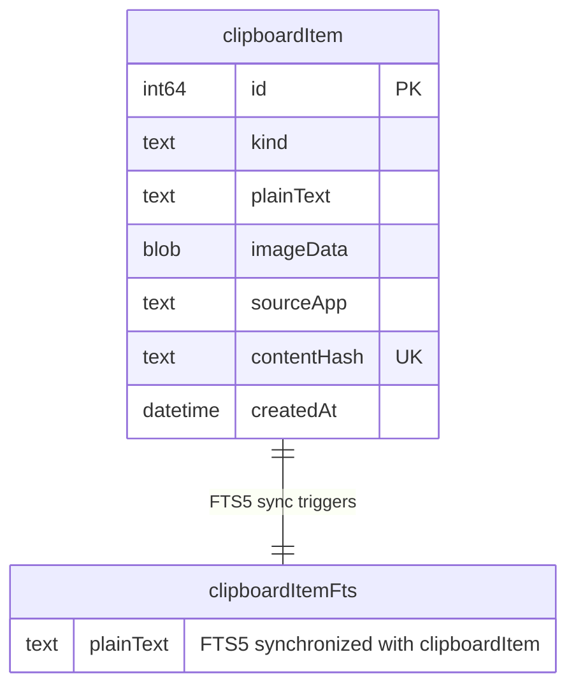

# Clipboard History — Standalone macOS App

## Overview

A standalone, single-purpose macOS app that monitors the system clipboard, stores history in SQLite, and presents a searchable floating panel on a global hotkey. Selecting an item auto-pastes it into the frontmost application.

## Problem Statement / Motivation

macOS has no built-in clipboard history. Users constantly overwrite clipboard contents and lose previously copied items. Alfred's clipboard history solves this but requires a $34 Powerpack license and bundles dozens of unrelated features. A dedicated, lightweight clipboard manager fills this gap.

## Proposed Solution

SwiftUI + AppKit hybrid app:
- **SwiftUI** for all UI (search field, history list, image previews, timestamps)
- **AppKit** (`NSPanel`) only for floating panel window behavior — the one thing SwiftUI can't do alone
- **GRDB.swift** with FTS5 for SQLite storage and full-text search
- **KeyboardShortcuts** (Sindre Sorhus) for user-configurable global hotkey
- **CGEvent** for simulating Cmd+V auto-paste

Target: macOS 14+ (Sonoma), personal use, unsigned distribution.

## Technical Approach

### Architecture

10 files. Every file has a clear, non-trivial responsibility.

```
ClipboardHistory/
  Sources/
    App/
      ClipboardHistoryApp.swift     # @main, MenuBarExtra, Settings scene
      AppDelegate.swift             # Hotkey registration, monitor startup, panel reference
    Models/
      ClipboardRecord.swift         # GRDB record + query methods (search, upsert, cleanup)
    Database/
      AppDatabase.swift             # DatabasePool setup, migrator, FTS5, migrations
    Services/
      ClipboardMonitor.swift        # NSPasteboard polling + content extraction + hashing (inlined)
    Views/
      FloatingPanel.swift           # NSPanel subclass + show/hide/position + paste logic
      ClipboardPanelView.swift      # Root SwiftUI view (search + list + empty state)
      ClipboardRowView.swift        # Row: text preview / image thumbnail / source app + timestamp
      SettingsView.swift            # Hotkey recorder, retention, launch at login
  Package.swift
```

**What was cut and why:**
- `ClipboardRepository.swift` — queries live on `ClipboardRecord` and `AppDatabase` directly. GRDB already provides query methods on records; a separate repository is indirection for a single-table app.
- `ThumbnailService.swift` — thumbnail generation is one function call, inlined into `ClipboardMonitor`.
- `PasteService.swift` — paste logic (4 lines of CGEvent code) lives on `FloatingPanel`, which already knows when to dismiss and paste.
- `ContentHasher.swift` — SHA256 is a single expression via CryptoKit, inlined where used.
- `PermissionChecker.swift` — two one-liner API calls, inlined into `AppDelegate` and `FloatingPanel`.
- `EmptyStateView.swift` — 5 lines of SwiftUI, inlined into `ClipboardPanelView`.
- `OnboardingView.swift` — simple alert dialog, inlined into `AppDelegate` / `SettingsView`.
- `PanelController.swift` — merged into `FloatingPanel.swift`, they are the same concern.

### Dependencies (Swift Package Manager)

| Package | Version | Purpose |
|---------|---------|---------|
| [GRDB.swift](https://github.com/groue/GRDB.swift) | ~> 7.0 | SQLite database with FTS5, ValueObservation |
| [KeyboardShortcuts](https://github.com/sindresorhus/KeyboardShortcuts) | ~> 2.0 | User-configurable global hotkey with SwiftUI recorder |

No other external dependencies. CryptoKit (built-in) for SHA256 hashing.

### Data Model

```swift
struct ClipboardRecord: Identifiable, Codable, FetchableRecord, MutablePersistableRecord {
    var id: Int64?
    var kind: String              // "text", "image"
    var plainText: String?        // Text content; also used for search on image items (source app name)
    var imageData: Data?          // Full image data stored as blob (capped at 10MB, no separate disk storage)
    var sourceApp: String?        // e.g. "Safari" — display name, resolved from frontmost app at capture time
    var contentHash: String       // SHA256 for deduplication (unique index)
    var createdAt: Date

    static let databaseTableName = "clipboardItem"
}
```



**What was cut from the data model and why:**
- `isPinned` — brainstorm explicitly said "Not in v1". Add via migration when needed.
- `lastUsedAt` — on duplicate, delete old row + insert new row (simpler than upsert, same UX result).
- `imagePath` — no separate disk storage. Images stored directly as blobs in SQLite (capped at 10MB, SQLite handles this fine). Eliminates file management, orphan cleanup, and an entire code path.
- `sourceAppBundleId` — one field (`sourceApp`) is enough. Store the display name at capture time. No need to resolve bundle IDs at render time.
- `richText` kind — store plain text representation. When pasting, we write whatever the original pasteboard had. No need to track RTF/HTML as a distinct type.
- `fileURL` kind — deferred to v2. File URLs treated as text strings for now.

### Key Technical Decisions

**1. FloatingPanel (NSPanel subclass)**
- Style mask: `.nonactivatingPanel`, `.titled`, `.fullSizeContentView`
- `canBecomeKey = true` (receives keyboard input for search)
- `canBecomeMain = false` (never steals focus from frontmost app)
- Level: `.floating`, collection behavior: `.canJoinAllSpaces`
- Hosts SwiftUI content via `NSHostingView`
- Dismisses on `resignKey()` (click outside / app switch)
- Paste logic lives here: write to pasteboard → close → observe frontmost app activation → fire CGEvent

**2. Clipboard monitoring**
- `Timer.scheduledTimer` at 0.5s interval on main thread (required for `NSPasteboard` access)
- Detect changes via `NSPasteboard.general.changeCount`
- **Main thread:** read pasteboard contents. **Background task:** hash content, generate thumbnail, write to DB.
- Extract content in priority order: **plain text > image** (text preferred when both present, e.g. Numbers cells)
- Respect `org.nspasteboard.ConcealedType` and `org.nspasteboard.TransientType` — skip password manager entries
- Detect source app via `NSWorkspace.shared.frontmostApplication?.localizedName`
- Process clipboard events sequentially (queue, not parallel) to prevent memory spikes from rapid large image copies

**3. Deduplication**
- SHA256 hash of content (text bytes / image data) via CryptoKit — a single expression, inlined
- Unique index on `contentHash`
- On duplicate: delete old row, insert new row (moves to top of recency list with fresh `createdAt`)

**4. Image storage — blobs in SQLite**
- Store full image data directly as blob in SQLite (max 10MB, silently skip larger)
- Generate thumbnail on the fly for list rendering, cache in-memory via `NSCache`
- No separate disk storage, no orphan cleanup, no file management
- Hashing and DB writes happen on a background task (not the main/timer thread)

**5. Auto-paste sequence**
1. Write selected item to `NSPasteboard.general`
2. Close panel (instant, no animation)
3. Observe `NSWorkspace.didActivateApplicationNotification` to confirm target app is active
4. Fire `CGEvent` for Cmd+V (key down + key up) at `.cgAnnotatedSessionEventTap`
5. Fallback: if no activation notification within 200ms, fire paste anyway (covers edge cases)
6. If Accessibility denied: copy to clipboard only, show notification "Paste manually with Cmd+V"

**6. Search**
- FTS5 with `unicode61()` tokenizer (no stemming — exact token matching for predictability)
- `synchronize(withTable: "clipboardItem")` for automatic index sync
- **Prefix search:** append `*` to last token so "hel" matches "hello"
- Real-time filtering on every keystroke (FTS5 is fast enough for <10k items)
- Empty search shows all items ordered by `createdAt DESC`

**7. Reactive data flow — ValueObservation**
- `ValueObservation.tracking` on `clipboardItem` table provides real-time UI updates
- When monitor inserts a new item, SwiftUI list updates automatically via observation
- No manual refresh wiring needed — GRDB handles the bridge between DB writes and UI reads
- `DatabasePool` (not `DatabaseQueue`) for concurrent reads during writes — prevents stutter during cleanup

**8. macOS 16 pasteboard privacy**
- Check `NSPasteboard.general.accessBehavior` on launch and periodically on poll failure (macOS 15.4+)
- If `.promptRequired` or `.denied`: show alert with explanation + "Open System Settings" button
- Deep link: `x-apple.systempreferences:com.apple.preference.security?Privacy_Pasteboard`
- Fallback if deep link fails: open System Settings to top level

**9. Threading model**
- **Main thread:** `NSPasteboard` reads (required by API), UI rendering
- **Background (Swift Concurrency `Task`):** SHA256 hashing, thumbnail generation, all DB writes
- **GRDB `DatabasePool`:** allows concurrent reads (UI search queries) during writes (monitor inserts, cleanup deletes)

### Panel Behavior

| Trigger | Action |
|---------|--------|
| Global hotkey (panel closed) | Open panel, center on screen containing mouse cursor, focus search field |
| Global hotkey (panel open) | Close panel |
| Escape key (search non-empty) | Clear search text |
| Escape key (search empty) | Close panel |
| Click outside panel | Close panel (via `resignKey`) |
| Cmd+Tab / app switch | Close panel (via `resignKey`) |
| Return key | Paste selected item, close panel |
| Arrow up/down | Navigate list (wrap at edges) |
| Type any character | Goes to search field (auto-focused) |
| Cmd+Delete | Delete selected item (no confirmation — it's clipboard ephemera) |

**Initial state:** Most recent item pre-selected, enabling quick hotkey-then-Return paste.

**Multi-monitor:** Panel centers on the `NSScreen` containing `NSEvent.mouseLocation`.

**Search field focus:** Use `@FocusState` with 50ms async delay. Additionally, override `keyDown(_:)` on the `NSPanel` subclass to buffer keystrokes that arrive before SwiftUI focus is established, forwarding them to the search field once ready.

### Permissions & Onboarding

Two permissions required, requested lazily:

1. **Accessibility** (for CGEvent paste simulation)
   - Checked on first paste attempt via `AXIsProcessTrustedWithOptions`
   - If untrusted: show alert explaining why + "Open System Settings" button
   - Deep link: `x-apple.systempreferences:com.apple.preference.security?Privacy_Accessibility`
   - Fallback: item copied to clipboard, user pastes manually

2. **Pasteboard access** (macOS 16+ only)
   - Checked on app launch + re-checked on poll failure
   - If not `.alwaysAllowed`: show alert with explanation + Settings link

### App Configuration

- **No dock icon**: `LSUIElement = true` in Info.plist
- **Menu bar icon**: `MenuBarExtra` with SF Symbol `clipboard`
- **Menu bar menu items**: Preferences..., Quit
- **Settings window**: `Settings` scene with `KeyboardShortcuts.Recorder` + launch at login toggle
- **Launch at login**: `SMAppService.mainApp` (register/unregister in Settings)
- **Settings storage**: `UserDefaults` (saved immediately on change)

### Retention & Cleanup

Hard-coded sensible defaults. No per-type configuration — one retention period, one max count.

| Setting | Value |
|---------|-------|
| Retention | 30 days |
| Max total items | 5000 |
| Max text size | 1 MB (silently skip larger) |
| Max image size | 10 MB (silently skip larger) |

- Cleanup runs on app launch + hourly timer
- Retention calculated from `createdAt`
- Cleanup deferred while panel is visible (avoid list changing under the user)
- Future: add configurable retention in Settings when/if needed

## Acceptance Criteria

### Core Functionality
- [x] Global hotkey toggles floating panel (open/close)
- [x] Panel appears centered on screen containing mouse cursor, search field auto-focused
- [x] Clipboard monitoring captures text and images from `NSPasteboard.general`
- [x] Items stored in SQLite via `DatabasePool` with content hash deduplication
- [x] Duplicate copies delete old row + insert new (move to top)
- [x] Password manager entries (`org.nspasteboard.ConcealedType`) are never captured
- [x] FTS5 search with prefix matching — "hel" matches "hello"
- [x] Empty search shows all items ordered by most recent
- [x] Arrow keys navigate the list with wrapping at edges
- [x] Return key pastes selected item into frontmost app via CGEvent Cmd+V
- [x] Escape clears search (if non-empty) or closes panel (if search empty)
- [x] Click outside panel dismisses it
- [x] Source app name displayed per item
- [x] Image items show thumbnails (generated on-the-fly, cached via `NSCache`)
- [x] Text items show first ~100 characters with ellipsis
- [x] Relative timestamps displayed per item ("2m ago", "1h ago")
- [x] UI updates reactively via GRDB `ValueObservation` (new items appear without manual refresh)

### Settings & Configuration
- [x] Menu bar icon with "Preferences..." menu item
- [x] User-configurable global hotkey via `KeyboardShortcuts.Recorder` *(deferred — using HotKey with hardcoded Cmd+Shift+V)*
- [x] Launch at login toggle via `SMAppService`
- [x] Settings persist in `UserDefaults`, saved immediately on change

### Permissions & Error Handling
- [x] Accessibility permission checked on first paste; alert shown if untrusted
- [x] Pasteboard access checked on launch + on poll failure (macOS 15.4+); alert shown if denied
- [x] If Accessibility denied: item copied to clipboard (user pastes manually)
- [x] Panel shows empty state ("Copy something to get started") when history is empty
- [x] Database corruption: delete and recreate (log warning)
- [x] Oversized content (>1MB text, >10MB image): silently skip

### Data Lifecycle
- [x] Cleanup runs on app launch and hourly (deferred while panel is visible)
- [x] Items older than 30 days deleted
- [x] Items beyond 5000 count cap deleted (keep most recent)
- [x] Cmd+Delete removes selected item immediately (no confirmation)

### Quality
- [x] No dock icon (`LSUIElement = true`)
- [x] Follows system light/dark mode automatically (SwiftUI semantic colors)
- [x] Panel uses `NSVisualEffectView` vibrancy (`.hudWindow` material)
- [x] Keyboard-only workflow fully functional (no mouse required after hotkey)
- [x] Main thread: pasteboard reads + UI only. Background: hashing, thumbnails, DB writes.
- [x] `DatabasePool` for concurrent reads during writes

## Implementation Phases

### Phase 1: Working App (end-to-end loop)
Get to a usable app as fast as possible. Copy, search, paste.

- [x] Create Xcode project with SPM dependencies (GRDB, HotKey)
- [x] Configure `Info.plist`: `LSUIElement = true`, bundle ID
- [x] `AppDatabase.swift`: DatabasePool setup, v1 migration (table + FTS5 with prefix search + indexes)
- [x] `ClipboardRecord.swift`: model + query methods (insert, search, deleteOld, deleteById)
- [x] `ClipboardMonitor.swift`: 0.5s timer, changeCount detection, text + image extraction, concealed type filtering, SHA256 hashing, background DB writes
- [x] `FloatingPanel.swift`: NSPanel subclass + show/hide/position + paste via CGEvent
- [x] `ClipboardPanelView.swift`: search TextField + List with `ValueObservation` + empty state + keyboard navigation
- [x] `ClipboardRowView.swift`: text preview / image thumbnail / source app name / relative timestamp
- [x] `ClipboardHistoryApp.swift`: `@main`, `MenuBarExtra`, basic menu (Quit)
- [x] `AppDelegate.swift`: wire hotkey → panel toggle, start monitor
- [x] Accessibility permission check + alert on first paste
- [x] Default hotkey: Cmd+Shift+V
- [ ] **Verify**: copy text/image in any app → hotkey → search → Return → pastes into previous app

### Phase 2: Polish
Settings, cleanup, vibrancy, edge cases.

- [x] `SettingsView.swift`: launch at login toggle *(hotkey recorder deferred — using HotKey with hardcoded Cmd+Shift+V)*
- [x] Cleanup logic: 30-day retention + 5000-item cap, runs on launch + hourly, deferred while panel visible
- [x] `NSVisualEffectView` vibrancy background (`.hudWindow` material)
- [x] macOS 16 pasteboard privacy check (on launch + on poll failure) with alert
- [x] Multi-monitor: panel centers on screen containing mouse cursor
- [x] Keystroke buffering in NSPanel `keyDown(_:)` for early typing before SwiftUI focus
- [x] Frontmost app observation (`didActivateApplicationNotification`) for reliable paste timing
- [ ] **Verify**: full workflow works reliably across app switches, multi-monitor, and permission states

## Dependencies & Risks

| Risk | Impact | Mitigation |
|------|--------|------------|
| macOS 16 pasteboard privacy prompt | Core monitoring may break | Check `accessBehavior` on launch + on poll failure, show alert with Settings link |
| CGEvent paste fails silently | User thinks paste worked but nothing happened | Observe frontmost app activation before firing; fallback to clipboard-only + notification |
| Global hotkey conflicts with other apps | Hotkey doesn't work | Use KeyboardShortcuts (user-configurable), default to Cmd+Shift+V (uncommon) |
| NSPanel search field focus race | User types before field is ready, keystrokes lost | 50ms async delay + keystroke buffering in NSPanel `keyDown(_:)` |
| Large image blobs in SQLite | Potential slowdown with many large images | Capped at 10MB per image; generate thumbnails on-the-fly with NSCache; 30-day retention limits accumulation |
| macOS Sequoia Option key regression | Hotkeys with Option modifier don't work | Default hotkey uses Cmd+Shift (no Option) |
| DB contention during cleanup | UI stutter while deleting hundreds of rows | `DatabasePool` (WAL mode) allows concurrent reads during writes; defer cleanup while panel visible |

## References & Research

### Internal
- Brainstorm: `docs/brainstorms/2026-02-08-clipboard-history-app-brainstorm.md`

### Libraries
- GRDB.swift: https://github.com/groue/GRDB.swift (v7.x, FTS5, ValueObservation)
- KeyboardShortcuts: https://github.com/sindresorhus/KeyboardShortcuts (v2.x)

### Key References
- Cindori floating panel tutorial: https://cindori.com/developer/floating-panel
- nspasteboard.org conventions (concealed/transient types): http://nspasteboard.org/
- Peter Steinberger's LSUIElement Settings workaround: https://steipete.me/posts/2025/showing-settings-from-macos-menu-bar-items
- macOS 16 pasteboard privacy: https://mjtsai.com/blog/2025/05/12/pasteboard-privacy-preview-in-macos-15-4/
- Igor Kulman's auto-type guide (CGEvent paste): https://blog.kulman.sk/implementing-auto-type-on-macos/

### Similar Projects (for reference)
- Maccy (open source clipboard manager): https://github.com/p0deje/Maccy
