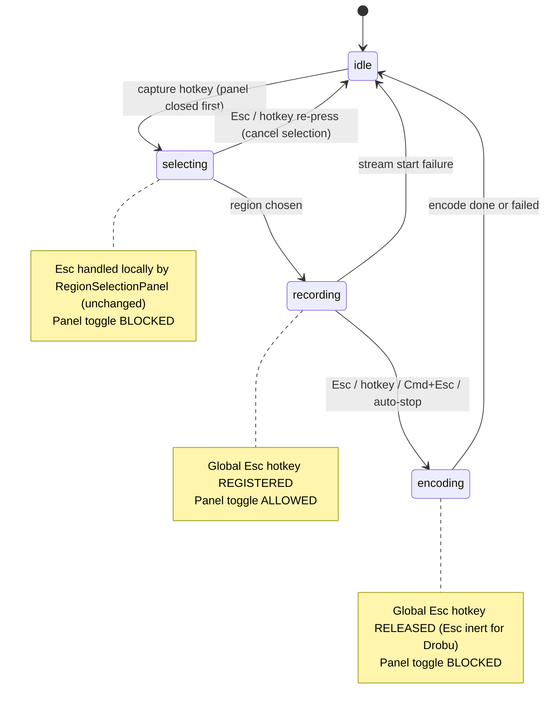
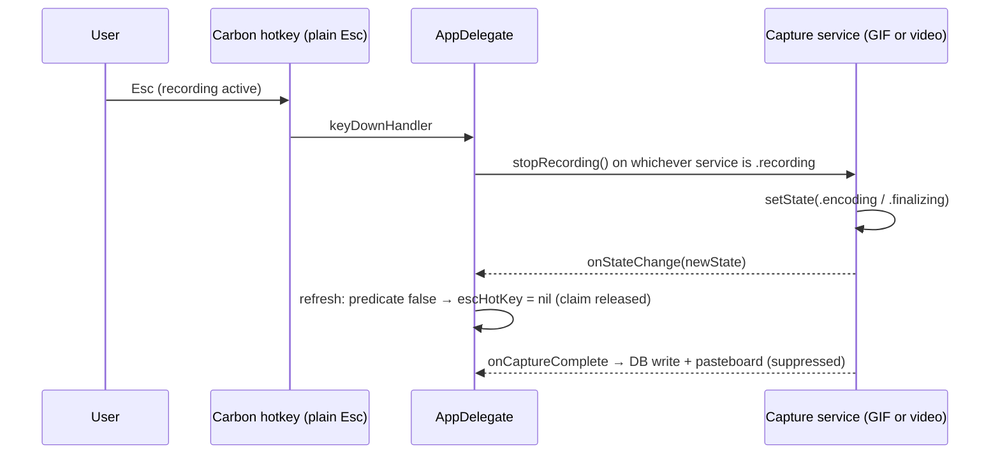

# feat: Esc stops recording + panel available while recording

## Summary

Two UX changes to the GIF/video recording flow: (1) plain Esc stops-and-saves an in-progress recording, with the Esc key claimed system-wide only while a recording is actually running; (2) the main clipboard panel becomes openable during an active recording so Drobu can record its own UI. Plus a local end-to-end test harness that drives the full flow with synthetic input events.

## Problem Frame

Today a recording can only be ended by re-pressing the capture hotkey that started it, or by the (undocumented) always-on Cmd+Esc hotkey. Plain Esc — the intuitive "end this" key — does nothing during recording. Separately, `togglePanel()` hard-blocks while any capture is active, so Drobu cannot demo its own panel UI in a recording, even though the capture content filters do not exclude Drobu's windows (the guard was a UX simplification in the original capture plans, not an engine constraint).

---

## Requirements

**Esc stops recording**

- R1. While a GIF or video recording is active, pressing plain Esc stops the recording and saves the result — identical outcome to re-pressing the capture hotkey or Cmd+Esc.
- R2. The Esc key is claimed system-wide only while a recording is active. In `idle`, `selecting`, `encoding`, and `finalizing` states, plain Esc behaves normally in every app (including Drobu's own panels and trim views).
- R3. Every path out of `.recording` (hotkey re-press, Cmd+Esc, Esc, auto-stop timer, stream start failure, error) releases the Esc claim. No path leaves a stale global Esc hotkey registered.
- R4. The recording HUD hint advertises Esc as the stop key for both GIF and video, without text overflowing the HUD window.
- R5. The existing Cmd+Esc stop hotkey keeps working unchanged.

**Panel during recording**

- R6. While a recording is active, the panel hotkey opens and closes the main panel, and the panel appears in the recording (no capture-engine changes).
- R7. The panel stays blocked during `.selecting`, `.encoding`, and `.finalizing`.
- R8. Opening or closing the panel during recording never stops, cancels, or otherwise alters the recording. GIF/video mutual exclusion and the close-panel-before-starting-selection behavior are unchanged.
- R9. A capture completing while the panel is open surfaces the new item through the existing GRDB `ValueObservation` without creating a duplicate clipboard entry (existing `suppressNextChange()` flow).

**Testing**

- R10. The new decision logic (Esc-claim predicate, panel-gate predicate) is pure, lives in `Sources/DrobuCore/Services/`, and is unit-tested with Swift Testing in the same commit (repo testing rule).
- R11. A local-only end-to-end harness exercises the real flow — start recording via synthetic hotkey, stop via synthetic Esc, assert the capture landed in the database; toggle the panel mid-recording and assert it appeared. Documented permission prerequisites; never runs in CI.

---

## Key Technical Decisions

- **Esc = stop-and-save, superseding the original discard-on-Esc contract.** Both `docs/plans/2026-02-18-feat-gif-screen-capture-plan.md` and `docs/plans/2026-03-29-feat-video-screen-capture-plan.md` specified Esc-during-recording = cancel-and-discard, but that was never shipped (nothing calls `cancelRecording()` today; the shipped Cmd+Esc routes to `stopRecording()`). User-confirmed decision: Esc saves. Rationale: the pain point is *ending* recordings conveniently; discard-on-Esc risks accidentally losing a long recording. `cancelRecording()` stays unused; a discard affordance (e.g., Shift+Esc) is deferred.
- **Global Carbon HotKey, not an NSEvent local monitor.** A local monitor (the video plan's original sketch) only fires when Drobu receives key events — useless when the user is recording another app, which is the primary stop-from-anywhere case. The HotKey library's create/`nil` idiom (already used by `registerHotkey`/`registerCaptureHotkey`/`registerVideoCaptureHotkey` in `Sources/DrobuCore/App/AppDelegate.swift`) registers on init and unregisters on deinit. Accepted trade-off: while recording, Esc is consumed system-wide — it will not reach the focused app, Drobu's own panel Esc affordances (close large preview, clear multi-select, clear search, close panel), or the trial-expiry activation panel. Shift-tap still dismisses the large preview. This blast radius is the point of the feature and is bounded by the recording itself (GIF auto-stops at 15s; video at 300s).
- **State-derived registration, not transition-derived.** Both services already expose `onStateChange` (fired by `setState` on every transition; currently unwired in AppDelegate for the capture services — the wiring precedent is `CaffeinateService`/`ClosedLidService` badge refresh). Both callbacks funnel into one refresh routine that recomputes a single predicate — "is either service `.recording`?" — and creates or nils the Esc hotkey to match. This one decision closes three flow risks at once: the fast selecting→recording→idle race, dual-service callback ordering, and a stale-Esc leak (the failure mode — a permanent system-wide Esc blackhole — is severe and invisible). The Esc `keyDownHandler` only calls stop on the recording service; it never touches the hotkey property itself — teardown happens via the state callback the stop flow triggers. Code-verified caveat: the video service transitions out of `.recording` synchronously (first-line `setState(.finalizing)`), but the GIF service today does not — its `setState(.encoding)` fires inside the encode task only after the stream stops, so the Esc claim would linger briefly and a rapid second Esc could re-enter `stopRecording()`. U2 closes this by mirroring the video pattern in the GIF service (synchronous transition out of `.recording` at the top of `stopRecording()`); the state-derived refresh tolerates the delay either way. Belt-and-suspenders: also nil the hotkey in `applicationWillTerminate`.
- **Esc is intentionally inert during `.encoding`/`.finalizing`.** Once recording ends, the claim is released; Esc falls through to the focused app. There is no `cancelEncoding()` and adding one is out of scope.
- **Panel auto-close on `resignKey` is unchanged.** During recording the panel persists only while it holds key focus; clicking the recorded app closes it (existing `FloatingPanel.resignKey` behavior). Acceptable for the self-recording use case — the user is interacting with the panel being recorded. Pinning the panel open during recording is deferred.
- **Pure policy helper for testability.** AppDelegate is AppKit-coupled and explicitly out of unit-test scope (`.claude/rules/testing-conventions.md`); the capture services need real ScreenCaptureKit and cannot run headless. The testable surface is the decision logic, extracted into a small pure type consumed by AppDelegate.
- **E2E harness is a local-only script, outside `swift test`.** Synthetic CGEvents require Accessibility permission for the posting process and a running, screen-recording-permitted Drobu — neither exists on CI runners. The harness lives in `tools/e2e/` so CI (`swift test` on `macos-15`) is untouched.

---

## High-Level Technical Design

Capture state machine with the two new behaviors annotated (GIF service shown; video is identical with `finalizing` in place of `encoding`):

Esc-stop sequence — teardown happens via the state callback, never inside the key handler (the video service already fires this transition synchronously; U2 adds the same synchronous transition to the GIF service so the diagram holds for both):

Directional guidance, not implementation specification: the policy helper is two pure functions over the pair of service states — `escClaimActive(gif:video:)` (true iff either is `.recording`) and `panelToggleAllowed(gif:video:)` (true iff both are `.idle` or `.recording`-vs-`.idle` in either arrangement; false whenever either service is `.selecting`/`.encoding`/`.finalizing`).

---

## Implementation Units

### U1. Pure capture-UI policy helper with tests

**Goal:** A small pure type that owns the two decisions — when the Esc claim is active and when the panel toggle is allowed — so the logic is unit-testable despite AppDelegate being out of test scope.

**Requirements:** R2, R7, R10

**Dependencies:** none

**Files:**
- `Sources/DrobuCore/Services/CaptureUIPolicy.swift` (new)
- `Tests/DrobuTests/CaptureUIPolicyTests.swift` (new)

**Approach:** Two pure static functions (or a tiny enum-namespace) taking `ScreenCaptureService.State` and `VideoCaptureService.State`. No AppKit imports, no service references — states in, Bool out. AppDelegate becomes a thin consumer.

**Patterns to follow:** `CaffeinateService` state/test pairing; Swift Testing `@Suite`/`@Test` with sentence-style names (`Tests/DrobuTests/CaffeinateServiceTests.swift`).

**Test scenarios:**
- Esc claim is active when GIF state is `.recording` and video is `.idle`, and vice versa.
- Esc claim is inactive for every non-recording combination: both `.idle`; GIF `.selecting`/`.encoding` with video `.idle`; video `.selecting`/`.finalizing` with GIF `.idle`.
- Panel toggle allowed when both `.idle`; when GIF `.recording` + video `.idle`; when video `.recording` + GIF `.idle`.
- Panel toggle blocked when either service is `.selecting`, `.encoding`, or `.finalizing` (full matrix sweep — small enough to enumerate exhaustively).

**Verification:** `swift test` passes with the new suite; the matrix is exhaustive over both state enums.

---

### U2. Recording-scoped global Esc hotkey in AppDelegate

**Goal:** Plain Esc stops-and-saves an active recording; the Esc claim exists only while recording.

**Requirements:** R1, R2, R3, R5

**Dependencies:** U1

**Files:**
- `Sources/DrobuCore/App/AppDelegate.swift`
- `Sources/DrobuCore/Services/ScreenCaptureService.swift`

**Approach:**
- Add a `HotKey?` property for the transient Esc claim (create/`nil` idiom, matching `registerCaptureHotkey`).
- Wire `captureService.onStateChange` and `videoCaptureService.onStateChange` (both currently nil) to a single refresh routine. The routine reads both services' current states, asks `CaptureUIPolicy` whether the claim should be active, and creates or nils the hotkey to match — idempotent and order-independent, safe for any callback interleaving.
- The Esc `keyDownHandler` mirrors the existing Cmd+Esc handler (stop whichever service is `.recording`); consider extracting a shared `stopActiveRecording()` used by both. The handler must not read or mutate the Esc hotkey property — teardown happens via the state callback that `stopRecording()` synchronously triggers.
- Harden the GIF stop path: `ScreenCaptureService.stopRecording()` currently leaves `state == .recording` until the encode task runs (async); transition out of `.recording` synchronously at the top of `stopRecording()` (mirroring `VideoCaptureService`'s first-line `setState(.finalizing)` re-entrancy pattern) so the Esc claim releases promptly and a rapid second Esc cannot re-enter the stop path.
- Defensive `nil` of the Esc hotkey in `applicationWillTerminate`.
- Cmd+Esc registration stays exactly as is; `stopRecording()`'s `guard state == .recording` already makes double-fire a no-op.

**Patterns to follow:** create/`nil` hotkey idiom (`registerHotkey` and siblings); `onStateChange` wiring precedent from `caffeinateService.onStateChange`/`closedLidService.onStateChange` badge refresh; `[weak self]` handler convention.

**Test scenarios:** Test expectation: none — AppKit/hotkey wiring is explicitly out of unit-test scope per `.claude/rules/testing-conventions.md`; the decision logic is covered by U1 and the end-to-end behavior by U5. Manual checks during development:
- Start GIF recording → press Esc → GIF saved to history (same result as hotkey re-press).
- Start video recording → press Esc → video saved.
- While idle, in another app, press Esc → reaches that app normally (no claim).
- During region selection, Esc still cancels selection (local panel handler, unchanged).
- During encoding/finalizing, Esc reaches the focused app (claim released at recording end).
- Rapid double-press of Esc during a GIF recording → exactly one capture saved, no duplicate encode.
- Cmd+Esc during recording still stops and saves.

**Verification:** All manual checks pass; `tail -f ~/Library/Application\ Support/ClipboardHistory/app.log` shows the expected state transitions; no stale Esc claim after any exit path (Esc works normally in other apps after every scenario).

---

### U3. Narrow the panel gate to allow toggling during recording

**Goal:** The panel hotkey works while a recording runs, so Drobu's UI can be recorded with Drobu.

**Requirements:** R6, R7, R8, R9

**Dependencies:** U1

**Files:**
- `Sources/DrobuCore/App/AppDelegate.swift`

**Approach:** Replace the two hard `!= .idle` returns in `togglePanel()` with a single `CaptureUIPolicy.panelToggleAllowed(...)` check. Everything else is untouched: `handleCaptureHotkey`/`handleVideoCaptureHotkey` still close the panel before starting region selection from idle; mutual exclusion guards stay; closing the panel calls no capture methods. The trial-expired path inside `showPanel()` (activation panel instead of clipboard panel) becomes reachable mid-recording — acceptable; the recording continues and the activation panel is just another window (note: while recording, Esc stops the recording rather than dismissing that panel).

**Patterns to follow:** existing guard style in `togglePanel()`; panel-lifecycle invariants from `docs/plans/2026-02-08-fix-panel-lifecycle-ux-plan.md` (recreate-on-open, `WeakFloatingPanel`, `suppressNextChange()` before pasteboard writes) — preserve, don't touch.

**Test scenarios:** Test expectation: none for unit tests (AppKit wiring; gate logic covered by U1). Manual checks:
- Start video recording → press panel hotkey → panel opens over the recording region and appears in the recorded video.
- Press panel hotkey again mid-recording → panel closes; recording unaffected.
- Paste an item from the panel mid-recording → paste works; no duplicate history entry; recording unaffected.
- Recording stops while panel open → new GIF/video row appears at top of panel via live observation (with an active content-type filter, the row appears once the filter matches — expected).
- Panel hotkey during region selection → still ignored.
- Click the recorded app while panel is open mid-recording → panel auto-closes (existing `resignKey` behavior, unchanged and accepted).

**Verification:** A recording made while toggling the panel shows the panel in the resulting GIF/video; clipboard history has exactly one entry per capture.

---

### U4. Update recording HUD hint text

**Goal:** The HUD advertises the new stop key so the feature is discoverable.

**Requirements:** R4

**Dependencies:** none (lands with U2 behavior; text-only otherwise)

**Files:**
- `Sources/DrobuCore/Views/RecordingIndicatorWindow.swift`

**Approach:** Change the hardcoded hint (`"Press hotkey to stop"`) to mention Esc — e.g. `"Esc or hotkey to stop"`. The label sits at a fixed x-origin (72) inside a fixed 200pt-wide window; recompute the container/window width from the label's `sizeToFit()` result so longer text doesn't clip. Critically, update the NSWindow's own frame (e.g. `setFrame` at the end of `setupContent()`, before `show()` is ever called) — `show(relativeTo:on:)` centers and clamps using `frame.width` at call time, so resizing only the container view would mis-center the HUD. The label is shared by GIF and video (no per-mode parameter today — keep it that way). The hint stays Esc-only by design: panel availability mid-recording is deliberately not advertised in the HUD (width budget; the HUD's job is the stop affordance) — it's documented in the E2E README/release notes instead.

**Patterns to follow:** existing `sizeToFit()` + manual frame layout in the same file.

**Test scenarios:** Test expectation: none — pure UI layout, out of unit-test scope. Manual check: hint text fully visible (no truncation) on both GIF and video recordings, HUD still positioned outside the capture region.

**Verification:** Visual check during a recording; the hint reads correctly and fits.

---

### U5. Local end-to-end test harness

**Goal:** A repeatable script that exercises the real shipped binary end to end — synthetic hotkey starts a recording, synthetic Esc stops it, the capture lands in the database; the panel toggles mid-recording.

**Requirements:** R11 (validates R1, R3, R6 against the real app)

**Dependencies:** U2, U3, U4 (tests the shipped behavior)

**Files:**
- `tools/e2e/recording_e2e.swift` (new — single-file Swift script, run via `swift tools/e2e/recording_e2e.swift`)
- `tools/e2e/README.md` (new — prerequisites and usage)

**Approach:**
- **Prerequisite checks, fail fast with instructions:** `AXIsProcessTrusted()` for the posting process (Accessibility); Drobu running (`pgrep -x Drobu`); Drobu must already hold Screen Recording permission.
- **Deterministic hotkeys:** write known capture/video/panel hotkey combos into Drobu's UserDefaults domain before launching the app (storage keys live in `Sources/DrobuCore/Models/CaptureHotkeyDefaults.swift` and siblings — implementer confirms exact keys), then launch via the repo's standard `pkill -x Drobu; ./build.sh --install && open /Applications/Drobu.app`.
- **Event driving:** post CGEvents at the HID tap — keyboard combos for hotkeys/Esc, mouse down-drag-up for region selection of a small fixed rect.
- **Assertions:** poll `~/Library/Application Support/ClipboardHistory/clipboard.sqlite` (via `sqlite3` CLI or GRDB) for a new record of the expected kind with `createdAt` after the scenario start; grep `~/Library/Application Support/ClipboardHistory/app.log` for expected state transitions; for the panel scenario, detect the panel window via `CGWindowListCopyWindowInfo` filtered to Drobu's PID (no app code changes needed).
- **Scenarios:** (a) video: start → record 3s → Esc → assert video record saved; (b) GIF: start → record 3s → Esc → assert GIF record saved AND assert the record appears within ~12s of scenario start — well before the 15s auto-stop boundary — so an auto-stop-produced GIF cannot satisfy the assertion (existence alone would pass even if the synthetic Esc silently failed); (c) panel mid-recording: start video → panel hotkey → assert panel window present → panel hotkey → assert gone → Esc → assert video record saved.
- **Non-CI by construction:** lives in `tools/`, never touched by `swift test` or `.github/workflows/tests.yml`.
- **Test residue:** scenarios write real records into the user's live clipboard history. README documents this; the records are normal captures the user can delete from the panel. The harness must not write to the database itself (the app owns the pool).

**Execution note:** Spike first — verify that CGEvent-posted keystrokes actually trigger Carbon `RegisterEventHotKey` hotkeys on this macOS version before building the full harness. If synthetic events don't reach Carbon hotkeys, fall back to `osascript` System Events key codes. If neither driver works, the deliverable for this plan iteration becomes `tools/e2e/SPIKE_RESULT.md` documenting the finding plus a manual verification checklist covering the U2/U3 scenarios; the full automated harness moves to follow-up work.

**Test scenarios:** The harness *is* the test. Its own failure modes to handle:
- Accessibility not granted → exit with a clear grant-instructions message, non-zero status.
- Drobu not running → same.
- DB poll timeout (no record within 30s) → fail the scenario with the last observed app.log lines for diagnosis.
- A pre-existing recording in progress at harness start → detect via app.log/state and abort rather than corrupting the scenario.

**Verification:** All three scenarios pass on the development machine against the freshly installed build; a deliberate sabotage check (e.g., skip the Esc post) makes the scenario fail, proving the assertions bite.

---

### U6. Minor version bump

**Goal:** Feature release bookkeeping per repo convention (new feature = minor bump, `CFBundleVersion` strictly increasing for Sparkle).

**Requirements:** repo release convention (CLAUDE.md)

**Dependencies:** U2, U3, U4 (ships with the feature)

**Files:**
- `Sources/DrobuCore/Info.plist` (`CFBundleShortVersionString` + `CFBundleVersion`)
- `website/src/components/DownloadCTA.astro`
- `website/src/components/Footer.astro`

**Approach:** Read the current version, bump minor, update all three locations consistently (the Settings About text reads `CFBundleShortVersionString` dynamically, so no SettingsView edit is needed despite CLAUDE.md listing four places). Execute at release time, immediately before `./release.sh` — if the feature merges without an immediate release, defer this unit to the release commit.

**Test scenarios:** Test expectation: none — version bookkeeping. Manual check: About box shows the new version after install.

**Verification:** All four locations agree; `CFBundleVersion` increased.

---

## Acceptance Examples

- AE1. **Given** a video recording is active and another app is frontmost, **when** the user presses Esc, **then** the recording stops, the video is saved to clipboard history, and the Esc keypress does not reach the frontmost app.
- AE2. **Given** no recording is active (idle, selecting, encoding, or finalizing), **when** the user presses Esc anywhere, **then** Drobu does not intercept it (selection-cancel via the selection panel's own handler is unchanged).
- AE3. **Given** a recording is active and the Drobu panel is open with search text entered, **when** the user presses Esc, **then** the recording stops and saves — the panel's clear-search/close behaviors are pre-empted (documented trade-off; Shift-tap still dismisses the large preview).
- AE4. **Given** a recording is active, **when** the user presses the panel hotkey, **then** the panel opens and is visible in the final recording; pressing it again closes the panel; the recording is unaffected either way.
- AE5. **Given** a recording is active and the trial has expired, **when** the user presses the panel hotkey, **then** the activation panel opens over the recording and the recording continues.

---

## Scope Boundaries

**In scope:** Esc-claim lifecycle in AppDelegate, panel-gate narrowing, HUD hint text, pure policy helper + tests, local E2E harness, minor version bump.

**Out of scope (true non-goals):**
- Capture-engine changes — content filters already include Drobu's windows.
- Region-selection behavior — Esc already cancels there via the selection panel's local handler.
- Cancel-during-encoding — no `cancelEncoding()` exists; Esc is deliberately inert once recording ends.

### Deferred to Follow-Up Work

- Discard affordance: wire `cancelRecording()` (currently dead code) to a key such as Shift+Esc for cancel-without-saving.
- Pinning the panel open during recording (suppress `resignKey` auto-close while recording) if click-away closing proves annoying in practice.
- Stop/cancel of an in-progress recording in `applicationWillTerminate`/signal handlers (pre-existing gap; neither feature worsens it).
- Removing or documenting the always-on Cmd+Esc hotkey (kept as-is in this plan).

---

## Risks & Dependencies

- **System-wide Esc swallow during recording.** While recording (up to 300s for video), Esc does not reach any app. Accepted by design; bounded by auto-stop timers; HUD hint makes the mode visible. If complaints arise, the deferred local-monitor hybrid or a shorter video cap are options.
- **Synthetic events may not trigger Carbon hotkeys.** The E2E harness depends on CGEvent-posted keys reaching `RegisterEventHotKey`. U5's spike-first execution note gates the harness on proving this early.
- **Pasteboard interleaving.** A user-initiated paste from the panel and a capture-completion pasteboard write each use independent monitor-suppression tokens; a tight interleave could in theory mis-suppress. Rare (requires paste within the completion window); existing behavior, surface only if E2E or usage shows a duplicate/missing entry.
- **HUD width.** Longer hint text in a fixed 200pt window clips; U4 recomputes width from the label.

---

## Sources & Research

- `Sources/DrobuCore/App/AppDelegate.swift` — Cmd+Esc stop hotkey (~131), `togglePanel()` guard (~179), create/`nil` hotkey idiom (~415-437), capture hotkey dispatch (~441-505), termination (~352-387).
- `Sources/DrobuCore/Services/ScreenCaptureService.swift` and `VideoCaptureService.swift` — `State` enums, `onStateChange` (exists, unwired for capture services), `setState` fires on every transition, `stopRecording()` re-entrancy guards, all `.recording` exit paths enumerated.
- `Sources/DrobuCore/Views/FloatingPanel.swift` — non-activating panel, `resignKey` auto-close, paste suppression; `PanelView.swift` Esc chain (~677); `RecordingIndicatorWindow.swift` hardcoded hint (~55).
- `.claude/rules/testing-conventions.md`, `.claude/rules/swiftui-keypress-gotchas.md`, `.claude/rules/swiftui-macos-gotchas.md` — test scope, keypress modifier gotchas, panel lifecycle invariants.
- `docs/plans/2026-02-18-feat-gif-screen-capture-plan.md` (state machine, panel-guard rationale, original Esc=discard contract), `docs/plans/2026-03-29-feat-video-screen-capture-plan.md` (local-monitor Esc sketch superseded here, mutual exclusion), `docs/plans/2026-02-08-fix-panel-lifecycle-ux-plan.md` (panel invariants).
- HotKey library: registration on init / unregistration on deinit (`HotKey.swift`), Carbon `RegisterEventHotKey` is system-global and consumes the event.
