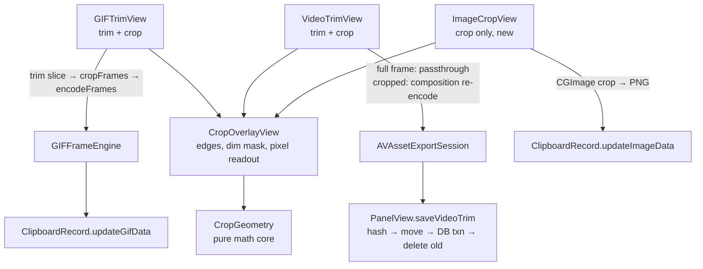
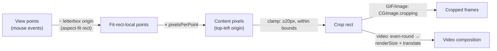

# feat: Spatial crop in the capture editing suite

## Summary

Add edge-drag crop to the inline edit mode (Cmd+Right) for GIFs, videos, and still images. A shared pure-geometry core and one reusable AppKit overlay power all three editors; saves bake the crop in destructively through each kind's existing re-encode path. Video keeps its lossless passthrough export unless a crop was applied.

---

## Problem Frame

Content that appears mid-recording (popups) can't be framed at region-select time, forcing re-records or deliberate over-capture (see origin: `docs/brainstorms/2026-06-06-capture-crop-editing-requirements.md`). Trim covers the time axis; this plan adds the spatial axis. Edit mode today supports only trim, and only for GIF/video — images have no edit mode at all.

---

## Requirements

Carried from origin with the same IDs.

**Crop interaction**

- R1. Four draggable edges over the displayed frame; dragging an edge inward shrinks the crop rect on that side.
- R2. Live dimension readout in content pixels (not view points) while dragging.
- R3. Crop rect cannot shrink below 20×20 **content pixels**.
- R4. Drags clamp to frame bounds; edges re-adjust outward freely before saving.

**Content types**

- R5. GIF: every frame cropped to the rect, preserving per-frame delays and the trim range.
- R6. Video: saved MP4 cropped to the rect; trim-only saves keep passthrough, cropped saves re-encode.
- R7. Still images: edit mode opens a crop-only editor (no timeline) — net-new entry gate, editor view, save callback, and DB updater.
- R8. File-copy records excluded; user files on disk never modified.

**Save and cancel semantics**

- R9. Cmd+Return saves; cropped (and trimmed) content replaces the record via the existing update/dedup path, moving it to the top.
- R10. Esc discards crop and trim together; record untouched.
- R11. Untouched crop edges → save behaves exactly as today (no spurious video re-encode).

**Accessibility**

- R12. Crop editor follows `.claude/rules/accessibility.md`: labels/roles set on the inner NSView in `makeNSView`, dynamic dimension value updated in `updateNSView`, decorative elements hidden.

---

## Key Technical Decisions

- **Pure geometry core, AppKit shell.** All crop math (aspect-fit mapping, clamping, hit-testing, sentinels) lives in a pure `CropGeometry` type with no UI dependency — unit-testable per the testing conventions; views stay thin.
- **Native NSView overlay, not SwiftUI DragGesture.** The floating panel is non-activating and movable-by-background; `TimelineScrubber` documents that SwiftUI gestures conflict with it. The overlay copies its `acceptsFirstMouse = true` + `mouseDownCanMoveWindow = false` pattern and does not take first responder (player views keep Esc/Cmd+Return ownership).
- **Minimum crop is 20×20 content pixels.** The output unit R2 already uses; `RegionSelectionPanel`'s 20×20 is in screen points and only coincides at 1x. Clamp live in pixel space.
- **"Crop untouched" sentinel = crop rect equals full content bounds** (integer equality). Gates the video passthrough-vs-re-encode branch (R11/AE1) and skips no-op crops for GIF/image.
- **Video crop via `AVMutableVideoComposition` + `AVAssetExportPresetHighestQuality`.** Passthrough ignores `videoComposition` entirely. Composition: `renderSize` = crop size rounded **down to even integers** (odd dims break H.264), one instruction spanning the full asset duration (session `timeRange` does the trim), layer transform = `preferredTransform` concatenated with translate(−cropOrigin) in the composition's top-left space, `frameDuration` from the track's `nominalFrameRate`.
- **Keep the property-based export pattern** (`outputURL`/`outputFileType`/`await session.export()` + `status`), mirroring `VideoTrimView`. The replacement API (`export(to:as:)`, `states()`) is macOS 15+ per SDK headers; deployment target is macOS 14. Deprecation warnings on newer SDKs are accepted.
- **GIF pipeline order: trim slice → crop each frame → `encodeFrames`.** `CGImage.cropping(to:)` is a lazy no-copy view (top-left origin, internally integral+clamped — clamp ourselves anyway), so no extra memory pass beyond what trim already holds. All frames crop to one identical rect — `CGImageDestination` cannot write heterogeneous frame sizes.
- **Cropped images re-encode as PNG** through a new `ClipboardRecord.updateImageData` mirroring `updateGifData`: recompute hash, dedup, refresh `plainText` via `mediaDisplayText`, bump `createdAt`.
- **Image edit gate requires a decodable bitmap.** `kindImage` + `imageData` decodes to a `CGImage`; `kindFile` stays excluded (satisfies R8 structurally), and non-bitmap pasteboard payloads (e.g., PDF-backed) never enter the editor.
- **Cropped-video temp file born `0o600`** via `umask(0o077)` wrap around the export (per `.claude/rules/file-permission-hardening.md`); the existing crash-safe `saveVideoTrim` flow (hash → move → DB transaction → delete old) is reused unchanged.

---

## High-Level Technical Design

Component and save-path topology:

Coordinate spaces (the load-bearing mapping — directional guidance):

Displayed-frame rect sources: video reads `AVPlayerView.videoBounds`; GIF/image compute aspect-fit manually from the content's true pixel size (never `NSImage.size`, which reports points and under-reports Retina media; Drobu's own captures are 1x but pasted media can be 2x).

---

## Assumptions

- Indeterminate spinner (the existing `isExporting` UI) suffices for cropped-video exports; determinate progress needs a macOS 15+ API and is deferred.
- Dimension readout renders as a `RegionSelectionPanel`-style monospaced pill positioned relative to the crop rect.
- Edge hit target is a generous slop band (~8–10 pt, nearest-edge picking) since the small pane gives coarse precision by design.
- Keyboard edge-nudging is deferred; accessibility v1 matches the `TimelineScrubber` precedent (labels/roles/values, mouse-driven interaction).
- A small edit-affordance hint for croppable media records ships with the image unit (images were never editable; without a hint the capability is undiscoverable).
- Export/encode failure keeps the user in edit mode with an inline error in the info bar plus a `Log.error` line; no alert dialogs.
- No new size cap on post-crop GIFs (parity with trim, which has none); crop only shrinks output.
- A record deleted mid-save (retention/dedup race): GIF/image updaters silently no-op — harmless, content lives in the row. Video differs: the already-moved `videos/<hash>.mp4` is left orphaned with no DB row and is reaped by the hourly orphan scan, not cleaned synchronously. Accepted, pre-existing behavior — named here so it isn't mistaken for a crop-path bug.
- The crop readout reports true content pixels (CropGeometry), while the metadata bar's `mediaDisplayText` derives dimensions from `NSImage.size` (points) — the two may disagree on Retina-origin media. Teaching `mediaDisplayText` true pixel sizes is out of scope.

---

## Implementation Units

### U1. Crop geometry core

- **Goal:** Pure, fully-tested model for crop state, coordinate mapping, clamping, and hit-testing.
- **Requirements:** R1, R2, R3, R4, R11 (sentinel).
- **Dependencies:** none.
- **Files:** `Sources/DrobuCore/Services/CropGeometry.swift` (new), `Tests/DrobuTests/CropGeometryTests.swift` (new).
- **Approach:** Value type holding content pixel size + crop rect (content pixels, top-left origin). Operations: aspect-fit displayed-rect computation; view-point ↔ content-pixel conversion; edge-drag application with live clamping (≥20 px per axis, within bounds); nearest-edge hit test with slop; `isFullFrame` sentinel (integer equality with content bounds); even-rounded rect for video render size; "content too small to crop" predicate (either dimension ≤ 20 px → edges disabled).
- **Patterns to follow:** `TimelineScrubber.frameFromX` coordinate-mapping shape; testing conventions (`@Test(arguments:)` for parameterized cases).
- **Test scenarios:**
  - Covers AE3. Drag that would cross the 20 px minimum clamps at exactly 20 and reports the clamped size.
  - Mapping round-trips at 1x, 2x (Retina), and fractional scales (small content upscaled in the pane); pixel rects are integral.
  - Letterboxed display: clicks in the margin map outside content and clamp to bounds.
  - Outward re-adjust after shrinking restores any larger rect up to full frame (R4).
  - Nearest-edge hit test picks the closest edge within slop; returns none beyond slop; tie-break is deterministic.
  - `isFullFrame` true only at exact full bounds; false at 1 px difference.
  - Even rounding floors 641×479 → 640×478; already-even unchanged; origin rounds to integers.
  - Content 20×20 or smaller on an axis → cropping disabled predicate fires.
  - Recomputing the mapping after a container resize leaves the content-pixel crop rect unchanged (resize invariance).
- **Verification:** `swift test` green; every public function exercised by at least one test.

### U2. Crop overlay view

- **Goal:** Reusable `NSViewRepresentable` overlay drawing crop edges, dim mask, and pixel readout; owns edge-drag interaction.
- **Requirements:** R1, R2, R12.
- **Dependencies:** U1.
- **Files:** `Sources/DrobuCore/Views/CropOverlayView.swift` (new).
- **Approach:** Flipped NSView (top-left origin throughout — note `RegionSelectionView` is a drawing-idiom precedent only; it is *not* flipped, so borrow its visuals, never its coordinate math). Draw: dim fill outside crop rect with punch-through (`.copy` fill), 2 px white border, monospaced-digit pill readout in content pixels (mirror `RegionSelectionView`'s pill: black 0.7 alpha, radius 4), anchored inside-top-center of the crop rect with an 8 pt offset, hidden when the crop rect height is under roughly twice the pill height. Mouse: `acceptsFirstMouse = true`, `mouseDownCanMoveWindow = false`, `convert(event.locationInWindow, from: nil)`, nearest-edge pick + drag via U1. Too-small state (U1 predicate fires): render a single non-interactive border with no edge handles, default cursor everywhere, readout reads "W × H px — already at minimum"; the info bar hints remain so the user can exit. Displayed-rect API: the overlay derives the aspect-fit rect itself from injected content pixel size + its own bounds (GIF/image); video supplies an explicit override rect (`videoBounds`). The view↔pixel mapping recomputes on `layout()`/`updateNSView` — the panel is resizable mid-edit; the crop rect is stored in content pixels so it is resize-invariant, and a mid-drag resize must not corrupt it. Cursor: `resizeLeftRight` on left/right edges, `resizeUpDown` on top/bottom edges, arrow outside slop bands, via `resetCursorRects`. Accessibility per R12: label + role on the inner view in `makeNSView`, `setAccessibilityValue` with "W × H pixels" in `updateNSView`; the pill itself `setAccessibilityElement(false)`. Does not accept first-responder status — Esc/Cmd+Return stay with the host editor's key view.
- **Execution note:** The overlay-hosting shape is gated by U4's layering spike — if a SwiftUI ZStack of two NSViewRepresentables fails hit-testing over the live `AVPlayerView`, host overlay + player as sibling subviews inside one container NSView and adjust this unit's API accordingly. Run that spike before finalizing the overlay's public shape.
- **Patterns to follow:** `RegionSelectionPanel.swift` (pill, punch-through, 20×20 floor idiom), `TimelineScrubber.swift` (mouse overrides, hit slop).
- **Test scenarios:** Test expectation: none — AppKit drawing and event wiring; all decision logic lives in U1 and is tested there.
- **Verification:** Overlay renders over a static image in the panel; edges drag with correct cursors; readout matches U1 math; VoiceOver announces label and value.

### U3. GIF crop integration

- **Goal:** Crop combined with trim in the GIF edit session, saved through the existing GIF path.
- **Requirements:** R5, R9, R10, R11; F1.
- **Dependencies:** U1, U2.
- **Files:** `Sources/DrobuCore/Views/GIFTrimView.swift`, `Sources/DrobuCore/Services/GIFFrameEngine.swift`, `Tests/DrobuTests/GIFFrameEngineTests.swift` (new).
- **Approach:** `GIFTrimView` gains crop state and layers `CropOverlayView` over `GIFTrimPlayerView` (displayed rect from aspect-fit math against frame pixel size — the player layer uses `.resizeAspect`). Save: slice the trim range, then if not full-frame, crop each surviving frame via new `GIFFrameEngine.cropFrames(_:to:)` (clamped integral rect, preserve each frame's delay), then `encodeFrames`. Esc/Cmd+Return handling unchanged. Encode runs off the main actor (`Task.detached`) — this is the codebase's first `[GIFFrame]`/CGImage actor-boundary crossing; declare `GIFFrame: Sendable` as the enabling change (the struct is not implicitly Sendable even though `CGImage` carries the SDK conformance — without the declaration the detached capture fails to compile under Swift 6). On encode failure: `Log.error` and the same inline info-bar error pattern as U4 (message, stay in edit mode, Esc to discard).
- **Patterns to follow:** existing `saveTrimmedGIF` flow; `ScreenCaptureService` detached-encode pattern.
- **Test scenarios:**
  - Covers AE5. Synthesize a small GIF (encode N frames with distinct delays) → trim to a sub-range + crop → output has only that sub-range, every frame at crop dimensions, original delays preserved.
  - `cropFrames` with an out-of-bounds rect clamps to the intersection; fully-outside rect returns nil/error rather than crashing.
  - Full-frame rect → output dimensions equal input (no-op crop path).
  - Cropped output canvas size equals the crop rect for every frame.
- **Verification:** `swift test` green; manual: capture GIF → trim + crop → save → paste shows cropped, trimmed GIF.

### U4. Video crop integration

- **Goal:** Crop in the video edit session; passthrough preserved for trim-only saves.
- **Requirements:** R6, R9, R10, R11; F2.
- **Dependencies:** U1, U2.
- **Files:** `Sources/DrobuCore/Views/VideoTrimView.swift`, `Sources/DrobuCore/Services/VideoCropExporter.swift` (new), `Tests/DrobuTests/VideoCropExporterTests.swift` (new).
- **Approach:** Overlay over the player; displayed rect from `AVPlayerView.videoBounds` (fallback to manual aspect-fit from the track's `naturalSize` if `videoBounds` is zero before the player is ready). `VideoCropExporter` houses the branch decision AND both export paths — passthrough (trim-only) and composition re-encode — so the decision is a pure tested function and the view only calls the exporter and manages `isExporting`/error state. Cropped path per the KTD: async `loadTracks`/`load(.naturalSize, .preferredTransform)`, even-rounded `renderSize`, full-duration instruction, translate transform, `frameDuration` from `nominalFrameRate`, `AVAssetExportPresetHighestQuality`, session `timeRange` for trim, `umask(0o077)` wrap, temp output URL. Result feeds the existing `onSave` → `saveVideoTrim` unchanged. Exporting state: while `isExporting`, the info bar shows the spinner plus a static "Saving…" label in place of the save/discard hints, Cmd+Return and Esc are swallowed (no-op), and crop-edge drags are disabled (default cursor, no hit-test response). Failure: `Log.error`; the info bar shows "Export failed — try again" in place of the hints, persistent until Cmd+Return (retry) or Esc (discard all edits and exit — unchanged semantics). Composition built and exported inside one `Task.detached`, capturing only Sendable inputs — crop rect as plain integers, asset URL, times (AVMutable* types are not Sendable; keep them out of `@MainActor` state).
- **Invariants:**
  - The panel must remain visible (and `isExporting` true) for the entire cropped export — cleanup deferral is gated solely on panel visibility, and it is the only thing stopping the hourly age-cleanup/orphan scan from deleting the source `videos/<hash>.mp4` mid-read. Do not close the panel on save until `onSave` completes; closing mid-export is out of scope and would break this guarantee.
  - The re-encode branch must never run when the crop is full-frame — the `isFullFrame` sentinel (integer-exact, not tolerance-based) is the sole guard against both pointless re-encodes (R11) and the same-hash `finalURL` overwrite edge in `saveVideoTrim`.
- **Execution note:** Two spikes before polishing UI: (1) verify overlay mouse delivery over the live `AVPlayerView` — there is no codebase precedent for stacking two NSViewRepresentables, and `AVPlayerView` consumes events even with `controlsStyle = .none`; if hit-testing fails, switch to the sibling-subviews-in-one-container shape and update U2. (2) One real cropped export to check vertical orientation — if mirrored, the crop-rect Y-direction disagrees with the composition space and needs the flip+translate correction.
- **Patterns to follow:** `VideoTrimView.exportTrimmed` (session setup, `isExporting` spinner, temp-file cleanup on failure).
- **Test scenarios:**
  - Covers AE2. Integration: write a tiny MP4 (few frames via `AVAssetWriter`) in the test, crop-export it, assert the output video track's `naturalSize` equals the even-rounded crop size.
  - Covers AE1. Branch decision: full-frame crop + any trim → passthrough chosen; any non-full crop → composition export chosen (pure decision function, tested directly; full-frame equality is integer-exact).
  - Odd crop dimensions are rounded down to even before `renderSize`.
  - Export failure path cleans up the temp file and surfaces the error state.
- **Verification:** `swift test` green; manual: record video → trim only → instant save (passthrough); trim + crop → re-encoded save with correct framing and duration.

### U5. Image crop edit mode

- **Goal:** Images enter edit mode for the first time, with a crop-only editor and a complete save path.
- **Requirements:** R7, R8, R9, R10; F3.
- **Dependencies:** U1, U2.
- **Files:** `Sources/DrobuCore/Views/ImageCropView.swift` (new), `Sources/DrobuCore/Views/PreviewPanel.swift`, `Sources/DrobuCore/Views/PanelView.swift`, `Sources/DrobuCore/Models/ClipboardRecord.swift`, `Tests/DrobuTests/ClipboardRecordTests.swift`.
- **Approach:** Entry gate: add a `kindImage` branch to the Cmd+Right handler requiring `imageData` that decodes to a bitmap `CGImage`; `kindFile` remains excluded. `PreviewPanel.imagePreview` gains an `isEditing` branch hosting `ImageCropView` (static image + overlay + info bar with save/discard hints). `ImageCropView` owns Esc (keyCode 53) / Cmd+Return (keyCode 36 + command) via first responder, acquired with the `DispatchQueue.main.async { window?.makeFirstResponder(view) }` pattern from the trim players. Save: crop the `CGImage`, encode PNG, `onImageSave(Data)` → new `PanelView.saveImageCrop` (set `isEditing = false`, `Task.detached` DB write) → new `ClipboardRecord.updateImageData(id:newData:in:)` mirroring `updateGifData` — dedup-DELETE and UPDATE must share one `pool.write` closure (matching `saveGifTrim`) so they commit atomically; a no-op UPDATE on a deleted row is the accepted, harmless outcome (hash recompute, dedup, `plainText` refresh via `mediaDisplayText` with `kindImage`, `createdAt` bump). Full-frame Cmd+Return behaves identically to Esc — editor closes, record untouched, no message. Discoverability hint: show "⌘→ to crop" in the metadata bar for `kindImage` records only (images were never editable; GIF/video already signal editability through the existing trim affordances — do not retrofit a second hint onto them).
- **Patterns to follow:** `updateGifData` (`ClipboardRecord.swift`), trim views' first-responder key handling, accessibility rules for the new view.
- **Test scenarios:**
  - `updateImageData` recomputes the hash, bumps `createdAt`, and refreshes `plainText` (via `makeTestDatabase()`).
  - `updateImageData` dedups: an existing row with the new hash is removed before the update, leaving exactly one row at the new hash.
  - `updateImageData` against a deleted id is a silent no-op — zero rows changed, no throw, no orphan (pins the contract so a future switch to throwing GRDB APIs fails loudly).
  - Crop round-trip: PNG in → decode → crop → PNG out at exactly the crop dimensions.
  - Gate helper: decodable PNG/TIFF `imageData` → editable; non-bitmap data → not editable; `kindFile` and `kindText` → not editable (covers AE4 structurally).
- **Verification:** `swift test` green; manual: copy screenshot → Cmd+Right → crop → save → paste shows cropped image; Esc leaves record untouched.

### U6. Versioning and ship verification

- **Goal:** Release-ready: minor version bump and end-to-end verification.
- **Requirements:** Origin success criteria.
- **Dependencies:** U3, U4, U5.
- **Files:** `Sources/DrobuCore/Info.plist`, `website/src/components/DownloadCTA.astro`, `website/src/components/Footer.astro`.
- **Approach:** Crop is a distinctly new user-facing capability → minor bump of `CFBundleShortVersionString`, increment `CFBundleVersion` by one, update the two website version strings in the same commit. Audit R12 accessibility items across new views. Run the full suite and a manual smoke of the popup scenario (over-capture → crop → paste) across all three kinds.
- **Test scenarios:** Test expectation: none — versioning and verification unit; behavior covered by U1–U5 suites.
- **Verification:** `swift test` green (all suites); `./build.sh --install` succeeds with the dev cert (not ad-hoc fallback); manual smoke of F1–F4.

---

## Scope Boundaries

Carried from origin — deferred for later:

- Corner handles, repositioning drag, aspect-ratio lock
- Non-destructive crop (metadata-based, re-croppable)
- Zoom/magnifier for pixel-precise cropping
- Crop for file-copy records

### Deferred to Follow-Up Work

- Keyboard edge-nudging (full keyboard operability for the crop overlay; arrow-key gotchas per `.claude/rules/swiftui-keypress-gotchas.md` apply when built)
- Determinate export progress via `states(updateInterval:)` once the deployment floor reaches macOS 15
- Migration from the deprecated property-based export API to `export(to:as:)` (same trigger)
- `AVAssetWriter`-based export for pinned output bitrate, if `HighestQuality` re-encodes prove too large

---

## Risks & Dependencies

- **Video composition Y-direction.** The composition transform space is top-left per SDK headers, but a mirrored output is the classic failure when crop-rect and composition spaces disagree. Mitigated by U4's verify-first execution note.
- **`AVPlayerView.videoBounds` timing.** May be `.zero` until the player lays out; fallback math from `naturalSize` covers it.
- **Swift 6 strict concurrency.** `AVMutableVideoComposition`/`AVAssetExportSession` are not Sendable; composition construction and export must stay inside one detached task. The GIF path's `[GIFFrame]` crossing into `Task.detached` is the codebase's first CGImage actor-boundary crossing (the capture path crosses `Data`, not `CGImage`). `CGImage` carries the SDK's `Sendable` conformance, but `GIFFrame` itself must be declared `Sendable` (one-word conformance, trivially correct) — do not reach for `@unchecked Sendable` wrappers.
- **Overlay-over-AVPlayerView layering is unproven.** No codebase precedent stacks two NSViewRepresentables, and `AVPlayerView` consumes mouse events even without controls. Mitigated by U4's spike, sequenced before U2's API is finalized.
- **Re-encode output size.** `HighestQuality` H.264 may exceed the 2 Mbps source bitrate; acceptable for v1 (cropped dimensions shrink it back), with the AVAssetWriter path as the deferred lever.
- **Deprecation warnings** for `status`/`error`/`export()` on macOS 15 SDKs — accepted; the macOS 14 floor has no alternative, and the codebase already carries this pattern.

---

## Sources & Research

- Origin requirements: `docs/brainstorms/2026-06-06-capture-crop-editing-requirements.md`
- Edit-mode wiring: `Sources/DrobuCore/Views/PanelView.swift` (Cmd+Right gate ~613–634, `saveGifTrim` ~987, `saveVideoTrim` ~1011–1105), `Sources/DrobuCore/Views/PreviewPanel.swift` (kind switch ~42–52, imagePreview ~93–116)
- Trim editors: `Sources/DrobuCore/Views/GIFTrimView.swift`, `Sources/DrobuCore/Views/GIFTrimPlayerView.swift` (keyDown 53/36, first responder), `Sources/DrobuCore/Views/VideoTrimView.swift` (passthrough export ~105–151, `isExporting` spinner), `Sources/DrobuCore/Views/VideoTrimPlayerView.swift`
- Crop-primitive precedents: `Sources/DrobuCore/Views/RegionSelectionPanel.swift` (pill label, punch-through, 20×20), `Sources/DrobuCore/Views/TimelineScrubber.swift` (acceptsFirstMouse, mouseDownCanMoveWindow, hit slop)
- Engine/model: `Sources/DrobuCore/Services/GIFFrameEngine.swift` (extract/encode, delay keys), `Sources/DrobuCore/Models/ClipboardRecord.swift` (`updateGifData` ~135–154, kind constants, `videoPath`)
- Capture scale facts: `ScreenCaptureService`/`VideoCaptureService` configure `captureResolution = .nominal` at point-sized width/height — Drobu captures are 1x; external media may be Retina
- AVFoundation: composition transform space is top-left origin (SDK header doc); passthrough ignores `videoComposition`; `export(to:as:)`/`states()` are macOS 15+; even-dimension H.264 requirement; `AVMakeRect(aspectRatio:insideRect:)` for aspect-fit math (macOS 10.7+). Apple docs: AVMutableVideoComposition, AVMutableVideoCompositionLayerInstruction, AVAssetExportSession, CGImage.cropping(to:)
- ImageIO: per-frame `kCGImagePropertyGIFDelayTime` on write, container-level loop count; `CGImageDestination` writes uniform frame sizes only
- Prior plans: `docs/plans/2026-02-17-feat-gif-trim-editing-plan.md`, `docs/plans/2026-03-29-feat-video-trim-plan.md`
