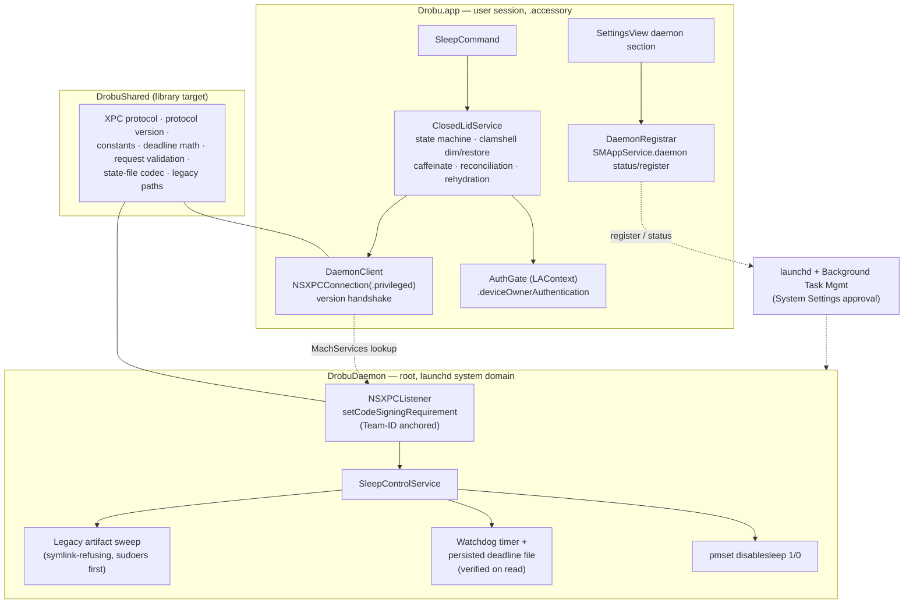
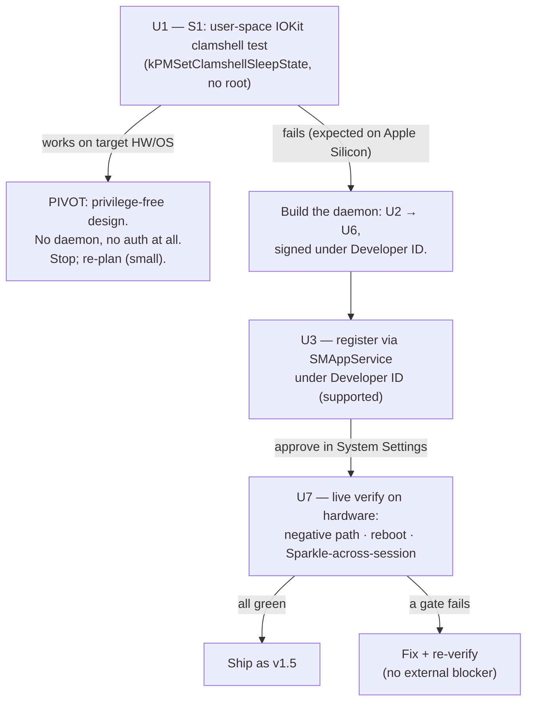

# feat: Touch ID activation for Closed Lid mode via SMAppService privileged daemon

## Summary

Replace Closed Lid mode's `sudo -A` + osascript password-dialog flow with an SMAppService-registered privileged daemon (XPC, code-sign-validated), gated in-app by the native `LAContext` Touch ID / Apple Watch / password sheet. The daemon absorbs everything the current shell choreography does (pmset toggle, watchdog auto-reversal, cleanup, sudoers entry). One cheap spike still runs first — a user-space IOKit clamshell test that, if it works, eliminates the daemon entirely. The app now ships under a **Developer ID Application** cert (Team `TGL69S88MD`, notarized as of v1.4.1), so SMAppService daemon registration is supported and the feature is shippable as v1.5.

---

## Problem Frame

Activating Closed Lid mode today shows a generic osascript password dialog — the user types their admin password into a box that looks like any phishing prompt. Touch ID is the expected macOS experience (System Settings itself offers it for admin unlocks). `LAContext` cannot simply gate the existing sudo flow: `sudo` needs a credential `LAContext` does not produce, and the Authorization-framework bridge that would supply one is broken on macOS 26.3 (`-60008`). So the privilege boundary has to move to a component that is *already* root by prior approval — which is what the daemon provides; Touch ID then gates intent before the privileged request, not the credential itself. The current mechanism is also fragile by construction: every activation shell-installs a transient LaunchDaemon, a cleanup script, and a sudoers NOPASSWD entry, then tears them down — many root-owned moving parts reconciled by timers. A resident SMAppService daemon collapses that choreography into one approved component with a real status API.

Constraints that shaped this plan:

- The Authorization framework (which would have given Touch ID "for free") returns `-60008` on macOS 26.3 — the reason the askpass workaround exists (`.claude/rules/macos-privilege-escalation.md`). Any new design must avoid it.
- The app is signed with a **Developer ID Application** cert, Team `TGL69S88MD`, and notarized (since v1.4.1 — `.claude/rules/sparkle-macos-gotchas.md`). This is exactly the signing tier Apple DTS says SMAppService **daemons** require (an Apple-issued cert with a stable Team ID), so registration is supported — no self-signed `Code=1` blocker, no enrollment wait. The Team ID gives a stable code-signing partition (no per-build cdhash drift), which makes both the XPC peer requirement and BTM approval persistence straightforward.
- Amphetamine-Enhancer (closest prior art) historically achieved closed-display mode with a **user-space IOKit call requiring no root** (`kPMSetClamshellSleepState` on `IOPMrootDomain`). Evidence suggests it no longer works on Apple Silicon (unanswered M2 issues; Amphetamine 5.3 moved to an admin-auth'd script), but if it works on target hardware the entire daemon — and all auth — becomes unnecessary. Cheap to test; must be tested first. Note R1 (Touch ID) is *instrumentally* motivated by the privilege boundary, not an end in itself: if S1 succeeds there is no privileged operation to gate, so Touch ID has no security purpose and the pivot drops it without violating R1 — the pivot dissolves R1's premise rather than contradicting it.

---

## Requirements

**User experience**

- R1. Activating Closed Lid mode prompts the native `LAContext` sheet (`.deviceOwnerAuthentication`: Touch ID, Apple Watch, or password fallback) — never a typed-password osascript dialog. One prompt per activation. Password fallback (clamshell-docked, no Touch ID hardware, `.userFallback`) proceeds to activation as a success path; cancel aborts silently; biometry lockout / auth-unavailable surfaces a visible one-line failure, not silence.
- R2. Stop and expiry require no authentication (the daemon is already root; no sudoers entry needed).
- R3. When the daemon is not yet usable, guidance matches the actual state: `.notRegistered` → the app calls `register()` inline first, then deep-links if approval is needed; `.requiresApproval` / `.notFound` → deep-link to System Settings → Login Items. Never a Touch ID prompt, never a silent failure, never a deep-link to a toggle that doesn't exist yet. Closed Lid mode is unavailable until the daemon is approved — there is no fallback to the old password flow once this ships.
- R4. Existing behavior is preserved: durations (15m/30m/1h/2h/4h), mutual exclusion with Keep Awake, menu-bar badge + live countdown, clamshell dim/restore on lid events, caffeinate companion.

**Privilege architecture**

- R5. All privileged operations (pmset disablesleep toggle, watchdog, cleanup) execute inside an SMAppService-registered root daemon reached over XPC. The new path contains no sudo, no sudoers, no osascript, no Authorization framework.
- R6. The daemon accepts XPC connections only from Drobu, enforced via `setCodeSigningRequirement` pinned to the **Apple-anchored Team-ID form** — `anchor apple generic and identifier "com.danielius.ClipboardHistory" and certificate leaf[subject.OU] = "TGL69S88MD"` (the exact designated requirement is read from the signed build via `codesign -d -r-`). Never a binary cdhash (per-build drift, `.claude/rules/keychain-and-crypto.md`) and never an unanchored CN/OU match — `anchor apple generic` forces the Apple CA chain a local attacker cannot forge, while the Team ID + identifier survive every rebuild.
- R7. The watchdog guarantees `pmset disablesleep` reversal on normal stop, on app crash/SIGKILL, on daemon restart, and across reboots: the daemon persists the session deadline and reconciles on start — past-deadline or orphaned state is reversed; a still-live session is re-armed to its **original absolute deadline**. Reconciliation is agnostic to whether `pmset disablesleep` itself survives a reboot (empirically unconfirmed — see Open Questions): it re-applies `disablesleep 1` when the setting is off but the session is live, and re-arms only when it is already on. This improves on the legacy behavior, which restarted the full countdown after reboot.
- R8. The daemon validates requests: duration bounded to the known set plus slack, **and a cumulative duty-cycle ceiling** so a looping or hostile caller cannot hold sleep off indefinitely by re-arming. Starting values (tunable — see Open Questions): cumulative active time capped at **8h within a rolling 24h window**, the accumulator persisted alongside the deadline in the state file (survives daemon restart/reboot) and decayed by elapsed wall-clock, reset on a clean user-initiated stop. Validation is the daemon's own control — it must hold even if peer validation were bypassed.

**Session lifecycle**

- R14. After an app relaunch of any kind (crash, Sparkle update, user quit) while a session is live, the client rehydrates from the daemon's persisted session: state machine `.active` with the daemon's remaining time, badge/countdown/stop affordance restored, caffeinate re-seeded from the daemon's deadline — without a new auth prompt and without sending a second `enable`. Orphaned disablesleep with no live daemon session is reversed, not adopted.

**Migration**

- R9. The four legacy artifacts left by the old (pre-daemon) flow are removed on first run of the daemon build: `/Library/LaunchDaemons/com.clipboardhistory.disablesleep-reversal.plist`, `/Library/Application Support/ClipboardHistory/cleanup-disablesleep.sh`, `/etc/sudoers.d/clipboardhistory-cleanup`, and the loaded launchd label `system/com.clipboardhistory.disablesleep-reversal`. The sudoers entry is the standing local-root primitive — it is removed **first** in any cleanup ordering. `Sources/DrobuCore/Services/PrivilegedCommand.swift` is deleted in U5 (the client cutover), since the daemon path is functional from the start under Developer ID.

**Spike and ship gating**

- R10. Spike evidence (the user-space IOKit outcome) and the SMAppService registration outcome under Developer ID are captured in `.claude/rules/smappservice-daemon.md` before the live-verification claim.
- R11. The feature ships only after live end-to-end verification on real hardware — including the **negative path**: a binary signed with a different identity must be refused by the daemon's listener, and the legitimate build accepted. Plus a Sparkle-update resilience check crossing a live session.

**Quality**

- R12. New logic in Services/, Models/, and the shared target ships with Swift Testing tests in the same commit. XPC wire, SMAppService registration, and real pmset/launchctl are not tested directly — injectable protocol abstractions are (per `.claude/rules/testing-conventions.md`).
- R13. CI stays green: new targets compile under Swift 6 strict concurrency on the older CI SDK (no non-Sendable types crossing actor boundaries; `swift test` must pass on a runner with no daemon registered).

---

## Key Technical Decisions

- **SMAppService daemon, not pam_tid / permanent sudoers / SMJobBless.** Apple's current (macOS 13+) mechanism for exactly this problem; absorbs the watchdog and cleanup into one approved component with a status API; sidesteps the broken Authorization framework. SMJobBless is deprecated; pam_tid mutates system-wide sudo policy; permanent sudoers is the optics/security posture we're escaping.
- **One spike still runs first, and it is the only gate.** S1 (user-space IOKit clamshell) can obviate the entire daemon and costs minutes, so it precedes any scaffolding. The former second spike (registration under self-signed, predicted to fail) is moot now that the app is Developer-ID-signed and notarized — registration is supported; U3 confirms approval behavior rather than probing for a blocker.
- **`DrobuShared` library target carries the XPC protocol, an explicit protocol-version integer, shared constants, and all testable daemon logic.** SPM cannot import executable targets into tests, so the daemon executable (`DrobuDaemon`) stays a thin wiring layer over library code. Also keeps GRDB/HotKey/Sparkle/SwiftUI out of the root process — the daemon depends on `DrobuShared` only.
- **`LAContext` is consent UX, not an authorization control.** The Touch ID result never reaches the daemon and is not verified daemon-side; a hostile XPC client skips it entirely. The privilege boundary is the one-time BTM approval plus the XPC code-sign requirement — which makes the requirement string the load-bearing control (next decision). Policy `.deviceOwnerAuthentication` (password fallback covers clamshell-docked Macs and no-Touch-ID hardware; Apple Watch included); no entitlement or Info.plist key needed on macOS for a non-sandboxed app. Stated plainly so no future reader mistakes the Touch ID sheet for the boundary.
- **XPC peer validation pinned to the Apple-anchored Team ID, not CN and not cdhash.** `anchor apple generic and identifier "com.danielius.ClipboardHistory" and certificate leaf[subject.OU] = "TGL69S88MD"` is unforgeable (the Apple CA chain cannot be minted by a local attacker) and stable across every rebuild (the Team ID and identifier do not change). A cdhash pin would break every rebuild; an unanchored CN match would be spoofable. The exact designated requirement is captured from the signed build via `codesign -d -r-` and committed as a constant in `DrobuShared`. (This is the form the prior self-signed plan deferred to "migration" — the migration already happened in v1.4.1, so the daemon adopts it directly.)
- **The daemon's persisted deadline is the single source of truth for session end.** The daemon owns the watchdog (internal timer + root-owned state file); the client seeds caffeinate's `-t` from the daemon's reported remaining time on every (re)adoption — never from the nominal duration — so the two timers cannot diverge after a crash or relaunch. The state file is trusted only after verification on read: root-owned, mode 0600 in a 0700 root-owned directory, deadline bounded by `now + maxDuration + slack` (a tampered future-dated deadline is treated as orphaned state and reversed).
- **`enable` is idempotent and re-arms in place.** Activating while already active re-validates, re-persists the deadline, and re-arms the timer in one transactional call — never passing through a disabled/cleared intermediate state. A failed re-arm leaves the prior session intact. The client's legacy "stop first, then start" becomes a single `enable` call across the boundary.
- **`stop()` is confirmed-by-readback; termination defers to the watchdog.** The client does not transition to `.idle` until the daemon's `disable` reply (or a status/pmset readback) confirms reversal; on XPC failure during stop it stays in a pending-reversal state with reconciliation running. On SIGTERM/SIGHUP/`applicationWillTerminate`, the client attempts a bounded-wait disable then exits — if the message doesn't make it, the watchdog deadline is the guarantee. This is a stated behavior change: today termination reverses sleep within milliseconds; under the daemon a missed disable defers reversal to the deadline. Accepted: the deadline is bounded (≤4h) and the alternative (blocking exit on XPC) is worse.
- **Protocol-version handshake with a defined mismatch policy.** Client compares `DrobuShared`'s protocol-version integer against the daemon's on connect. Mismatch (stale daemon after an update) → refuse activation, attempt `register()` to install the bundled daemon, and surface re-approval guidance if required — never talk a newer protocol at an older daemon.
- **Daemon signing rides the existing notarized Developer ID pipeline.** The daemon executable is signed with the same `Developer ID Application: DANIELIUS ISIŪNAS (TGL69S88MD)` identity, hardened runtime (`--options runtime`) + secure timestamp (`--timestamp`), inside-out (daemon before the outer bundle, mirroring the Sparkle pattern in `build.sh`), with a stable explicit `--identifier` (guards against AMFI launch-constraint identifier drift on Sparkle bundle replacement — Mozilla VPN case, Apple forums 795022). It is included in the bundle that `release.sh` notarizes and staples. App launch reconciles registration state after updates.
- **Legacy cleanup: daemon-side sweep is primary; client `sudo -n` is a fallback for installs that never approve the daemon.** The daemon is root and needs no sudoers dependency; it sweeps the four legacy paths on first start with the sudoers entry deleted first. The client's one-shot best-effort `sudo -n <legacy-cleanup-script>` (promptless via the legacy NOPASSWD entry, on machines that still have it from an old install) covers the case where the daemon is never approved — and only runs after verifying the script path is root-owned and not group/other-writable, since invoking a tamperable path via sudo would be a root-escalation hand-off.
- **Client-side responsibilities stay client-side.** State machine, clamshell dim/restore (unprivileged IOKit), caffeinate companion, reconciliation timer, and the `pmset -g` read all remain in `ClosedLidService`; only privileged writes cross XPC.
- **Daemon logging goes to its own root-owned file.** A root daemon has no user home; it cannot reuse `Log` (which writes to `~/Library/Application Support/...`). The daemon logs to `/Library/Application Support/ClipboardHistory/daemon.log` (root-owned, 0600, created under `umask(0o077)` per `.claude/rules/file-permission-hardening.md`).

---

## High-Level Technical Design

### Component topology



### Spike decision gate



### Activation sequence

```mermaid
sequenceDiagram
  participant U as User
  participant P as PanelView (/sleep)
  participant C as ClosedLidService
  participant A as AuthGate (LAContext)
  participant D as DrobuDaemon (root)
  U->>P: pick Closed Lid · 1h
  P->>C: start(duration)
  C->>C: daemon status check
  alt status == .notRegistered
    C->>C: register() inline
    alt now .requiresApproval
      C-->>U: guidance alert → "Open System Settings"
    end
  else status == .requiresApproval / .notFound
    C-->>U: guidance alert → "Open System Settings"
  else enabled
    C->>D: version handshake
    alt protocol mismatch
      C-->>U: re-register + re-approval guidance
    else match
      C->>A: evaluate(.deviceOwnerAuthentication)
      A-->>U: Touch ID / Watch / password sheet
      A-->>C: success (password fallback = success; cancel → silent abort; lockout → visible failure)
      C->>D: enable(durationSeconds) over XPC
      D->>D: validate (bounds + cumulative ceiling) · pmset disablesleep 1 · persist deadline · arm watchdog
      D-->>C: ok (transactional; idempotent re-arm if already active)
      C->>C: state = .active · caffeinate seeded from daemon remaining · clamshell monitor · reconciliation
    end
  end
```

---

## System-Wide Impact

- **Termination semantics change.** Today SIGTERM/`applicationWillTerminate` reverse `pmset` synchronously (blocking sudo) before exit; after this work they attempt a bounded-wait XPC disable, and a missed message defers reversal to the watchdog deadline. The signal handlers in `Sources/DrobuCore/App/AppDelegate.swift` and `ClosedLidService.cleanup()` are rewritten to this contract — they must not call into the deleted sudo path.
- **AppDelegate launch sequence changes.** `auditDisableSleep()` (orphan detection keyed to the legacy LaunchDaemon plist path) becomes dead and misleading after migration — it is replaced by a launch-time daemon `status()` query that rehydrates a live session (R14) or reverses a true orphan. The signal-handler install and `applicationWillTerminate` wiring are revisited in the same change.
- **XPC failure surfaces reach the UI.** Daemon-unavailable / connection-invalid / protocol-mismatch are new error classes that did not exist under the synchronous sudo path; each maps to a defined user-facing outcome (silent, guidance alert, or visible failure) routed through `SleepCommand`, not swallowed.
- **Two independent clocks collapse to one.** The client caffeinate `-t` and the daemon watchdog deadline could diverge after a relaunch; the daemon's persisted deadline becomes the single source of truth, with caffeinate re-seeded from the daemon's reported remaining time on every adoption.
- **Build/release graph grows a target.** A new `DrobuShared` library and `DrobuDaemon` executable enter `Package.swift`, `build.sh` (inside-out Developer-ID signing + plist copy), `release.sh` (the daemon is inside the notarized/stapled bundle), and the test target's dependencies. CI must compile all targets on the older SDK with a runner that has no daemon registered.

---

## Implementation Units

### Phase A — Spike and scaffold

### U1. Spike S1: user-space clamshell sleep test

- **Goal:** Determine in minutes whether `kPMSetClamshellSleepState` on `IOPMrootDomain` still works without root on target hardware (Apple Silicon, macOS 26) — if yes, the daemon and all auth are unnecessary and the plan pivots.
- **Requirements:** R10.
- **Dependencies:** none.
- **Files:** `tools/spikes/clamshell-spike.swift` (self-contained script runnable via `swift tools/spikes/clamshell-spike.swift`; intentionally outside the SPM build graph — `swift test` will not compile it, so it can rot undetected and is a throwaway probe, not shipping code).
- **Approach:** Port the Amphetamine-Enhancer `CDMManager` call (IOPMLib, `IOPMrootDomain` setProperty, Phil Dennis-Jordan technique) into a one-shot script that sets clamshell-sleep off, prints the IOReturn, waits for a keypress, and restores. Manual protocol: run, close lid on AC power, observe whether the Mac stays awake (external display or ping from phone), reopen, restore, verify with `pmset -g`.
- **Test scenarios:** Test expectation: none — manual spike experiment; the artifact is the recorded outcome (IOReturn code + observed lid behavior) in `.claude/rules/smappservice-daemon.md`.
- **Verification:** Outcome recorded with hardware/OS context. Requires the user at the machine. If sleep is prevented: stop the chain at the gate and surface the pivot decision. If the call fails or the lid still sleeps: proceed to U2.

### U2. Daemon scaffold: targets, plist, bundle assembly

- **Goal:** A no-op `DrobuDaemon` exists in the bundle with its launchd plist, Developer-ID-signed, so registration can be exercised and Phase B has its skeleton.
- **Requirements:** R5 (structure), R13.
- **Dependencies:** U1 (gate: S1 failed).
- **Files:** `Package.swift`; `Sources/DrobuShared/DaemonConstants.swift` (new target); `Sources/DrobuShared/ProtocolVersion.swift`; `Sources/DrobuDaemon/main.swift`; `Sources/DrobuDaemon/com.danielius.ClipboardHistory.daemon.plist`; `build.sh`; `Tests/DrobuTests/DaemonConstantsTests.swift`.
- **Approach:** Add library target `DrobuShared` (no dependencies — verified leaf, no circularity: `DrobuShared` imports nothing back) and executable target `DrobuDaemon` (depends on `DrobuShared` only). `DrobuCore` gains a dependency on `DrobuShared`, **and `DrobuShared` is added to the `DrobuTests` target's `dependencies`** so the new logic suites can `@testable import DrobuShared`. Constants: label/mach-service name `com.danielius.ClipboardHistory.daemon`, the Team-ID-anchored code-sign requirement string, legacy artifact paths, daemon state-file and log paths, protocol-version integer. Plist: `Label`, `BundleProgram` → `Contents/MacOS/DrobuDaemon`, `MachServices`, `RunAtLoad: true` — no SMJobBless keys (`SMAuthorizedClients`/`SMPrivilegedExecutables` cause error 108). `build.sh` (already a single Developer-ID path — no ad-hoc branch, fails loudly if the cert is missing): copy daemon binary into `Contents/MacOS/`, plist into `Contents/Library/LaunchDaemons/`, and sign the daemon **before** the app bundle with the resolved `Developer ID Application` identity, `--options runtime`, `--timestamp`, and a constant explicit `--identifier`. The daemon's identity anchor is the Team ID + `--identifier` (a bare SPM executable carries no embedded `__TEXT,__info_plist`; no daemon Info.plist is required) — its stability across Sparkle replacement is what U7's live test validates.
- **Patterns to follow:** Sparkle embedding + inside-out Developer-ID signing in `build.sh` (the hardened-runtime + `--timestamp` discipline from `.claude/rules/sparkle-macos-gotchas.md` "Notarization requires hardened runtime + secure timestamp on ALL nested code"); `ditto` not `cp -r` (`.claude/rules/macos-distribution.md`); Info.plist copy pattern for the daemon plist.
- **Test scenarios:** Constants round-trip — the daemon plist is declared as a **test resource** (`resources:` in the test target, read via `Bundle.module`) rather than a bare CWD-relative path, so the test resolves it identically on CI and locally; assert its `Label`/`MachServices` key equals the `DaemonConstants` mach-service name (catches plist↔constant drift); legacy path list matches the four documented artifacts exactly; protocol-version constant is a positive integer. Build verification is U2's main check.
- **Verification:** `swift test` green; `./build.sh --install` produces a bundle where `codesign -vv` passes for daemon and app, and `codesign -dvvv` on the daemon shows `Timestamp` set and `flags=0x10000(runtime)`; CI compiles all targets.

### U3. Registration + permanent daemon status surface

- **Goal:** Register the no-op daemon via `SMAppService.daemon(plistName:)` from a new Settings row under Developer ID (registration supported); confirm approval persists across rebuilds; leave behind the permanent status/approval UI with state-correct remediation.
- **Requirements:** R3, R10.
- **Dependencies:** U2.
- **Files:** `Sources/DrobuCore/Services/DaemonRegistrar.swift`; `Sources/DrobuCore/Views/SettingsView.swift`; `Tests/DrobuTests/DaemonRegistrarTests.swift`; `.claude/rules/smappservice-daemon.md` (new).
- **Approach:** `DaemonRegistrar` wraps `SMAppService.daemon` behind a thin protocol (injectable for tests) exposing a mapped status enum (`notRegistered` / `requiresApproval` / `enabled` / `notFound` / failure(Error)) plus `register()`, `unregister()`, and `openApprovalSettings()` (`SMAppService.openSystemSettingsLoginItems()`). Remediation is state-correct: `.notRegistered` → call `register()` inline (which *creates* the approval toggle), then deep-link only if the result is `.requiresApproval`; `.requiresApproval` / `.notFound` → deep-link straight to Login Items (never send a `.notRegistered` user to a toggle that doesn't exist yet). Settings gains a "Closed Lid" section following the launch-at-login `SMAppService.mainApp` precedent in `SettingsView` — status row + action row + an "unregister" affordance (orphan recovery). Settings-scene gotchas apply: `Text` + `.onTapGesture` (+ `.accessibilityAddTraits(.isButton)`), no `Button`, no `.alert` (`.claude/rules/swiftui-macos-gotchas.md`, `.claude/rules/accessibility.md`).
- **Registration protocol (manual):** build + install the Developer-ID-signed bundle → `register()` → approve in System Settings → Login Items → confirm `.enabled` → rebuild + reinstall → confirm approval **persists** without re-prompting (`sfltool dumpbtm` shows a Team-ID/cert-anchored designated requirement, not a cdhash; the stable Team ID is why it persists). `sfltool resetbtm` + reboot to reset state between trials if needed. Record the observed behavior in the rules file.
- **Test scenarios:** Status mapping covers every `SMAppService.Status` case plus thrown registration errors; registrar mock drives the Settings row through `.notRegistered` (→ auto-register path), `.requiresApproval` (→ deep-link), `.enabled`, and failure states. Covers R3's state-correct remediation at the unit level.
- **Verification:** Registration + approval persistence documented in `.claude/rules/smappservice-daemon.md`; Settings row reflects live status. Requires the user at the machine (and the Developer ID cert in the local keychain — see Risks).

### Phase B — Daemon implementation

### U4. XPC protocol and daemon service logic

- **Goal:** The daemon does the real work: transactional, idempotent enable/disable of `pmset disablesleep`, watchdog with a verified persisted deadline, boot reconciliation that re-arms live sessions, spoof-resistant peer validation, hazard-aware legacy sweep, root-side logging.
- **Requirements:** R5, R6, R7, R8, R9 (daemon-side sweep), R14 (daemon `status()` source of truth).
- **Dependencies:** U2.
- **Files:** `Sources/DrobuShared/DaemonXPCProtocol.swift`; `Sources/DrobuShared/SleepSessionState.swift` (deadline math + state-file codec, `now:`-closure injectable); `Sources/DrobuShared/RequestValidation.swift`; `Sources/DrobuDaemon/SleepControlService.swift`; `Sources/DrobuDaemon/Watchdog.swift`; `Sources/DrobuDaemon/LegacySweep.swift`; `Sources/DrobuDaemon/DaemonLog.swift`; `Sources/DrobuDaemon/main.swift`; `Tests/DrobuTests/SleepSessionStateTests.swift`; `Tests/DrobuTests/RequestValidationTests.swift`.
- **Approach:** `@objc` protocol with reply blocks (NSXPCConnection is callback-based; client wraps in continuations): `enable(durationSeconds:reply:)`, `disable(reply:)`, `status(reply:)` (returns remaining time / active flag — the rehydration source), `protocolVersion(reply:)`, `daemonVersion(reply:)`. All parameter/reply types are Sendable-safe primitives (R13; keep non-Sendable types off the actor hop, `.claude/rules/media-editing-gotchas.md`). Listener delegate applies `setCodeSigningRequirement` with the Team-ID-anchored constant **before** resume — and **fails closed**: if the call throws (e.g. `errSecCSNoSuchCode` from a dev location), the listener refuses every connection rather than accepting unvalidated peers. The requirement string is captured from the signed build via `codesign -d -r-` and committed to `DrobuShared` (the negative-path test in U7 proves the requirement actually engages). `enable` is transactional **and idempotent**: validate (bounds + cumulative duty-cycle ceiling) → if already active, re-validate/re-persist/re-arm in place without passing through a cleared state; any failure leaves the prior session intact and reverts partial steps. Watchdog fires → `pmset disablesleep 0` + clear state. State file: root:wheel 0600 in a root:wheel 0700 dir, created under `umask(0o077)`; **verified on read** (wrong owner / loose mode / deadline beyond `now + maxDuration + slack` → treat as untrusted → reverse + rewrite). On daemon start: sweep legacy artifacts once (sudoers entry **first**, `lstat`-refusing symlinks, verifying the base dir is root-owned and not group/other-writable, never `rm -rf`), then reconcile.
- **Reconciliation decision table (enumerated, not just the reversal cell):**
  - state present, deadline future, SleepDisabled **off** (post-reboot if `pmset disablesleep` did *not* persist — see Open Questions; empirically unconfirmed) → **re-apply `disablesleep 1` + re-arm watchdog to the original absolute deadline**.
  - state present, deadline future, SleepDisabled on (post-reboot if it *did* persist, or app-only restart) → re-arm watchdog to absolute deadline only.
  - state present, deadline past, any → reverse + clear state.
  - state absent, SleepDisabled on → orphan → reverse.
  - state absent, SleepDisabled off → no-op.
- **Test scenarios:** Deadline math at boundaries (exactly expired, 1s left, far future) via injected clock — no wall-clock sleeps. State codec round-trip; corrupt file → untrusted → reverse; valid-but-future-beyond-ceiling deadline → untrusted; wrong-owner/loose-mode → untrusted. Validation: each known duration accepted; zero/negative/>4h+slack rejected; cumulative re-arm beyond the duty-cycle ceiling rejected. Reconciliation decision table: every cell above → expected action (the re-apply+re-arm cell explicitly). `enable` while already active with a new duration updates deadline + re-arms without clearing; `enable` failing validation while active leaves the prior session intact. Legacy sweep: path list exact; idempotent (second run no-ops); swept path is a symlink → refuses, logs, does not follow; base dir group/other-writable → refuses. The XPC wire itself is not tested (R12).
- **Verification:** `swift test` green; manual daemon-side verification deferred to U7.

### U5. Client refactor: ClosedLidService over XPC + LAContext gate (cutover)

- **Goal:** `ClosedLidService.start()` becomes status-check → version handshake → Touch ID gate → idempotent XPC enable; stop is confirmed-by-readback; launch rehydrates a live session. The sudo/osascript path is deleted in this unit — the daemon is functional from the start under Developer ID, so there is no transitional fallback.
- **Requirements:** R1, R2, R3, R4, R7 (client side of reversal), R9 (client cutover + cleanup), R14, R12.
- **Dependencies:** U4.
- **Files:** `Sources/DrobuCore/Services/ClosedLidService.swift`; `Sources/DrobuCore/Services/DaemonClient.swift` (new); `Sources/DrobuCore/Services/AuthGate.swift` (new); `Sources/DrobuCore/Services/SleepCommand.swift`; `Sources/DrobuCore/App/AppDelegate.swift`; delete `Sources/DrobuCore/Services/PrivilegedCommand.swift`; `Tests/DrobuTests/ClosedLidServiceTests.swift` (new).
- **Approach:** `DaemonClient` owns the `NSXPCConnection(machServiceName:options:.privileged)` lifecycle (lazy connect, interruption → reconnect, invalidation → nil out) and exposes an async façade behind a protocol; on connect it runs the protocol-version handshake — mismatch → refuse activation + attempt `register()` + surface re-approval guidance (never speak a newer protocol at an older daemon). `AuthGate` wraps `LAContext` behind a protocol returning `AuthResult { success, cancelled, failed(reason) }`: `.userCancel` → cancelled (silent), automatic password fallback → success (the intended path when the lid is closed and the sensor is unreachable), lockout / biometryNotAvailable → failed (visible). Fresh context per evaluation, `localizedReason` a static string under 60 chars with no PII or internal identifiers (it surfaces in system auth logs). `ClosedLidService` keeps its state machine, clamshell dim/restore, caffeinate companion, and reconciliation timer; caffeinate `-t` is seeded from the daemon's reported remaining time (not nominal duration). `stop()` is **confirmed-by-readback**: it does not set `.idle` until the daemon `disable` reply (or a `status()`/`pmset -g` readback) confirms reversal; on XPC failure during stop it stays pending-reversal with reconciliation running (not idle). **Launch-time rehydration** replaces `auditDisableSleep()`: query daemon `status()` → if a live future-deadline session exists, rebuild `state = .active(...)` with the daemon's remaining time and re-arm caffeinate/clamshell/countdown without a new auth prompt or a second `enable`; a true orphan (disablesleep on, no daemon session) is reversed. The **error enum lives where routing lives** — `SleepCommand.execute`'s existing exhaustive `catch` over `PrivilegedCommandError` is rewritten to the new `ClosedLidError` (the `PrivilegedCommandError` arm is dropped with the deletion of `PrivilegedCommand.swift`), and posts the `.daemonNotApproved` notification (AppDelegate turns it into an `NSAlert`, since Settings-scene `.alert` doesn't fire). Signal handlers / `applicationWillTerminate` attempt a bounded-wait disable (a semaphore-with-timeout bridge from the synchronous handler) then `exit(0)` — a missed message defers to the watchdog (stated behavior change). One-shot legacy cleanup: first launch tries the daemon-side sweep as primary; the client `sudo -n <legacy-cleanup-script>` covers installs that never approve the daemon but still carry the old NOPASSWD entry — an explicit, test-covered step that runs only after `lstat`-verifying the script path is a non-symlink regular file owned by root and not group/other-writable.
- **Patterns to follow:** Injection mirrors `LicenseManager(publicKey:store:now:)` + `InMemoryLicenseStore` (adopt the `now:`-closure for deterministic time tests — do not copy `CaffeinateService`'s `duration: 0` wall-clock hack); state-machine shape mirrors `CaffeinateService`; logging per `Log` conventions (`TypeName: message`, `do/catch` not `try?`, never log user data).
- **Test scenarios:** With mock daemon + mock auth gate + injected clock — happy path (enabled + version match + auth success → `.active`, `onStateChange(.active)` fires exactly once **and only after** both the status-enabled and auth-success gates pass, so the badge can't flash active on a failed activation; daemon received correct duration); auth cancel → stays `.idle`, no daemon call; auth fallback (password) → proceeds to enable; auth lockout → visible failure, `.idle`; `.requiresApproval` → no auth prompt, guidance error; `.notRegistered` → register attempted; protocol mismatch → refuse + guidance, no enable; XPC failure after auth → `.idle`, error logged; `stop()` happy → daemon `disable` confirmed → `.idle`; `stop()` with XPC failure → stays pending-reversal, reconciliation still running, not `.idle`; launch rehydration → mock daemon reports live session with N seconds left → service rehydrates `.active` with correct remaining, no `enable` sent; expiry via reconciliation when mock reports deadline passed; mutual exclusion still stops Keep Awake first; double-`start()` guarded by `isActivating`; clamshell change while idle → no-op; restore-on-stop path invoked; legacy-cleanup invoked only when the script path passes the root-ownership / non-symlink check, skipped otherwise. Edge: daemon enable succeeds but caffeinate spawn fails → state still `.active` (belt-and-suspenders, matches current behavior).
- **Verification:** `swift test` green; no references to `runPrivileged`/`PrivilegedCommandError`/`auditDisableSleep` legacy-plist logic remain; with the daemon approved locally, `pkill -x Drobu; ./build.sh --install && open /Applications/Drobu.app` activates Closed Lid via Touch ID with no Keep Awake regression.

### U6. Activation UX and approval onboarding

- **Goal:** The unapproved/unregistered/orphaned daemon journeys are self-explanatory end to end; status is visible in Settings; accessibility holds.
- **Requirements:** R3, R4 (menu/badge unchanged), R12.
- **Dependencies:** U5.
- **Files:** `Sources/DrobuCore/App/AppDelegate.swift`; `Sources/DrobuCore/Views/SettingsView.swift`; `Sources/DrobuCore/Services/SleepCommand.swift`; `Tests/DrobuTests/SleepCommandErrorMappingTests.swift` (new — the existing SleepCommand suite is `SleepCommandFormattingTests.swift`, confirmed present and formatting-scoped; add a dedicated error-mapping suite rather than overloading it).
- **Approach:** AppDelegate observes the `.daemonNotApproved` notification → `NSAlert.beginSheetModal` with "Open System Settings" → `openApprovalSettings()`. Settings daemon section from U3 gains live status refresh on window focus and the unregister affordance for orphan recovery (drag-to-Trash-without-unregister leaves a stale BTM binding; the affordance + documented `sfltool resetbtm` escape hatch in the rules file cover it). VoiceOver: status row labeled with state; action rows `.isButton`; decorative elements hidden (`.claude/rules/accessibility.md`).
- **Test scenarios:** `ClosedLidError` → user-facing route mapping (silent / guidance notification / visible failure / error-log) for every case, against a mock service, in the new suite. Test expectation for the alert/SwiftUI wiring itself: none — AppKit UI wiring is out of test scope by convention.
- **Verification:** Manual: daemon unregistered → activation produces guidance and the deep-link lands on Login Items; daemon registered-not-approved → correct deep-link; orphaned-daemon state → unregister affordance recovers; VoiceOver reads the Settings section sensibly.

### Phase C — Live verification and release

### U7. Live verification, Sparkle resilience, rules capture, release

- **Goal:** Prove the whole stack live on real hardware — the negative path, reboot reconciliation, and update survival across a live session — then ship v1.5.
- **Requirements:** R7 (live), R10, R11, R14 (live).
- **Dependencies:** U3 evidence; U4–U6.
- **Files:** `.claude/rules/smappservice-daemon.md`; `Sources/DrobuCore/Info.plist` (`CFBundleShortVersionString` → `1.5`, `CFBundleVersion` → `8`) + `website/src/components/DownloadCTA.astro` + `website/src/components/Footer.astro` (`1.5` in the release commit, per CLAUDE.md's three-places rule).
- **Approach (manual protocol):**
  - **Registration persistence:** with the Developer-ID build, register → approve once → rebuild → confirm approval persists (`sfltool dumpbtm` anchor is Team-ID/cert, not cdhash).
  - **Negative path (the boundary proof):** connect to the daemon from a binary signed with a *different* identity → confirm the listener **refuses** it; connect from the legit build → confirm **accepted**. A requirement that silently fails to apply (`errSecCSNoSuchCode` from a dev location) is identical to no requirement — this step is the only thing that proves the gate engages.
  - **Full cycle:** Touch ID prompt → lid closed on AC → stays awake → expiry reverses; reboot mid-session with >50% of a 1h session remaining → boot reconciliation re-applies + re-arms → Mac stays awake lid-closed for the *remaining* time only.
  - **Sparkle across a live session:** install the current shipped build, activate a 2h session, then take the Sparkle update to the daemon build → confirm the session is uninterrupted (lid stays awake), the relaunched client rehydrates the countdown with no second Touch ID prompt, the daemon registers + prompts approval once on first launch of the new build, and record the protocol/daemon-version handshake outcome. (No signing-identity change is involved — the shipped build is already Developer ID — so the AMFI/identity-drift failure mode does not apply here.)
  - **Orphan recovery:** delete the app without unregistering → reinstall → record whether the stale BTM binding self-heals on re-register or strands the user; document recovery (`sfltool resetbtm` escape hatch).
  - **Release:** bump version in the three places, run `./release.sh` (builds + Developer-ID-signs, notarizes + staples both the `.app` — now containing the daemon — and the DMG, EdDSA-signs the stapled DMG, tags, pushes, updates the appcast). The first-launch daemon-approval prompt is new user-facing behavior — note it in the release/update copy.
- **Test scenarios:** Test expectation: none — live verification and release mechanics; the artifact is the verification record and the rules file.
- **Verification:** Every R1–R14 demonstrated live; negative-path rejection proven; Sparkle-across-live-session and orphan-recovery outcomes recorded; version bumped in all three places; v1.5 released.

---

## Scope Boundaries

**In scope:** everything in U1–U7 — spike, daemon, client cutover, approval/onboarding UX, migration cleanup, live verification, and the v1.5 release. With Developer ID in hand there is no Phase B/C ship gate; the units are sequential, not blocked on anything external.

**Deferred to follow-up work**

- `.pkg`-based update path — only if U7 shows Sparkle bundle replacement reliably breaks daemon launch constraints (Sparkle maintainer's recommended escape hatch). Not expected, since the identity is stable across the update.
- Tuning the R8 duty-cycle ceiling against real heavy-user telemetry (see Open Questions).

**Outside scope**

- `CaffeinateService` (`/sleep` Keep Awake) — needs no privileges, untouched.
- Mac App Store distribution (SMAppService daemons are incompatible with sandboxing anyway).
- Stripe/licensing surfaces.

---

## Risks & Dependencies

- **This dev laptop lacks the Developer ID cert (blocking for local work here).** `security find-identity -v -p codesigning` on this machine shows only the legacy self-signed `ClipboardHistoryDev`; the Developer ID Application identity (Team `TGL69S88MD`) lives on the other Mac where v1.4.1 was released. `build.sh` now hard-fails without it. Before building, signing, or running U2/U3/U5/U7 here, import the Developer ID identity (Keychain Access → export the identity + private key from the other Mac, or re-download the cert from the Developer portal and pair it with the private key) — or do the daemon work on the Mac that already has it.
- **Blast radius of `enable` is persistent sleep denial, not annoyance.** A hostile/looping caller arming `disablesleep 1` drains battery and can overheat a bagged laptop; the watchdog is driven by the caller's own duration, so it does not bound abuse. Mitigation: daemon-side cumulative duty-cycle ceiling in `RequestValidation` (R8) — the daemon's own control, independent of peer validation.
- **`LAContext` is consent UX, not a privilege control.** The Touch ID result never reaches the daemon. Stated plainly so it is not mistaken for the boundary; the load-bearing controls are BTM approval + the Team-ID-anchored XPC requirement + daemon-side validation. The negative-path test (U7) is the proof the requirement engages — a silently-unapplied requirement (`errSecCSNoSuchCode`) is the worst case, mitigated by failing closed.
- **Root legacy sweep has symlink/TOCTOU hazards.** Deleting fixed paths as root in an installer-writable tree invites planted-symlink redirection. Mitigation: `lstat`-refuse symlinked components, verify the base dir is root-owned and not group/other-writable, never `rm -rf`, delete the sudoers entry first.
- **The legacy NOPASSWD sudoers entry is a standing local-root primitive while it exists.** It only exists on machines that ran the old (pre-daemon) Closed Lid flow. Mitigation: daemon-side sweep is primary (no sudoers dependency); the client `sudo -n` fallback runs only after verifying the script path is root-exclusively owned; cleanup removes the sudoers line first.
- **State-file tamper defeats the watchdog.** A non-root-writable deadline file could be future-dated to hold sleep off. Mitigation: root:wheel 0600 in a 0700 dir, ownership/mode verified on read, deadline bounded by the same ceiling `enable` enforces.
- **Sparkle bundle replacement may break the daemon (low–medium).** Launch constraints can pin the old cdhash (forums 758329/795022). Mitigations: stable Developer ID identity + constant `--identifier`, launch-time registration reconciliation, protocol-version handshake, U7 live-session resilience test; `.pkg` path as deferred escape hatch. Lower risk than the self-signed case because the signing identity is stable across the update.
- **Pivot (positive).** S1 succeeding invalidates the daemon entirely in favor of a privilege-free design — which is why it runs first.
- **Approval UX friction (low).** One toggle in System Settings on first launch of the daemon build; no programmatic prompt exists. Mitigated by U6. MDM-managed Macs may block approval for standard users — same class of limitation as today's admin-password requirement.
- **First-launch re-prompt after the daemon ships.** Installed 1.4.x users updating to 1.5 will see the one-time Login Items approval prompt for the daemon (a normal Developer ID → Developer ID update; no Keychain/TCC identity change beyond what 1.4.1's migration already settled). Note it in update copy.
- **CI/SDK drift (low).** New targets must compile on the older CI SDK under strict concurrency; mitigated by the Sendable-primitive XPC surface and `swift test` in CI (R13).
- **New attack surface and maintenance burden on a solo-maintained product (accepted).** A resident root daemon is more to secure and maintain than the current per-activation script. Accepted deliberately: the daemon is small and single-purpose (pmset toggle + watchdog), the boundary is hardened above (Team-ID requirement, fail-closed, validation, verified state file), and it *removes* the standing sudoers primitive the current flow leaves behind — net surface is plausibly lower, not higher.

---

## Open Questions

- Does approval survive a Sparkle update with the (stable) Developer ID identity, or is one-time re-approval needed per update? U7 measures it; the answer shapes update-notes copy, not the architecture.
- When an N+1 client meets an N daemon after an update, does the bundled daemon get pulled by `register()` cleanly, or is explicit unregister→register needed? The handshake defines the *policy* (refuse + re-register); U7 records the *observed* recovery path.
- Does `pmset disablesleep 1` survive a reboot? The prior closed-lid plan asserts it persists; the reconciliation design (U4) is built to be correct either way, but the empirical answer determines which decision-table cell fires post-reboot. Confirmed during U7's reboot-mid-session step.
- Are the R8 duty-cycle starting values (8h cumulative / rolling 24h window) right for real heavy users (e.g. someone running long unattended jobs lid-closed daily)? Too tight trips legitimate use; too loose weakens the control. Tunable constants in `DrobuShared`; revisit against real usage.

---

## Sources & Research

**Local:** `Sources/DrobuCore/Services/ClosedLidService.swift` (state machine, legacy paths, clamshell IOKit, signal-handler/cleanup paths), `Sources/DrobuCore/Services/SleepCommand.swift` (the actual error-routing site — `execute`'s exhaustive `PrivilegedCommandError` catch), `Sources/DrobuCore/Services/PrivilegedCommand.swift` (flow being replaced), `Sources/DrobuCore/App/AppDelegate.swift` (`auditDisableSleep` orphan check + signal handlers), `build.sh` + `release.sh` (Developer-ID signing, hardened runtime + `--timestamp`, notarize + staple — `.claude/rules/sparkle-macos-gotchas.md`, `.claude/rules/macos-distribution.md`), `Sources/DrobuCore/Views/SettingsView.swift` (`SMAppService.mainApp` row precedent), `Sources/DrobuCore/Services/LicenseManager.swift` (`now:`-closure injection precedent), `Tests/DrobuTests/SleepCommandFormattingTests.swift` + `CaffeinateServiceTests.swift` (test shapes), `.github/workflows/tests.yml` (path filter), `docs/plans/2026-02-27-feat-closed-lid-mode-plan.md` (four-layer safety model; auth approach superseded — read for launchd mechanics only), `.claude/rules/` (keychain-and-crypto, sparkle-macos-gotchas, macos-privilege-escalation, file-permission-hardening, testing-conventions, swiftui-macos-gotchas, accessibility).

**External (load-bearing):**

- Apple forums 799910, 733046, 751439 — DTS/Quinn: SMAppService daemons require an Apple-issued Team ID cert (Developer ID satisfies this); daemon runs as root.
- Apple forums 795022 (Mozilla VPN), 758329 — AMFI launch-constraint breakage on bundle replacement; stable `--identifier` fix; Sparkle discussions 2423/2572 — bundle-replacement caveats, decouple daemon management from update callbacks.
- theevilbit SMAppService deep dive — `sfltool dumpbtm` shows cert-anchored designated requirement; re-registration persistence; `sfltool resetbtm` recovery.
- Apple forums 681053, 744791, 757628 — `setCodeSigningRequirement` (macOS 13+) supersedes audit-token validation; requirement via `anchor apple generic` + Team ID; dev-location sandbox caveat `errSecCSNoSuchCode` (why the negative-path test matters).
- dev.to "macOS Apps With Embedded Daemons" + Apple sample (thread 799910) — plist shape (`BundleProgram`, `MachServices`), error 108 from legacy SMJobBless keys.
- trilemma-dev/SwiftAuthorizationSample, alienator88/HelperToolApp — SPM app+helper+shared target structure; SMAppService reference implementation.
- x74353/Amphetamine-Enhancer (`CDMManager/AppDelegate.m`, launch agent plist, guard script) — user-space `kPMSetClamshellSleepState` technique (S1), WatchPaths fail-safe, three-gate guard pattern; unmaintained since ~2022, M2 issues unanswered (why S1 is a question, not an answer).
- Apple docs — `LAPolicy.deviceOwnerAuthentication` (Apple Watch + password fallback), `NSFaceIDUsageDescription` is iOS-only, `touchIDAuthenticationAllowableReuseDuration` max 5s.
