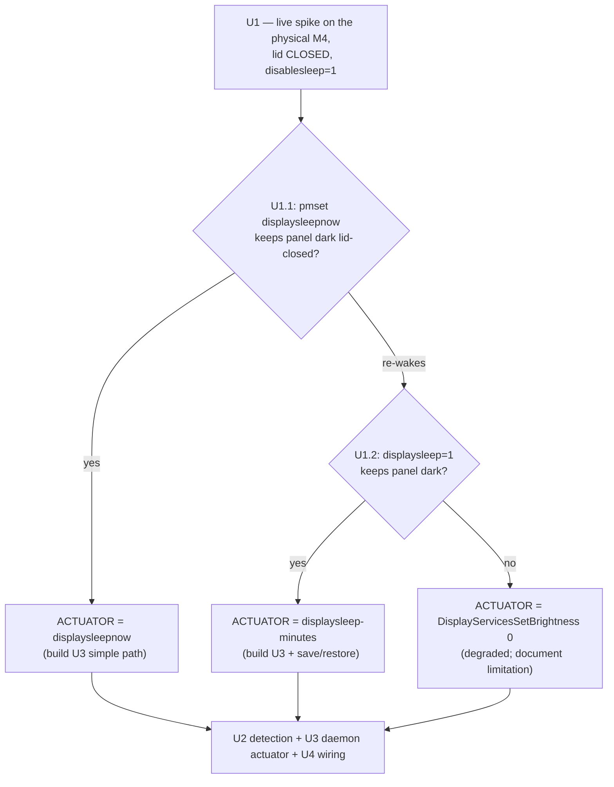
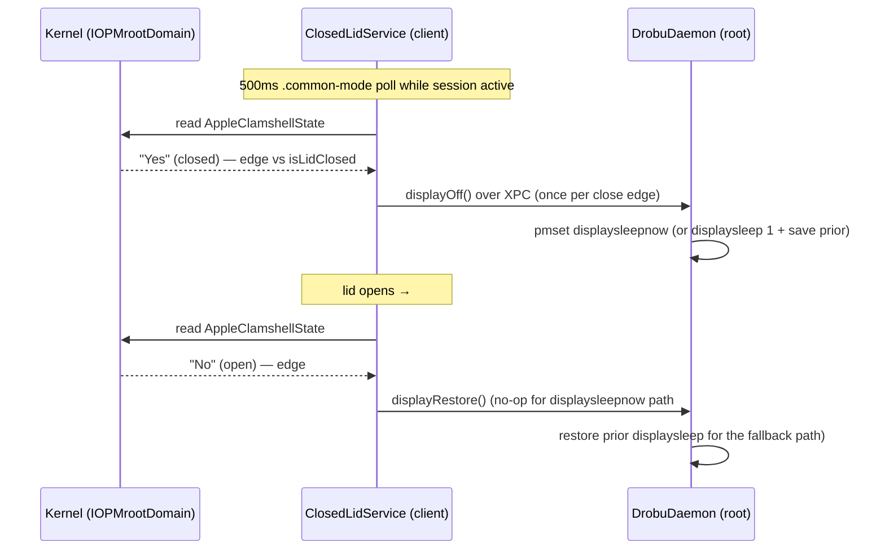

# feat: Turn off the internal display on lid-close (Closed Lid mode, Apple Silicon)

## Summary

Closed Lid mode keeps the Mac awake with the lid shut via a root daemon running `pmset disablesleep 1` (shipped in PR #31, working). But the built-in panel's backlight stays **on** inside the closed clamshell — wasted power and heat. The original `ClosedLidService` dim logic (lid-change IOKit notification + `IODisplaySetFloatParameter` brightness) is Intel-era and a silent no-op on Apple Silicon. This plan replaces both halves with mechanisms that work on the target hardware (Apple M4 Pro, macOS 26.3.1): **poll `AppleClamshellState`** for lid detection, and **`pmset displaysleepnow` issued by the daemon** for display-off — gated behind a one-time **live hardware spike** that confirms the panel actually stays dark lid-closed under `disablesleep`. A public fallback (`displaysleep 1` for the session) and a degraded last resort (`DisplayServicesSetBrightness 0`) bound the risk so the feature ships regardless of the spike's exact outcome.

This is a **follow-up to PR #31** (branch `feat/touchid-closed-lid-daemon`). The daemon, Touch ID gate, registration, and stay-awake behavior are done and out of scope here.

---

## Problem Frame

The decisive finding from research + live M4 probing: **the display-sleep and system-sleep assertion lanes are independent on Apple Silicon.** With `disablesleep 1` active, `PreventUserIdleDisplaySleep` reads `0` and `displaysleep 10` is honored — so `disablesleep` does **not** pin the display awake. We are not fighting powerd; the panel stays lit only because nothing tells it to sleep when the lid closes (the OS's normal lid-close display-off is part of the sleep path that `disablesleep` suppresses, and the app's compensating dim is dead on this hardware).

So the work is two independent, tractable pieces — a working **trigger** (detect lid-close) and a working **actuator** (sleep the panel) — plus a spike to confirm the actuator holds the panel dark for the full closed interval.

Constraints that shaped this plan:

- **Both current code paths are dead on Apple Silicon.** `kIOPMMessageClamshellStateChange` via `IOServiceAddInterestNotification` never fans out on the M4 (confirmed: no breadcrumb logged), and `IODisplaySetFloatParameter("brightness")` over `IODisplayConnect` is a no-op (the panel is on the `IOMobileFramebuffer` path). Both are deleted, not patched.
- **Developer-ID-safe APIs only.** The app is notarized under Developer ID; it cannot use entitlement-gated private APIs (SkyLight `SLSDisplayPowerControlClient` needs `com.apple.private.SkyLight.displaypowercontrol`, which AMFI rejects on injected entitlements) or kexts (notarization-incompatible).
- **The daemon is the single `pmset` owner.** PR #31's daemon serializes `pmset disablesleep` under a lock + watchdog + boot reconciliation. Any new `pmset` invocation must route through it, not a competing client call, to avoid split-brain power state — especially the fallback, which mutates the user's global `displaysleep` setting and must be restored even across a client crash.

---

## Requirements

- **R1.** While a Closed Lid session is active, closing the lid turns the internal panel **off** (dark) and keeps the system awake; the off-action fires once per close edge, not repeatedly.
- **R2.** Opening the lid restores normal display behavior, and any session-scoped power setting the daemon temporarily changed (fallback path) is restored to its prior value — on lid-open, on session stop/expiry, and on daemon boot reconciliation if the session is gone.
- **R3.** Lid detection works on Apple Silicon (M4) — via `AppleClamshellState`, not the notification that never fires there.
- **R4.** Display-off and any `displaysleep`-setting mutation are routed through the existing root daemon (single `pmset` owner) and bound to the session lifecycle the daemon already manages — a crashed/killed client never leaves the user's `displaysleep` permanently lowered.
- **R5.** If true panel-off proves unachievable with public APIs, the feature still ships in a **degraded** mode (minimum brightness via `DisplayServicesSetBrightness`, panel still electrically lit) with the limitation documented — never blocked entirely.
- **R6.** The display-off **mechanism is chosen by a live hardware spike before the production code is built** — the build commits only to a spike-confirmed (trigger, actuator) pair.
- **R7.** Pure/parseable logic (clamshell-state parsing, close/open edge detection) ships with Swift Testing unit tests in the same commit; real `pmset`/IOKit/XPC are not unit-tested (carried-over R12 from PR #31) and are verified live.
- **R8.** No regression to the stay-awake feature: `disablesleep` ownership, the watchdog, reconciliation, and the `caffeinate -ims` companion (deliberately no `-d`, so it permits display sleep) are unchanged.

---

## Key Technical Decisions

- **Lid detection: poll `AppleClamshellState` on `IOPMrootDomain`, not the interest notification.** The kernel sets the `AppleClamshellState` property (`"Yes"` = closed / `"No"` = open) **before** it messages clients, so the property is authoritative even when the `kIOPMMessageClamshellStateChange` notification never reaches user space — which is exactly the current M4 bug. Cache the `io_service_t` from `IOServiceGetMatchingService(IOPMrootDomain)` and read it via `IORegistryEntryCreateCFProperties` on a 500ms `.common`-mode `Timer` (matches the `ClipboardMonitor`/reconciliation cadence; `.common` mode per `.claude/rules/nsmenu-statusitem-gotchas.md` so it keeps firing during menu tracking). Edge-trigger on an `isLidClosed` bool so the off-action fires once per close. *Optional:* keep a `kIOGeneralInterest` notification as a wake-up hint that reads the property immediately on **any** `messageType` (never filter on `kIOPMMessageClamshellStateChange` — that filter is the bug); the poll remains the source of truth.
- **Display-off: `pmset displaysleepnow`, issued by the daemon.** The verb is undocumented in macOS 26's `pmset` usage but exists and exits 0. Adding it to the daemon's `PmsetControl` is a one-line extension of the audited path that already runs `pmset disablesleep`. Routed through the daemon (not a client `pmset` call) to keep `pmset` single-owner. Confidence is MEDIUM until the spike confirms the panel **stays** dark lid-closed (a `UserIsActive` assertion could theoretically re-wake it — the spike's make-or-break check).
- **Fallback (if `displaysleepnow` doesn't hold lid-closed): daemon lowers `displaysleep` to 1 minute for the session, restores the prior value after.** Fully public, supported `pmset`. Because it mutates a persistent user setting, it **must** be daemon-owned and bound to the same session deadline/watchdog/reconciliation as `disablesleep`, so a crashed client can't strand the user at a 1-minute display timeout. The prior value is saved alongside the session state.
- **Degraded last resort: `DisplayServicesSetBrightness(displayID, 0.0)`.** Present on this machine, no entitlement, but only **minimum** brightness — the panel stays electrically lit (less heat/battery benefit). Ships safely with a documented limitation; chosen only if both `pmset` variants fail the spike.
- **Rejected mechanisms (confirmed dead/ungrantable on Apple Silicon — do not implement):** `IODisplayWrangler` + `IORequestIdle` (the node is a placeholder, not in `pmset -g powerstate`, no display-power consumer wired on M-series); `IODisplaySetFloatParameter`/`IODisplayConnect` brightness (the current dead code); SkyLight `SLSDisplayPowerControlClient` (ungrantable private entitlement); `IOMobileFramebuffer` `setPowerState` / any kext (notarization-incompatible).
- **Protocol-version bump.** Adding `displayOff()` (and, if the fallback is chosen, display-sleep save/restore) to the XPC protocol bumps `drobuDaemonProtocolVersion` 1 → 2. PR #31's handshake already refuses a client/daemon protocol mismatch and re-registers — so a Sparkle update must ship client + daemon together (they always do; they're in one bundle).
- **`caffeinate -ims` is left exactly as-is.** It deliberately omits `-d`, so it does not assert against display sleep — a happy accident that means the companion won't fight `displaysleepnow`. Touching it is out of scope.

---

## High-Level Technical Design

### Spike decision gate (mechanism is chosen here, before U2–U4 build)

### Lid-close → display-off flow (production)

---

## Implementation Units

### Phase A — Spike (gate)

### U1. Live hardware spike: display-off mechanism, lid-closed, under `disablesleep`

- **Goal:** Determine which actuator keeps the M4 internal panel **dark for the full closed interval** while `disablesleep 1` is active, so U3 commits to a spike-confirmed mechanism. This is the make-or-break gate; everything downstream depends on its outcome.
- **Requirements:** R6.
- **Dependencies:** none.
- **Files:** `tools/spikes/display-off-spike.md` (a recorded manual protocol + the one-liners to run; intentionally outside the SPM build graph, a throwaway probe like `tools/spikes/clamshell-spike.swift`). Outcome recorded in `.claude/rules/smappservice-daemon.md` (or a new `.claude/rules/applesilicon-display.md`).
- **Approach:** Run on the **physical M4 with the lid actually closed** (prior probing was lid-open) and `disablesleep 1` active (daemon session running), observing via SSH/log from another device since the screen is the thing under test. **Already answered — do NOT re-spend budget:** `displaysleepnow` exists/exits 0, `IODisplayWrangler` is unwired, `AppleClamshellState` exists and reads `No` lid-open.
  - **U1.1 (make-or-break):** enable Closed Lid → `sudo pmset displaysleepnow` → close lid → reopen after ~60s. Does the backlight extinguish **and stay off**? Watch `pmset -g assertions` for `PreventUserIdleDisplaySleep` flipping to 1 or `UserIsActive` re-firing. If it stays dark → ship `displaysleepnow` (U3 simple path). If it re-wakes within seconds → U1.2.
  - **U1.2 (fallback):** `sudo pmset -a displaysleep 1`, close lid, observe stay-dark; restore the prior value after. If it holds → U3 implements the save/lower/restore path.
  - **U1.3 (detection sanity):** with `disablesleep 1`, log `AppleClamshellState` every 500ms through an open→close→open cycle; confirm it flips to `"Yes"` within one tick of physical close. (Kernel source says it should; verify on hardware.)
  - **U1.4 (cheap confirm):** one-line check that `IODisplayConnect` matching returns nothing, so the current dim path is provably deletable.
- **Test scenarios:** Test expectation: none — manual hardware spike; the artifact is the recorded (mechanism, observed behavior) outcome.
- **Verification:** A chosen, confirmed actuator (`displaysleepnow` | `displaysleep 1` | degraded brightness) where the panel is observably dark for the full closed interval and restores on open; recorded in the rules file. Requires the user at the machine.

### Phase B — Implementation (mechanism chosen by U1)

### U2. Lid-close detection via `AppleClamshellState` polling (client)

- **Goal:** Replace the dead clamshell-notification detection with a reliable Apple-Silicon poll that edge-triggers display-off on close and restore on open.
- **Requirements:** R1 (trigger), R2 (open edge), R3, R7.
- **Dependencies:** U1 (U1.3 confirms the poll flips on hardware).
- **Files:** `Sources/DrobuCore/Services/ClosedLidService.swift` (replace `startClamshellMonitoring()` body with the cached-service + 500ms `.common`-mode poll; keep `stopClamshellMonitoring()` for teardown — release the cached `io_service_t`, invalidate the timer; keep `handleClamshellChange(isClosed:)` as the edge dispatch; **delete** `dimDisplay()`, `restoreDisplay()`, `savedBrightness`, `withDisplayService`, the file-scope `clamshellCallback`/`kIOPMMessageClamshellStateChange`/`kClamshellStateBit`, and the `IODisplayConnect` brightness code); `Sources/DrobuShared/ClamshellState.swift` (new — a pure `parseClamshellState(_ raw: String?) -> Bool?` mapping `"Yes"`→closed/`"No"`→open/else→nil, so it is unit-testable without IOKit); `Tests/DrobuTests/ClamshellStateTests.swift` (new).
- **Approach:** Cache `IOServiceGetMatchingService(kIOMainPortDefault, IOServiceMatching("IOPMrootDomain"))` once; on each tick read properties via `IORegistryEntryCreateCFProperties`, extract `AppleClamshellState`, map through the pure parser, and compare to an `isLidClosed` bool. On a false→true edge call the display-off path (U4); on true→false call restore. The poll runs only while a session is active (start it where the old monitoring started; stop in `teardownClientState`/`cleanup`). Optional wake-up-hint notification is a follow-up, not required.
- **Patterns to follow:** the existing `reconciliationTimer` 500ms/`.common` idiom in `ClosedLidService`; `ClipboardMonitor` polling cadence; the `now:`-closure injection style if time enters the edge logic (it doesn't here).
- **Test scenarios:**
  - `parseClamshellState("Yes")` → closed (`true`); `parseClamshellState("No")` → open (`false`); `parseClamshellState(nil)` and unexpected values (`"yes"`, `""`, `"1"`) → `nil` (unknown, treated as no-edge).
  - Edge logic: open→closed transition fires display-off exactly once; staying closed across multiple ticks does **not** re-fire; closed→open fires restore exactly once; unknown (`nil`) reading does not spuriously fire either edge.
  - The poll is a no-op when no session is active (idle guard).
- **Verification:** `swift test` green for the parser + edge suites; no references to `clamshellCallback`, `kIOPMMessageClamshellStateChange`, `IODisplayConnect`, `IODisplaySetFloatParameter`, or `savedBrightness` remain; closing the lid on hardware logs a single close edge.

### U3. Daemon display-off actuator over XPC

- **Goal:** Expose the spike-chosen actuator as a daemon XPC method, single-owner with the existing `pmset` lock, and (for the fallback path) bound to the session lifecycle so a temporary `displaysleep` change is always restored.
- **Requirements:** R1, R2 (restore), R4, R5.
- **Dependencies:** U1 (mechanism choice).
- **Files:** `Sources/DrobuShared/DaemonXPCProtocol.swift` (add `displayOff(reply:)` and — fallback path only — `displayRestore(reply:)`; bump `Sources/DrobuShared/ProtocolVersion.swift` `drobuDaemonProtocolVersion` 1 → 2); `Sources/DrobuDaemon/PmsetControl.swift` (add `displaySleepNow()` running `pmset displaysleepnow`, mirroring `setDisableSleep`'s `Process` + `FileHandle.nullDevice` + exit-0 pattern; fallback path adds `currentDisplaySleepMinutes()` read + `setDisplaySleepMinutes(_:)`); `Sources/DrobuDaemon/SleepControlService.swift` (implement the XPC method under the existing `lock`; fallback path persists the prior `displaysleep` value into the session state and restores it on `disable`/`expire`/reconcile-clear); `Sources/DrobuShared/SleepSessionState.swift` (fallback path only — add an optional `priorDisplaySleepMinutes` field, codec round-trips it).
- **Approach:** Simple path (`displaysleepnow`): `displayOff()` just runs `pmset displaysleepnow`; `displayRestore` is unnecessary (the lid sensor wakes the panel on open). Fallback path: `displayOff()` reads + saves the current `displaysleep`, sets it to 1, persists the prior value in the session state; restore on lid-open and on every session-end path (stop, watchdog expiry, reconciliation reverse) — reusing the daemon's existing recovery ownership so a crash can't strand the setting. Keep all of it inside the lock; log via `DaemonLog` with the `SleepControlService:`/`PmsetControl:` prefix and no XPC-derived strings.
- **Patterns to follow:** `PmsetControl.setDisableSleep`; the transactional/lock discipline and `armReversalRetryLocked`/`settleLocked` recovery idioms in `SleepControlService`; `SleepSessionState` codec (default Date coding, sorted keys).
- **Test scenarios:**
  - `SleepSessionState` codec round-trips the new optional `priorDisplaySleepMinutes` (present and absent) — fallback path only.
  - Pure validation of any new parsing (e.g., `pmset -g | displaysleep` value extraction) if the fallback reads the current setting — table-style like `parseSleepDisabled`.
  - Real `pmset displaysleepnow` / `displaysleep` mutation and the XPC wire are **not** unit-tested (R12) — verified live in U1/manual.
- **Verification:** `swift test` green for the codec/parse additions; `./build.sh` signs daemon + app (hardened runtime + timestamp), `codesign` clean; the daemon's distinct `--identifier` and the M3 requirement still hold; protocol-version constant is 2.

### U4. Client wiring: drive display-off on the lid-close edge

- **Goal:** Connect U2's edge to U3's actuator through the existing `DaemonClient`, with the same nil-tolerant async façade as the other daemon calls.
- **Requirements:** R1, R2, R4, R8.
- **Dependencies:** U2, U3.
- **Files:** `Sources/DrobuCore/Services/DaemonClient.swift` (add `displayOff() async -> Bool?` and, fallback path, `displayRestore() async -> Bool?`, mirroring the `disable()` continuation + `ResumeOnce` + `setCodeSigningRequirement` pattern; protocol-version handshake already guards the bump); `Sources/DrobuCore/Services/ClosedLidService.swift` (in `handleClamshellChange(isClosed:)`, call `daemon.displayOff()` on the close edge and `daemon.displayRestore()` on the open edge — fire-and-tolerate-failure, since the panel is cosmetic relative to the stay-awake guarantee); `Tests/DrobuTests/ClosedLidServiceTests.swift` (extend the mock daemon).
- **Approach:** Display-off is best-effort: an XPC failure logs but does not fail the session (consistent with the caffeinate belt-and-suspenders rule). On the open edge, restore is likewise best-effort. The `MockDaemonControl` gains `displayOff`/`displayRestore` recording so the edge wiring is unit-tested without real IOKit/pmset.
- **Patterns to follow:** `DaemonClient.disable()`/`status()` continuation bridging; `MockDaemonControl` in `ClosedLidServiceTests`; the `companionsEnabled` test seam (the poll/timer must be gated by it too, so tests don't spawn a real run-loop timer).
- **Test scenarios:**
  - With mock daemon + injected clock: a simulated close edge (drive `handleClamshellChange(isClosed: true)` while active) calls `daemon.displayOff()` exactly once; a subsequent still-closed tick does not re-call; an open edge calls `displayRestore` (fallback path) / is a no-op (simple path).
  - Display-off XPC failure (`displayOff` returns nil) logs and does **not** change session state — the Closed Lid session stays `.active` (R8: no stay-awake regression).
  - Edge while idle → no daemon call.
- **Verification:** `swift test` green for the extended `ClosedLidServiceTests`; with the daemon approved locally, closing the lid turns the panel off and reopening restores it, with the stay-awake session unaffected (`pmset -g` still `SleepDisabled 1` until the session ends).

---

## Scope Boundaries

**In scope:** U1–U4 — the spike, the `AppleClamshellState` poll, the daemon display-off actuator (+ session-bound restore for the fallback path), the client edge wiring, and deleting the dead Intel-era detection + brightness code.

**Deferred to follow-up work**
- The optional `kIOGeneralInterest` wake-up-hint notification (a latency optimization over the 500ms poll) — only if the poll proves too laggy in practice.
- External-display / true clamshell-mode handling (internal off + external on) — this plan is built-in-display-only per the confirmed scenario.

**Outside scope**
- The Touch ID daemon, registration, approval UX, and the lid-closed **stay-awake** behavior — all shipped in PR #31.
- `CaffeinateService` / `/sleep` Keep Awake — untouched.
- The `caffeinate -ims` invocation — deliberately unchanged (no `-d` already permits display sleep).

---

## Risks & Dependencies

- **The spike could reject both `pmset` variants (low–medium).** Then true power-off is unreachable with public APIs and we ship the **degraded** `DisplayServicesSetBrightness(0)` (min brightness, panel still lit), documenting the limitation. R5 ensures the feature is never fully blocked. Mitigation: the spike is ~1 hour of hardware testing, not a research unknown; the verdict is ~70% a `pmset` variant works.
- **`pmset displaysleepnow` is undocumented.** It exists and exits 0 on macOS 26.3.1 today, but an undocumented verb could change. Mitigation: the `displaysleep 1` fallback is fully supported public `pmset`; the degraded brightness path needs no `pmset` at all.
- **Fallback path mutates a persistent user setting.** Lowering `displaysleep` to 1 minute must always be restored. Mitigation: daemon-owned, persisted in the session state, restored on stop/expiry/reconcile — reusing PR #31's recovery ownership (the same guarantee that protects `disablesleep`). A client crash cannot strand it.
- **Protocol-version bump requires client+daemon lockstep.** Mitigation: they ship in one bundle; PR #31's handshake refuses a mismatch and re-registers.
- **CI/SDK drift on new XPC reply blocks (low).** The added `displayOff`/`displayRestore` `@objc` reply blocks must compile under Swift 6 strict concurrency on the older CI SDK (`.claude/rules/media-editing-gotchas.md`). Mitigation: mirror the existing `disable()` reply-block shape exactly (already CI-green).
- **Dependency:** U1 requires the user at the physical M4 with the lid closeable and a second device to observe (SSH/ping), with a Closed Lid session active (daemon approved — done).

---

## Open Questions

- Does `pmset displaysleepnow` keep the panel dark for the full closed interval under `disablesleep 1`, or does a `UserIsActive` assertion re-wake it? **U1.1 decides** — and decides whether U3 is the simple path or the fallback.
- Is the 500ms poll latency acceptable, or is the wake-up-hint notification worth adding? Deferred; revisit if the ~0.5s worst-case lag between lid-close and panel-off is noticeable.
- On the `displaysleepnow` simple path, is any explicit restore needed on lid-open, or does the lid/HID wake handle it fully? Expected no-op; confirm during U1/U4 hardware verification.

---

## Sources & Research

**Local:** `Sources/DrobuCore/Services/ClosedLidService.swift` (clamshell monitoring + dim/restore being replaced), `Sources/DrobuDaemon/PmsetControl.swift` / `SleepControlService.swift` (the `pmset` owner to extend), `Sources/DrobuShared/DaemonXPCProtocol.swift` + `ProtocolVersion.swift` + `SleepSessionState.swift` (XPC surface + version + session state), `tools/spikes/clamshell-spike.swift` (the spike-script precedent from PR #31), `.claude/rules/` (nsmenu-statusitem-gotchas for `.common` timers, testing-conventions for R12, media-editing-gotchas for CI/Sendable drift, file-permission-hardening), `docs/plans/2026-06-07-001-feat-touchid-closed-lid-daemon-plan.md` (the daemon this builds on; U1-spike-gate pattern).

**Live M4 probing (2026-06-10, M4 Pro / macOS 26.3.1):** `AppleClamshellState` present on `IOPMrootDomain` (`No` lid-open), `AppleClamshellCausesSleep = Yes`; `IODisplayWrangler` present but **not** in `pmset -g powerstate` (unwired placeholder); `IOMobileFramebuffer` ×15 (the panel path); `displaysleep` honored + `PreventUserIdleDisplaySleep = 0` under `disablesleep 1` (the independent-lane finding); `pmset displaysleepnow` absent from usage but exits 0.

**External (3-angle web-research workflow, adversarially synthesized):** display-off API survey (IODisplayWrangler/IORequestIdle dead on Apple Silicon; SkyLight entitlement ungrantable; `DisplayServicesSetBrightness` = min brightness only; `pmset displaysleepnow` the viable public path); lid-detection (kernel sets `AppleClamshellState` before `messageClients`, so polling beats the non-firing notification); prior art (Amphetamine/Amphetamine-Enhancer, KeepingYouAwake, Lunar's display-disconnect approach, `caffeinate -d` semantics). Verdict: ~70% achievable with a `pmset` variant via Developer-ID-safe APIs; lid-detection half is HIGH-confidence solid; the only real unknown is the lid-closed stay-dark behavior, which the U1 spike resolves.
