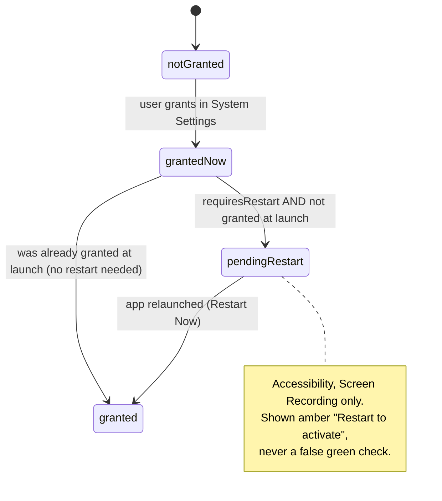
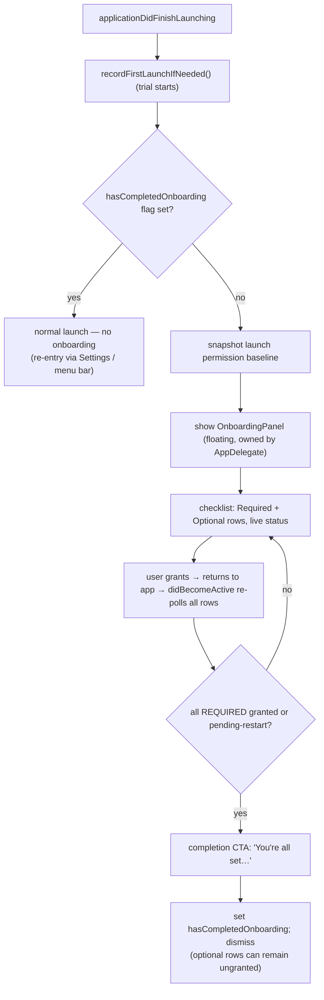

# feat: Welcoming first-launch onboarding + permission setup

## Summary

Give Drobu a warm first-launch experience: instead of silently dropping a menu-bar icon and then ambushing the user with a system permission prompt the first time they touch paste / capture / Closed Lid, show a one-screen permission **checklist** that explains each capability, lets them grant what they want up front, and reflects live status as they go. Cozy in tone, no-nonsense in function, never forced.

---

## Problem Frame

Today, launching Drobu for the first time puts an icon in the menu bar and nothing else — no welcome, no orientation. Permissions are demanded ad-hoc: Accessibility via an every-launch `NSAlert` (`AppDelegate.checkAccessibilityOnLaunch`), Screen Recording only when a capture first fails, Pasteboard reactively when a poll trips, the Closed Lid daemon when the user first picks a duration. The result is a disjointed first impression and surprise system dialogs mid-task.

Research into well-onboarded macOS apps (Wispr Flow as the gold standard, plus SuperWhisper, Raycast, CleanShot X, AltTab) converges on a clear pattern for an app with a handful of permissions: a **front-loaded, single-screen checklist** that primes each permission with a benefit-first explanation, sends the user to the right place to grant it, and updates live. Drobu's own "Closed Lid Mode" Settings section already implements this pattern in miniature (status text + contextual action + re-check on focus) — this plan generalizes that proven model into a first-run welcome and a reusable "Setup & Permissions" surface.

This is the start-of-lifecycle counterpart to the recently-shipped in-app uninstall (end-of-lifecycle). Scope is the welcome + permission setup; it is not a feature tour.

---

## Requirements

### First-run trigger & re-entry

- R1. On first launch only, an onboarding window appears automatically, presenting Drobu's permissions for setup.
- R2. First-run is tracked by a new `UserDefaults` flag, independent of the licensing `trial-start` Keychain key (which must not be overloaded).
- R3. The window is re-openable on demand from Settings ("Setup & Permissions") and a menu-bar item, and never re-appears uninvited after the first completion.

### Permission rows & status

- R4. The window shows permission rows tiered **Required** (Accessibility = paste-anywhere; Pasteboard on macOS 15.4+ = clipboard capture) and **Optional** (Screen Recording = GIF/video; Closed Lid helper = Login Items), plus an optional Launch-at-Login toggle.
- R5. Each row shows a live status — not-granted / pending-restart / granted — and a single contextual action (open the correct System Settings pane, enable the daemon, restart, or toggle).
- R6. The Pasteboard row appears only on macOS 15.4+ (where `accessBehavior` exists); on earlier systems it is absent, not shown as not-applicable.

### Live re-check, restart, and non-coercion

- R7. While the window is open, statuses re-poll on app activation (`NSApplication.didBecomeActiveNotification`) and on a timer, so a row flips to granted shortly after the user grants it in System Settings.
- R8. Accessibility and Screen Recording show a "pending — restart to activate" state after a grant that happened this session (not a false "granted"), with a Restart action that relaunches Drobu.
- R9. Granting is never forced: optional rows may be left unset, the user can dismiss/skip at any time, and required-but-ungranted never blocks app use — copy still works (existing graceful degradation), the panel just explains what's limited.

### Engineering

- R10. Permission detection sits behind an injectable seam so per-permission status mapping, required-satisfied, restart-pending, and the 15.4+ conditional are unit-tested with a mock; the real TCC / CoreGraphics / NSPanel / relaunch calls stay out of unit scope.
- R11. The first-run gate and the onboarding row/completion model are unit-tested as pure logic.
- R12. New onboarding/Settings views honor the accessibility contract (`Text`+`.onTapGesture` with `.isButton`, `.accessibilityElement(children: .ignore)` + explicit labels, NSPanel `title` for VoiceOver).

---

## Key Technical Decisions

- KTD1 — Single-screen checklist, not a multi-step wizard. Four permissions don't justify a stepped flow; research flags a wizard here as over-engineering. A front-loaded checklist (Pattern A) is the right shape and matches the existing Settings "Closed Lid Mode" vocabulary.

- KTD2 — Host it in a floating `NSPanel` on the `ActivationPanel` model (AppDelegate-owned, `canBecomeKey = true`, app stays `.accessory`), not a SwiftUI `Settings`/regular window. This sidesteps the documented Settings-scene traps (`.alert`/`.confirmationDialog` don't fire, `NSApp.delegate` is nil under `.regular`) and the `.accessory ↔ .regular` activation-policy juggling, and lets the panel reach the delegate directly. Recreate the panel each time (NSHostingView `onAppear` is unreliable).

- KTD3 — A `PermissionsService` behind a `PermissionProbing` seam (mirrors `DaemonServiceControlling`) maps raw probes to a `PermissionState` enum: `.granted` / `.notGranted` / `.pendingRestart` / `.notApplicable`. The mapping is pure and unit-testable; the seam's production impl wraps `AXIsProcessTrusted()`, `CGPreflightScreenCaptureAccess()`, the pasteboard `accessBehavior` read, `DaemonRegistrar().status`, and `MainAppLaunchAgentControl().isEnabled`.

- KTD4 — Model "granted but needs restart" honestly via a launch baseline, not a guess. The service snapshots each permission's granted-state at launch. A restart-requiring permission (Accessibility, Screen Recording) is `.granted` only if it was granted *at launch*; if it was not granted at launch but is now, it is `.pendingRestart` until relaunch. Non-restart permissions (Pasteboard, daemon, Launch-at-Login) never enter `.pendingRestart`. This rule is a pure function of `(grantedAtLaunch, grantedNow, requiresRestart)` and is the core test target.

- KTD5 — First-run gate is a new `UserDefaults` key (e.g. `hasCompletedOnboarding`), decoupled from `trial-start`. The every-launch `checkAccessibilityOnLaunch()` modal is replaced: on first run, onboarding owns the Accessibility ask; after onboarding, lapses surface through existing in-context graceful degradation and the re-entry points — not an every-launch modal (the wrong first impression and a double-fire with onboarding).

- KTD6 — Reuse the daemon-row's state-correct remediation for the Closed Lid row: `DaemonRegistrar().remediate()` already encodes "`.notFound` means register-first, never deep-link to a toggle that doesn't exist yet." Reuse the existing System Settings deep-links (`Privacy_Accessibility`, `Privacy_ScreenCapture`, `Privacy_Pasteboard`) and `SMAppService.openSystemSettingsLoginItems()` rather than inventing new ones.

- KTD7 — Never trigger the macOS 15.4+ pasteboard alert-storm. The Pasteboard row reads `accessBehavior` (a non-mutating property) for status and guides the user to System Settings; it must not call any API that fires the per-access "Allow paste" alert. (The clipboard monitor's own 0.5s poll is the alert source; onboarding only reads the behavior value.)

---

## High-Level Technical Design

### Per-permission status state machine

Restart-requiring permissions take the longer path; the rest resolve directly. `.notApplicable` only occurs for Pasteboard below macOS 15.4 (and that row is simply not shown).

### First-launch flow

---

## Implementation Units

### U1. PermissionsService + PermissionState (detection seam + status logic)

- Goal: One place that reports the live state of every Drobu permission, with the restart-aware mapping, behind a testable seam.
- Requirements: R5, R8, R10
- Dependencies: none
- Files: new `Sources/DrobuCore/Services/PermissionsService.swift`; test `Tests/DrobuTests/PermissionsServiceTests.swift`.
- Approach: Define `enum Permission { accessibility, screenRecording, pasteboard, closedLidHelper, launchAtLogin }` and `enum PermissionState { granted, notGranted, pendingRestart, notApplicable }`. A `PermissionProbing` protocol exposes a raw `isGranted(_:) -> Bool` (and `.notApplicable` signal for pasteboard < 15.4) per permission; production impl wraps `AXIsProcessTrusted()`, `CGPreflightScreenCaptureAccess()`, pasteboard `accessBehavior == .allow` (guarded to 15.4+), `DaemonRegistrar().status == .enabled`, `MainAppLaunchAgentControl().isEnabled`. `PermissionsService` captures a launch baseline (granted-at-launch per permission) and exposes `state(for:) -> PermissionState` applying the pure rule from KTD4, plus `requiredSatisfied() -> Bool` (all required permissions `.granted` or `.pendingRestart`). Keep the launch-baseline snapshot and the requiresRestart set as data, so the mapping is pure.
- Patterns to follow: `Sources/DrobuCore/Services/DaemonRegistrar.swift` (`DaemonServiceControlling` seam + `SMAppServiceDaemonControl` production impl + injectable default).
- Test scenarios:
  - requiresRestart permission granted at launch → `.granted` (no restart prompt).
  - requiresRestart permission not granted at launch, granted now → `.pendingRestart`.
  - requiresRestart permission not granted now → `.notGranted` (baseline irrelevant).
  - non-restart permission granted now → `.granted`; not granted now → `.notGranted`; never `.pendingRestart` regardless of baseline.
  - pasteboard on a probe reporting not-applicable → `.notApplicable`.
  - `requiredSatisfied()` true when all required are `.granted`/`.pendingRestart`, false when any required is `.notGranted`; ignores optional rows.
- Verification: `swift test` covers all PermissionState transitions via a mock `PermissionProbing`; no real TCC call in unit scope.

### U2. First-run gate

- Goal: Decide whether onboarding should auto-show, tracked independently of licensing.
- Requirements: R1, R2, R3, R11
- Dependencies: none
- Files: new `Sources/DrobuCore/Services/OnboardingGate.swift`; test `Tests/DrobuTests/OnboardingGateTests.swift`.
- Approach: A small type over an injected `UserDefaults` (default `.standard`) with `shouldAutoShow: Bool` (true when the `hasCompletedOnboarding` flag is absent/false) and `markCompleted()`. Inject the suite for tests. Do not read or write the Keychain.
- Patterns to follow: `RetentionDefaults` / UserDefaults-backed settings types in `Models/`.
- Test scenarios: fresh defaults → `shouldAutoShow == true`; after `markCompleted()` → `false`; persists across a new instance on the same suite; uses the injected suite, never `trial-start`.
- Verification: tests use a throwaway `UserDefaults(suiteName:)`; production main app auto-shows exactly once.

### U3. Onboarding row/completion model (view-model)

- Goal: Turn permission state into the ordered, tiered rows the UI renders, plus the completion gate — all as testable logic separate from SwiftUI.
- Requirements: R4, R5, R6, R9, R11
- Dependencies: U1
- Files: new `Sources/DrobuCore/Views/OnboardingViewModel.swift` (or `Services/`); test `Tests/DrobuTests/OnboardingViewModelTests.swift`.
- Approach: `@MainActor` observable model holding the `PermissionsService`. Produces `[OnboardingRow]` where each row carries permission, tier (`.required`/`.optional`), title, benefit-first subtitle, state, and the action kind (`.openSystemSettings(pane)` / `.enableDaemon` / `.restart` / `.toggleLaunchAtLogin`). The pasteboard row is included only on macOS 15.4+. `isComplete` mirrors `requiredSatisfied()`. A `refresh()` re-polls (called on focus/timer). Action invocation delegates to existing primitives (deep-link open, `DaemonRegistrar().remediate()`, relaunch, `MainAppLaunchAgentControl`).
- Patterns to follow: `SettingsView`'s `daemonStatus` + `daemonActionRow` state-driven rendering; `LicenseManager.shared` `@Published` observability.
- Test scenarios:
  - On macOS 15.4+ the row set includes Pasteboard; simulated < 15.4 excludes it.
  - Rows are correctly tiered: Accessibility + Pasteboard required; Screen Recording + Closed Lid optional.
  - `isComplete` is driven only by required rows (optional ungranted → still complete).
  - Each row maps to the expected action kind and the correct Settings pane / deep-link target.
  - `refresh()` after the mock probe flips a permission updates that row's state.
- Verification: model is exercised with a mock `PermissionsService`; SwiftUI view is not unit-tested.

### U4. OnboardingView (SwiftUI checklist UI)

- Goal: The cozy, no-nonsense checklist itself.
- Requirements: R4, R5, R8, R9, R12
- Dependencies: U3
- Files: new `Sources/DrobuCore/Views/OnboardingView.swift`.
- Approach: A header with the one personality line + a trial note ("Your 14-day trial just started"), then Required and Optional sections of rows, then a completion footer. Each row mirrors the daemon-row triad: status glyph (gray circle / amber ring / green check), title + benefit subtitle, and a `Text`+`.onTapGesture` action whose label is contextual (`Open Accessibility Settings` / `Enable` / `Restart to activate` / a Launch-at-Login `Toggle`). Screen Recording row carries the scope-reassurance subtitle ("Drobu only reads your own screen — nothing leaves your Mac"). Completion footer shows "You're all set — copy something and press ⌥Space to try it" and a `Start Using Drobu` dismiss; a `Skip for now` affordance is always present. Accessibility: each action row `.accessibilityElement(children: .ignore)` + explicit label + `.accessibilityHint` + `.isButton`; decorative glyphs `.accessibilityHidden(true)`.
- Patterns to follow: `SettingsView.daemonActionLabel` / `daemonActionRow` (whole-row tap target, accessibility), `ActivationView` layout, `.claude/rules/accessibility.md`.
- Test scenarios: none — SwiftUI view; the row/completion logic it renders is covered in U3. `Test expectation: none -- SwiftUI view wiring; logic covered by OnboardingViewModelTests.`
- Verification: manual — rows render tiered, copy reads warm-but-functional, VoiceOver announces each action as a button with its hint.

### U5. OnboardingPanel + AppDelegate hosting, first-launch hook, live re-check, restart

- Goal: Show the window on first launch, keep it live, and own the restart action.
- Requirements: R1, R3, R7, R8
- Dependencies: U2, U4
- Files: new `Sources/DrobuCore/Views/OnboardingPanel.swift`; modify `Sources/DrobuCore/App/AppDelegate.swift`.
- Approach: `OnboardingPanel` mirrors `ActivationPanel` (floating `NSPanel`, `NSHostingView`, `canBecomeKey = true`, `title` set, `showCentered()`, `animationBehavior = .none`), recreated each show, owned/retained by `AppDelegate`. AppDelegate snapshots the launch permission baseline (feeding `PermissionsService`) and, in `applicationDidFinishLaunching` near the current `checkAccessibilityOnLaunch()` call, shows the panel when `OnboardingGate.shouldAutoShow`. While visible, re-poll all permissions on `NSApplication.didBecomeActiveNotification` and a `.common`-mode timer; tear the timer down on dismiss. The Restart action calls `NSApp.relaunch(self)` (or the established relaunch helper) — exclude from unit scope.
- Patterns to follow: `Sources/DrobuCore/Views/ActivationPanel.swift` (panel construction + `showCentered`), `AppDelegate.showActivationPanel` (ownership), `SettingsView` `.onReceive(didBecomeActive)` re-check (~line 206), `WeakFloatingPanel` for environment.
- Execution note: keep the panel/relaunch/NSPanel wiring thin — it's the system boundary; the testable logic lives in U1–U3.
- Test scenarios: none for the NSPanel/relaunch wiring (system boundary). The auto-show decision is U2; the row/refresh logic is U3. `Test expectation: none -- NSPanel + relaunch are system boundaries; gating and refresh logic tested in U2/U3.`
- Verification: manual — fresh-defaults launch shows the panel centered; granting a permission in System Settings and returning flips its row live; Accessibility grant shows amber + Restart; restart relaunches and (next launch) the panel does not auto-reappear.

### U6. Integration: replace the every-launch modal, add re-entry, fix stale usage string

- Goal: Wire onboarding into the lifecycle cleanly and remove the disjointed old behavior.
- Requirements: R3, R9
- Dependencies: U5
- Files: modify `Sources/DrobuCore/App/AppDelegate.swift` (remove/redirect `checkAccessibilityOnLaunch` every-launch modal; add a "Setup & Permissions" menu-bar item that re-opens the panel), `Sources/DrobuCore/Views/SettingsView.swift` (a "Setup & Permissions" row that re-opens onboarding), `Sources/DrobuCore/Info.plist` (broaden `NSScreenCaptureUsageDescription` to cover video, not just GIF).
- Approach: Delete the unconditional first-thing-on-launch Accessibility `NSAlert`; first-run is now onboarding, later lapses use existing in-context degradation. Add the two re-entry points (Settings row + menu-bar item) that call into AppDelegate to show the panel on demand (these bypass the `shouldAutoShow` gate). Update the screen-capture usage string to mention GIF and video.
- Patterns to follow: `AppDelegate.setupStatusItem` menu construction; `SettingsView` section + `daemonActionLabel` row; existing deep-link usage.
- Test scenarios: none — wiring + a plist string. `Test expectation: none -- menu/Settings wiring and an Info.plist copy change; behavior covered by U2 (gate) and manual verification.`
- Verification: manual — no every-launch Accessibility modal after onboarding; Settings and menu-bar entries re-open the panel; capture permission dialog text reads correctly for video too.

### U7. Documentation & learnings capture

- Goal: Record the reusable onboarding/permission gotchas.
- Requirements: none (supporting)
- Dependencies: U1, U5
- Files: new `.claude/rules/permission-onboarding-gotchas.md`.
- Approach: Capture the restart-pending rule (never false-green Accessibility/Screen Recording; baseline-compare detection), the macOS 15.4+ pasteboard alert-storm avoidance (read `accessBehavior`, never trigger the per-access alert), the "host onboarding in an ActivationPanel-model floating NSPanel, not a Settings/regular window" decision and why, the daemon-row remediation reuse, and the live-re-check-on-`didBecomeActive` pattern.
- Test scenarios: none — documentation. `Test expectation: none -- docs only.`
- Verification: rules entry committed and focused.

---

## Acceptance Examples

- AE1 (R1, R2, R3). Given a brand-new install (no `hasCompletedOnboarding` flag), when the app launches, then the onboarding panel appears; after completing/skipping it, subsequent launches do not auto-show it, but Settings → "Setup & Permissions" re-opens it.
- AE2 (R6). Given macOS 15.4+, the checklist includes a Pasteboard row; given an earlier macOS, that row is absent.
- AE3 (R7). Given the panel is open and Accessibility ungranted, when the user enables it in System Settings and returns to Drobu, then the Accessibility row updates without a manual refresh.
- AE4 (R8). Given Accessibility was not granted at launch, when the user grants it this session, then the row shows "Restart to activate" (amber) — not a green check — and a Restart action relaunches Drobu.
- AE5 (R9). Given the user grants only the Required permissions and leaves Screen Recording and Closed Lid ungranted, when they click "Start Using Drobu", then onboarding completes and the optional capabilities remain available later from Settings.

---

## Assumptions

These are the autonomous-run bets (no synchronous confirmation available); each is reversible and called out for the reviewer.

- **Required tier = Accessibility + Pasteboard(15.4+); Optional = Screen Recording + Closed Lid.** Rationale: Accessibility gates the headline paste-anywhere action and Pasteboard gates capturing history at all (both "broken on first launch" if absent); GIF/video and Closed Lid are power features. If product disagrees, the tiering is a one-line change in U3.
- **The every-launch `checkAccessibilityOnLaunch()` modal is removed, not kept as a fallback.** Onboarding covers first run; post-onboarding relies on in-context graceful degradation + re-entry. (Alternative: keep a once-per-N-days nudge — deferred; nagging is an anti-pattern.)
- **Onboarding shows a light "14-day trial started" line** but does not gate or alter the trial; it's a welcome, not a paywall. The expiry-side `ActivationPanel` is unchanged.
- **`hasCompletedOnboarding` is a simple boolean** (not a versioned `onboardingVersion`). If we later add re-onboarding for new permissions, it becomes an int; not needed now.

---

## Scope Boundaries

In scope: first-run detection + gate, the permission checklist panel, the `PermissionsService` abstraction + restart-aware status, live re-check, re-entry points, removal of the every-launch Accessibility modal, the stale usage-string fix, and tests for the logic layers.

Non-goals:
- A feature tour / product walkthrough (this is permission setup + welcome, not a tutorial of slash commands, GIF editing, etc.).
- Changing how any permission is *used* at runtime (paste flow, capture, daemon) — only how it's *introduced*.
- Reworking the trial/licensing flow or the expiry `ActivationPanel`.

Deferred to follow-up work:
- A versioned re-onboarding flow that re-surfaces the panel when a future release adds a new permission.
- A menu-bar status badge when a previously-granted required permission lapses (research suggested it; out of this PR's scope — re-entry via Settings/menu covers the need for now).
- Auditing whether `NSAppleEventsUsageDescription` / the apple-events entitlement can be dropped entirely (vestigial per research) — a separate cleanup.

---

## Risks & Dependencies

- **False-green is the cardinal risk.** `AXIsProcessTrusted()`/`CGPreflightScreenCaptureAccess()` return true immediately on grant but the feature doesn't work until restart — KTD4's launch-baseline rule and the amber pending-restart state exist specifically to avoid claiming "ready" when it isn't. Mitigation: the rule is the primary U1 test target.
- **Pasteboard alert-storm (macOS 15.4+).** Any onboarding code that triggers the per-access pasteboard alert would fire it repeatedly. Mitigation (KTD7): read `accessBehavior` only; never call a paste-access API from onboarding.
- **Settings-scene traps.** Building onboarding as a SwiftUI Settings/regular window would reintroduce the `.alert`-doesn't-fire / `NSApp.delegate == nil` / activation-policy problems. Mitigation (KTD2): floating `NSPanel` on the `ActivationPanel` model.
- **Daemon `.notFound` vs `.notRegistered`.** The Closed Lid row must not deep-link to a Login Items toggle that doesn't exist yet. Mitigation (KTD6): reuse `DaemonRegistrar().remediate()` verbatim.
- **NSHostingView `onAppear` unreliability / retain cycles.** Mitigation: recreate the panel each show, use `WeakFloatingPanel` for environment (established pattern).
- **Dependency:** none external; all detection APIs and deep-links are already in the codebase.

---

## Alternatives Considered

- **Multi-step wizard (Wispr Flow's 10-step flow).** Rejected: that shape suits an account-creation + profiling + dictation-test app; for four permissions it's friction. A single checklist is the SuperWhisper-shaped, right-sized choice.
- **Progressive in-context only (Maccy/Rectangle).** Rejected: it's today's behavior — the broken-first-impression problem. Accessibility and Pasteboard are "broken on first launch" and can't be discovered gracefully.
- **Build onboarding as a SwiftUI `Settings`/`Window` scene.** Rejected (KTD2): reintroduces the Settings-scene interaction traps and activation-policy juggling for no benefit; the floating panel is simpler and delegate-reachable.
- **Force all permissions before first use (Loom).** Rejected: blocks optional capabilities the user may not want and violates "never forced" (R9).

---

## Sources / Research

- Onboarding/permission-priming patterns + Wispr Flow / SuperWhisper / Raycast / CleanShot X / AltTab / Bartender / Maccy / Loom teardown; macOS permission-request mechanics and System Settings deep-links; restart-required and pasteboard-15.4 behaviors — the external research digest gathered for this feature (Wispr Flow setup docs, SuperWhisper docs, jano.dev Accessibility-permission mechanics, mjtsai pasteboard-15.4, rmcdongit deep-link gist, AltTab issue #127).
- Internal terrain map (this session): permission touchpoints and the daemon-row gold-standard priming — `Sources/DrobuCore/Services/DaemonRegistrar.swift` (`remediate()`, status mapping, seam), `Sources/DrobuCore/Views/SettingsView.swift` (`daemonActionRow`, `daemonStatus`, `.onReceive(didBecomeActive)` re-check), `Sources/DrobuCore/Views/ActivationPanel.swift` (panel model), `Sources/DrobuCore/App/AppDelegate.swift` (`checkAccessibilityOnLaunch`, `checkPasteboardPrivacy`, launch sequence, `recordFirstLaunchIfNeeded`), `ScreenCaptureService.swift`/`VideoCaptureService.swift` (CGPreflight/CGRequest + deep-link), `ClipboardMonitor.swift` (pasteboard `accessBehavior` check), `LaunchAgentControlling.swift`, `LicenseManager.swift` (trial start + `@Published` status).
- Relevant rules: `.claude/rules/swiftui-macos-gotchas.md` (Settings-scene traps, NSPanel recreate), `.claude/rules/accessibility.md` (row conventions), `.claude/rules/nsmenu-statusitem-gotchas.md` (`.common`-mode timer), `.claude/rules/swift-testing-gotchas.md` (test-runtime isolation).
