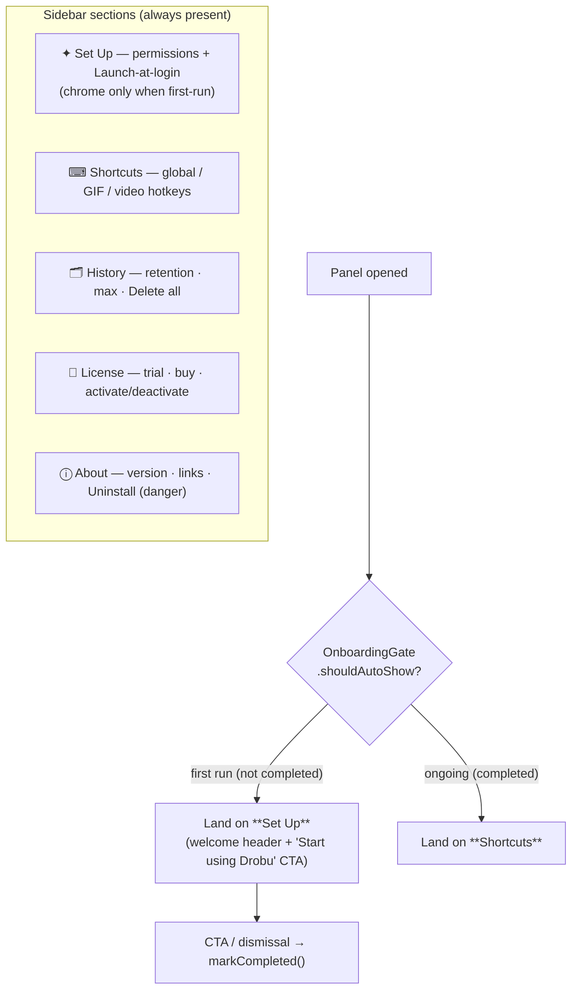
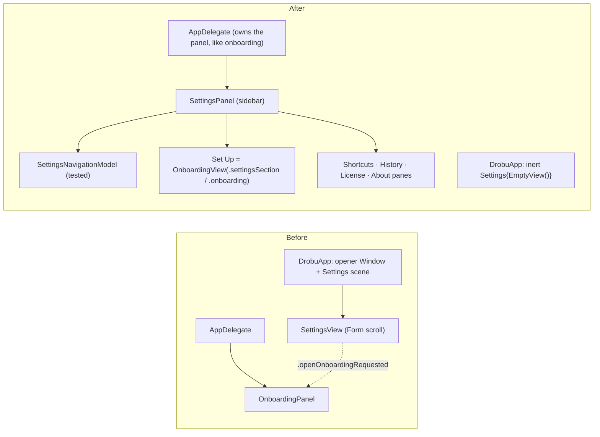

# refactor: Unified cozy sidebar Settings panel (merges onboarding + settings)

## Summary

Replace Drobu's two overlapping configuration surfaces — the floating first-run onboarding panel and the long single-scroll SwiftUI `Settings` scene — with **one** AppDelegate-owned floating `NSPanel` that presents a **sidebar + detail** layout in Drobu's cozy onboarding aesthetic. The same panel serves first-run setup (opens to a "Set Up" section with welcome + CTA) and ongoing settings (opens to "Shortcuts"; Set Up becomes a plain, revisitable section). Merging the two surfaces removes ~40% duplicated content, lets us **delete the entire SwiftUI Settings-scene apparatus** (hidden opener `Window`, `.accessory`↔`.regular` activation-policy switching, `.alert`-doesn't-fire workarounds), and reuses the proven onboarding components wholesale. This is a presentation-layer refactor — no licensing, daemon-protocol, or capture-pipeline behavior changes.

---

## Problem Frame

Today's Settings is one `Form{}.formStyle(.grouped).frame(width: 450)` whose height grows with content into an endless scroll (`Sources/DrobuCore/Views/SettingsView.swift`, 521 lines, six stacked sections), with destructive actions (Delete all data, Uninstall) sitting directly beneath benign toggles. Separately, the first-run permission checklist lives in its own floating panel (`Sources/DrobuCore/Views/OnboardingPanel.swift`). The two screens duplicate or overlap heavily:

- **Launch-at-login** appears in both (onboarding optional row + Settings General toggle).
- **Closed-lid keep-awake** status appears in both (onboarding row + Settings "Closed Lid Mode" section).
- The Settings **"Setup & Permissions → Open"** row is literally a portal that posts `.openOnboardingRequested` to launch the onboarding panel.
- **Capture** is split: the *permission* lives in onboarding, the *hotkeys* live in Settings.

When one screen's only job is to open the other, they want to be one screen. The Settings scene also forces a fragile apparatus (a hidden 0×0 `Window` that owns `@Environment(\.openSettings)`, activation-policy toggling on open/close, and `NSAlert`/notification workarounds because `.accessory` apps can't cleanly present a `Settings` scene and `.alert` doesn't fire inside it).

---

## Scope

**In scope:** A single sidebar `NSPanel` (the "Settings panel") replacing both surfaces; 5 sidebar sections (Set Up, Shortcuts, History, License, About); first-run vs ongoing modes gated by the existing `OnboardingGate`; migration of every existing control into the new panes; deletion of the Settings-scene apparatus; collapse of the two status-menu items into one; version bump + website.

**Preserved verbatim (no behavior change):** hotkey recording + persistence, launch-at-login, permission detection (incl. the restart-aware status rule, the Screen-Recording `layer == 0` window-name signal, and the pasteboard `accessBehavior == alwaysAllow(2)` rule), daemon remediation/removal, retention/max enforcement, delete-all, license activation/deactivation, uninstall incl. the "also delete data" checkbox.

### Out of scope (non-goals)

- No changes to the licensing model, the daemon XPC protocol, or the capture pipeline.
- No new settings or capabilities — this reorganizes existing ones.
- No change to the menu-bar status-item's clipboard/sleep submenus.

### Deferred to Follow-Up Work

- Converting the SwiftUI `@main` to a pure AppKit entry point (see KTD5 — we keep an inert placeholder scene now; a full AppKit `@main` is a cleaner but riskier follow-up).
- In-pane search / a settings search field (not warranted at five sections).

---

## Key Technical Decisions

### KTD1 — Host as an AppDelegate-owned `NSPanel`, not the `Settings` scene
Model the new panel on `OnboardingPanel` (AppDelegate-owned, `isFloatingPanel`, `level = .floating`, `.nonactivatingPanel/.titled/.fullSizeContentView/.closable`, `titlebarAppearsTransparent`, recreated each show, always `.accessory`). This is what unlocks the merge and lets us delete the activation-policy dance, the opener `Window`, and the `.alert` workarounds — the panel is a real `NSWindow` reachable directly from the delegate. **Cost:** it is not a "standard" macOS Settings window; ⌘, is wired by our status menu (already the case — `AppDelegate.swift:344`), not by the SwiftUI Settings scene.

### KTD2 — Custom lightweight sidebar (selectable rows + detail), not `NavigationSplitView`
A fixed-size floating panel with the cozy card aesthetic is better served by a custom `HStack(sidebar List/VStack of selectable rows, detail)` than `NavigationSplitView`, which imposes its own chrome, collapsing behavior, and sizing that fight a fixed floating panel. The sidebar is a simple selection list bound to the navigation model (U1). *Directional guidance, not implementation spec.* If a `List(selection:)` proves cleaner than hand-rolled rows during execution, that's an execution-time call — the navigation model (U1) is the contract either way.

### KTD3 — Keep `NSAlert.beginSheetModal` for destructive confirmations, anchored to the panel window
The panel is a real `NSWindow`, so the existing `confirmAndDeleteAll` / `confirmAndUninstall` sheets work unchanged once re-anchored to the panel (instead of `NSApp.keyWindow`). Critically, the uninstall confirmation uses an `NSButton` checkbox `accessoryView` ("also delete my history and settings") that SwiftUI's `.confirmationDialog`/`.alert` cannot host. `.confirmationDialog` now *would* fire (we're no longer in a Settings scene), but it offers no benefit and loses the checkbox — so keep `NSAlert`.

### KTD4 — `OnboardingView` gains a presentation mode (full chrome vs section-embedded)
The Set Up pane reuses `OnboardingView` / `OnboardingViewModel` / `PermissionsService` as-is. Add a presentation `mode` (`.onboarding` vs `.settingsSection`) that controls only chrome: `.onboarding` shows the welcome header + footer CTA (today's first-run experience); `.settingsSection` shows just the live permission rows (no header, no CTA). The tested view-model (rows/tiers/`OnboardingCompletion`/`onboardingCompletesGate`) is untouched.

### KTD5 — `DrobuApp` keeps one inert placeholder scene
A SwiftUI `App` requires at least one `Scene`. After deleting the opener `Window` and the real `Settings { SettingsView() }`, replace them with an inert `Settings { EmptyView() }` placeholder that is never opened (the status menu owns ⌘, → opens our panel directly). This is the minimal, low-risk change. A full AppKit `@main` is the cleaner end-state but is deferred (see Deferred to Follow-Up Work) to keep this refactor bounded. **Assumption to verify in execution:** the inert `Settings { EmptyView() }` scene does not register a conflicting ⌘, or auto-present any window under `.accessory`; if it does, drop to an empty `WindowGroup` that's never opened or pull the ⌘, key-equivalent off the status menu item.

### KTD6 — Version: minor bump 1.7.0 → 1.8.0 (build 13)
Per `CLAUDE.md` versioning guidance this reorganizes existing features (no brand-new capability), which argues patch — but it is a *distinctly new, user-visible settings experience*, which argues minor. Recommend **minor (1.8.0)**: users will plainly notice the new surface. Bump `Sources/DrobuCore/Info.plist` (`CFBundleShortVersionString` 1.8.0 + `CFBundleVersion` 13), `website/src/components/DownloadCTA.astro`, `website/src/components/Footer.astro` in the same change.

---

## High-Level Technical Design

**Sidebar IA + mode gate** (one shell, two modes; `OnboardingGate` decides the landing + Set Up chrome):

**Component ownership shift:**

---

## Implementation Units

### U1. Sidebar navigation model (pure, tested)

**Goal:** A pure, unit-testable model defining the sidebar's sections, the landing section per mode, and where first-run chrome shows — so all mode logic is testable without the panel.

**Dependencies:** none.

**Files:**
- Create `Sources/DrobuCore/Views/SettingsNavigationModel.swift`
- Create `Tests/DrobuTests/SettingsNavigationModelTests.swift`

**Approach:** A `SettingsSection` enum (`.setUp, .shortcuts, .history, .license, .about`) with display title + SF Symbol name + ordered `allCases`. A `@MainActor final class SettingsNavigationModel: ObservableObject` (mirrors `OnboardingViewModel`'s shape) holding `@Published var selected: SettingsSection`, initialized from a pure `landingSection(firstRun:)` (→ `.setUp` if firstRun else `.shortcuts`), plus a pure `showsWelcomeChrome(in:firstRun:)` → `firstRun && section == .setUp`. Keep the pure functions free-standing (like `onboardingCompletesGate`) so they're testable directly.

**Patterns to follow:** `Sources/DrobuCore/Views/OnboardingViewModel.swift` (pure free functions + `@Published` view-model; `OnboardingCompletion` enum style).

**Test scenarios** (`SettingsNavigationModelTests.swift`):
- `landingSection(firstRun: true) == .setUp`; `landingSection(firstRun: false) == .shortcuts`.
- `showsWelcomeChrome(in: .setUp, firstRun: true) == true`; `(.setUp, false) == false`; `(.shortcuts, true) == false` (chrome is Set-Up-only even in first run).
- Section ordering is exactly `[.setUp, .shortcuts, .history, .license, .about]`.
- Every section has a non-empty title and a symbol name.
- New model initialized with `firstRun: true` has `selected == .setUp`; with `firstRun: false` has `selected == .shortcuts`.

**Verification:** `swift test` passes the new suite; the model compiles with no UI dependencies.

---

### U2. The sidebar panel shell (`SettingsPanel` + sidebar container)

**Goal:** A new AppDelegate-owned floating `NSPanel` with a custom sidebar + detail layout in the cozy aesthetic, hosting per-section detail views and driven by U1's model. First-run dismissal marks the gate.

**Dependencies:** U1.

**Files:**
- Create `Sources/DrobuCore/Views/SettingsPanel.swift` (the `NSPanel` subclass + actuator, modeled on `OnboardingPanel`)
- Rewrite `Sources/DrobuCore/Views/SettingsView.swift` into the sidebar container view (sidebar list bound to `SettingsNavigationModel.selected` + a `@ViewBuilder` detail switch); migrate the per-section sub-views in U3–U6.

**Approach:** Mirror `OnboardingPanel` exactly for window config (size ~`680×460`; `isFloatingPanel`, `level .floating`, `collectionBehavior [.canJoinAllSpaces,.fullScreenAuxiliary]`, `titlebarAppearsTransparent`, `animationBehavior = .none`, `isReleasedWhenClosed = false`, **set `title` for VoiceOver**, recreated each show). The content view is `HStack { Sidebar(model:) ; Divider() ; detail(for: model.selected) }`. Sidebar rows are selectable elements (cozy styling, accent highlight for selected). `init` takes the dependencies (`PermissionsService`, `OnboardingGate`, `firstRun: Bool`, `database`, `LicenseManager`) and a landing section from `landingSection(firstRun:)`. `close()` marks the gate complete (only meaningful first-run; idempotent otherwise) — reuse the `onboardingCompletesGate`/gate semantics where they apply.

**Patterns to follow:** `Sources/DrobuCore/Views/OnboardingPanel.swift` (panel config, recreate-each-show, gate-on-close); `.claude/rules/swiftui-macos-gotchas.md` (NSPanel+SwiftUI: `onAppear` unreliable → recreate each show; `WeakFloatingPanel` for env keys if needed; `animationBehavior = .none`); `.claude/rules/accessibility.md` (NSPanel needs `title`; sidebar rows are `Text + .onTapGesture` → need `.isButton` + `.isSelected` traits, and group the label while keeping any row action focusable — the onboarding VoiceOver lesson).

**Test scenarios:** `Test expectation: none` — NSPanel/NSHostingView/sidebar rendering is system-boundary UI wiring (verified via build + manual VoiceOver/click-through). The selection/landing/chrome logic it depends on is covered by U1.

**Verification:** `./build.sh --install` launches; the panel opens with a working sidebar; clicking each section swaps the detail pane; window never scrolls; VoiceOver reads the panel title and can focus + activate each sidebar row.

---

### U3. Set Up section — embed onboarding with dual chrome modes

**Goal:** The Set Up detail pane reuses `OnboardingView`; first-run shows welcome + CTA, ongoing shows plain live permission status. "Remove Helper" moves into the Closed-lid row's detail.

**Dependencies:** U1, U2.

**Files:**
- Modify `Sources/DrobuCore/Views/OnboardingView.swift` (add presentation `mode`)
- Modify `Sources/DrobuCore/Views/SettingsView.swift` (Set Up detail = `OnboardingView(mode:)`)
- Possibly modify `Sources/DrobuCore/Views/OnboardingViewModel.swift` only if "Remove Helper" placement needs a row-detail hook (prefer keeping it in the row's action area).

**Approach:** Add `enum Presentation { case onboarding, settingsSection }` (or a `showsChrome: Bool`) to `OnboardingView`. `.onboarding` renders the existing header + footer tri-state CTA; `.settingsSection` renders only the Required/Optional rows (no header, no footer) — the rows, glyphs, and action controls are identical and already accessible. The Set Up pane passes `.onboarding` when `showsWelcomeChrome(in:.setUp,firstRun:)` is true, else `.settingsSection`. The CTA ("Start using Drobu") marks the gate and transitions the panel to ongoing mode (re-render Set Up chrome-less) or closes — execution-time choice; default: mark gate + switch the panel's `firstRun` to false so chrome drops and the user stays oriented. "Remove Helper" stays the Closed-lid row's contextual action (as today in `daemonActionRow`), not a standalone row.

**Patterns to follow:** `Sources/DrobuCore/Views/OnboardingView.swift` (header/footer/`actionControl`/`statusGlyph`); the accessibility structure from the onboarding VoiceOver fix (group label, action controls separately focusable).

**Test scenarios:**
- `showsWelcomeChrome` gating is covered in U1; add a view-model-level assertion if a chrome flag is introduced there.
- `Test expectation: none` for the SwiftUI rendering of the two modes (system boundary; verified manually). The completion/`onboardingCompletesGate` behavior is already covered by `OnboardingViewModelTests`.

**Verification:** First launch → Set Up shows welcome + CTA; after completing, reopening from the menu → Set Up shows plain rows, no CTA; permission rows still flip live (focus re-check + timer) and the restart-pending / SR / pasteboard signals behave exactly as before.

---

### U4. Shortcuts + License panes (benign migrations)

**Goal:** Move the three hotkey recorders into a "Shortcuts" pane and the license status/activation UI into a "License" pane, reusing existing sub-views unchanged.

**Dependencies:** U2.

**Files:**
- Modify `Sources/DrobuCore/Views/SettingsView.swift` (Shortcuts detail = 3× `HotkeyRecorderView`; License detail = `licenseStatusRow` + `licenseKeyRow` + the activation handlers).

**Approach:** Shortcuts pane hosts Global paste/open, Capture GIF, Capture Video recorders (the only home for hotkeys now — General is dissolved). License pane reuses `licenseStatusRow` (~303-328), `licenseKeyRow` (~330-387) and `pasteFromClipboard`/`handleLicenseInput`/`tryActivate` (~389-446) verbatim, plus the Buy link (`PurchaseLinks.buy`). No logic changes.

**Patterns to follow:** existing `SettingsView.swift` sub-views; `Sources/DrobuCore/Views/HotkeyRecorderView.swift` (NSViewRepresentable — set accessibility on the inner NSView).

**Test scenarios:** `Test expectation: none` — pure relocation of existing, already-covered UI (hotkey persistence + `LicenseManager` activation are covered by existing tests; this unit moves the views, it does not change logic). Confirm no logic was altered during the move.

**Verification:** Recording a hotkey in Shortcuts persists and re-registers (existing behavior); License pane shows correct trial/expired/activated states, activates a valid key, rejects an invalid one, and the Buy link opens `PurchaseLinks.buy`.

---

### U5. History pane (retention/max + Delete-all danger zone)

**Goal:** Move retention days, max items, and "Delete all data" into a "History" pane with quiet danger styling on the destructive action, confirmation preserved.

**Dependencies:** U2.

**Files:**
- Modify `Sources/DrobuCore/Views/SettingsView.swift` (History detail; re-anchor `confirmAndDeleteAll` sheet to the panel window).

**Approach:** Reuse the retention/max `TextField`s (clamped 1–365 days, 100–50,000 items) + the explanatory caption. "Delete all data" keeps `confirmAndDeleteAll` (~448-469) but the `NSAlert.beginSheetModal` re-anchors to the new panel's window (the panel is `NSApp.keyWindow` when open) — verify the anchor resolves; fall back to `panel` reference if `keyWindow` is unreliable for a `.nonactivatingPanel`.

**Patterns to follow:** existing retention controls + `confirmAndDeleteAll`; `.claude/rules/` retention defaults.

**Test scenarios:**
- If retention/max clamping is not already unit-tested, add coverage: input `0`/`400` days clamps to `1`/`365`; input `50`/`60000` items clamps to `100`/`50000`; valid values persist. (If existing tests cover `RetentionDefaults` clamping, `Test expectation: none` and cite them.)
- `Test expectation: none` for the delete-all sheet UI (NSAlert system boundary) — but **manually verify** the confirmation sheet attaches to the panel and actually deletes on confirm / no-ops on cancel.

**Verification:** Retention/max edits persist and enforce on next cleanup; "Delete all data" shows a confirmation sheet anchored to the panel and only deletes on confirm.

---

### U6. About pane (version + Uninstall danger zone)

**Goal:** Move version + links into an "About" pane with a clearly-separated Uninstall danger zone at the bottom, confirmation + data-wipe checkbox preserved.

**Dependencies:** U2.

**Files:**
- Modify `Sources/DrobuCore/Views/SettingsView.swift` (About detail; re-anchor `confirmAndUninstall` sheet to the panel window).

**Approach:** About shows `CFBundleShortVersionString` (reads at runtime — auto-updates), any links, then a visually-separated danger zone with "Uninstall Drobu…". Reuse `confirmAndUninstall` (~473-507) including the `NSButton` checkbox `accessoryView` ("also delete my history and settings") — re-anchor `beginSheetModal` to the panel window (KTD3).

**Patterns to follow:** existing `confirmAndUninstall`; `.claude/rules/uninstall-gotchas.md` (teardown ordering, the data-wipe checkbox semantics).

**Test scenarios:** `Test expectation: none` — relocation of the existing uninstall flow (system boundary; `UninstallService` logic is covered by `UninstallServiceTests`). **Manually verify** the uninstall sheet attaches to the panel, the checkbox toggles the data-wipe, and cancel is a no-op.

**Verification:** About shows the live version; Uninstall opens the confirmation sheet (anchored to the panel) with the working "also delete data" checkbox and only proceeds on confirm.

---

### U7. Rewire AppDelegate + DrobuApp; delete the Settings-scene apparatus; retire the onboarding panel

**Goal:** Point all entry points at the new panel, collapse the two menu items into one, and remove the now-dead Settings-scene machinery and the standalone onboarding panel.

**Dependencies:** U2–U6 (the panel must fully exist).

**Files:**
- Modify `Sources/Drobu/DrobuApp.swift` — delete `SettingsOpenerView` + the `"settings-opener"` `Window` scene + the `Settings { SettingsView() }` scene; replace with inert `Settings { EmptyView() }` (KTD5).
- Modify `Sources/DrobuCore/App/AppDelegate.swift` — `openPreferences()` (and `showOnboardingFromMenu`) now construct/show the `SettingsPanel` directly (delegate owns it, like `onboardingPanel`); `showOnboardingIfFirstRun()` opens the panel to Set Up; **collapse** the two menu items (`AppDelegate.swift:343-344` "Set Up Drobu…" + "Settings...") into a single `"Settings..."` item (keyEquivalent `,`) whose action opens the panel (to Set Up if `OnboardingGate.shouldAutoShow`, else Shortcuts); remove the `.openSettingsFromMenu` post and the `.openOnboardingRequested` observer/usage.
- Modify `Sources/DrobuCore/App/ClipboardHistoryApp.swift` — remove the `openSettingsFromMenu` and `openOnboardingRequested` `Notification.Name` declarations (keep `daemonNotApproved` — it's the menu-bar Closed-lid approval alert, unrelated to settings).
- Delete (or repurpose into `SettingsPanel`) `Sources/DrobuCore/Views/OnboardingPanel.swift`; update the `onboardingPanel` property + `showOnboarding*` methods to use `SettingsPanel`.

**Approach:** The delegate already owns `onboardingPanel`; generalize it to own the single `settingsPanel`. One `showSettings(section:)` entry: first-run auto-show targets Set Up with chrome; menu "Settings..." targets `landingSection(firstRun:)`. Recreate the panel each show (per the rule). Removing the activation-policy dance is safe — the panel runs under `.accessory` exactly like onboarding does today (proven).

**Patterns to follow:** `AppDelegate` `onboardingPanel`/`showOnboarding()` ownership (~40, ~640-667); `.claude/rules/nsmenu-statusitem-gotchas.md` (menu construction; `menu === statusItem?.menu` guards if touching delegate callbacks).

**Test scenarios:**
- The "which section opens" decision is `landingSection(firstRun:)` — covered in U1.
- `Test expectation: none` for the scene deletion + menu wiring (system boundary). **Manually verify:** ⌘, and the single menu item open the panel; first launch auto-shows Set Up with chrome; no stray window appears at launch; no activation-policy flicker; the app quits/relaunches cleanly.

**Verification:** Exactly one settings/setup menu item exists; it opens the unified panel; first-run still auto-shows Set Up; `grep` confirms `SettingsOpenerView`, the opener `Window`, `.openSettingsFromMenu`, `.openOnboardingRequested`, and the `.regular` activation toggle are gone; `OnboardingPanel.swift` is removed or repurposed; `swift test` + `./build.sh --install` are green and the app behaves identically feature-for-feature.

---

### U8. Version bump + website + docs

**Goal:** Ship-version metadata and the reusable learnings.

**Dependencies:** U7.

**Files:**
- Modify `Sources/DrobuCore/Info.plist` (`CFBundleShortVersionString` → 1.8.0, `CFBundleVersion` → 13).
- Modify `website/src/components/DownloadCTA.astro` (Version 1.8.0), `website/src/components/Footer.astro` (v1.8.0).
- Append to `.claude/rules/swiftui-macos-gotchas.md` and/or `.claude/rules/permission-onboarding-gotchas.md`: the merged-panel decision and any NSPanel-sidebar gotchas discovered (e.g., `Settings { EmptyView() }` placeholder behavior, sidebar selection accessibility).

**Approach:** Mirror the version checklist in `CLAUDE.md` (3 places: Info.plist display + build, DownloadCTA, Footer). Capture gotchas as they're hit during U2/U7.

**Test scenarios:** `Test expectation: none -- metadata + docs only.`

**Verification:** Settings "About" shows 1.8.0 at runtime; website shows 1.8.0; rules updated.

---

## System-Wide Impact

- **App lifecycle / entry point** (`DrobuApp.swift`): removing two scenes is the highest-risk change — guard with the inert-placeholder assumption (KTD5) and a launch smoke test (no stray window, ⌘, works, clean quit/relaunch).
- **Menu bar** (`AppDelegate` status menu): two items become one; users lose the separate "Set Up Drobu…" entry (Set Up is now a section) — acceptable and intended.
- **Onboarding**: first-run experience is preserved (same checklist, now inside the sidebar) — verify the gate still auto-shows exactly once and that an existing-install update (no gate flag) still surfaces Set Up once.
- **Accessibility**: a new sidebar selection list is new VoiceOver surface — apply the onboarding lesson (labeled, focusable, `.isSelected`).

---

## Risks & Dependencies

| Risk | Likelihood | Mitigation |
|---|---|---|
| Deleting both `DrobuApp` scenes breaks the App lifecycle / shows a stray window | Med | KTD5 inert placeholder; launch smoke test in U7; fall back to never-opened `WindowGroup` if `Settings{EmptyView()}` misbehaves under `.accessory`. |
| `NSAlert.beginSheetModal` won't anchor to a `.nonactivatingPanel` | Low–Med | Anchor to the panel reference directly rather than `NSApp.keyWindow`; verify delete-all + uninstall sheets attach (U5/U6). |
| Sidebar selection has poor VoiceOver | Med | Apply `.claude/rules/accessibility.md` row pattern (label + `.isButton` + `.isSelected`); manual VoiceOver pass. |
| NSPanel + SwiftUI sidebar lifecycle quirks (`onAppear`, selection state) | Med | Recreate the panel each show (per rule); keep selection in the `@Published` model (U1), not view `@State`. |
| Losing the restart-aware / SR-`layer 0` / pasteboard-`alwaysAllow(2)` correctness when reusing `OnboardingView` | Low | U3 reuses `OnboardingView`/`PermissionsService` unchanged — no re-implementation; existing tests guard the logic. |

**Dependencies:** none external. Reuses `OnboardingView`, `OnboardingViewModel`, `PermissionsService`, `OnboardingGate`, `HotkeyRecorderView`, `LicenseManager`, the daemon/license/retention services as-is.

---

## Assumptions

- The inert `Settings { EmptyView() }` placeholder scene does not present a window under `.accessory` and does not steal ⌘, from the status menu item (KTD5 — verify in U7; documented fallback).
- The single floating panel under `.accessory` activates and accepts key/focus exactly as `OnboardingPanel` does today (proven by the shipped onboarding).
- `NSAlert.beginSheetModal` can anchor to the panel window (verify in U5/U6).
- Minor version bump (1.8.0) is the right tier (KTD6) — if the user prefers patch (1.7.1), only the Info.plist/website numbers change.

---

## Verification (whole feature)

- `swift test` green (new `SettingsNavigationModelTests` + all existing suites — no regressions).
- `./build.sh --install` launches; first run auto-shows Set Up (welcome + CTA); completing it and reopening from the menu lands on Shortcuts with Set Up as a plain section.
- Every migrated control works identically: hotkey recording, launch-at-login, all permission rows + their live re-check, retention/max enforcement, delete-all (confirmed), license activate/deactivate, uninstall (confirmed, with data-wipe checkbox), daemon enable/remove.
- `grep` proves the Settings-scene apparatus is gone (`SettingsOpenerView`, opener `Window`, `.openSettingsFromMenu`, `.openOnboardingRequested`, `.regular` activation toggle) and `OnboardingPanel` is retired/repurposed.
- Manual VoiceOver pass over the sidebar + each pane; manual launch/quit/relaunch smoke test (no stray window, ⌘, opens the panel).

---

## Sources & Research

- In-session UX brainstorm (2026-06-14): decided sidebar + detail layout, cozy Drobu-panel styling, the onboarding↔settings merge, and the unified "Set Up" permissions section (4 user decisions).
- Settings-architecture map (in-session Explore agent): `DrobuApp.swift` dual-scene + opener; `SettingsView.swift` Form/sections/sub-views; `OnboardingPanel.swift` config; AppDelegate menu wiring (`:343-344`).
- Rules honored: `.claude/rules/swiftui-macos-gotchas.md`, `.claude/rules/permission-onboarding-gotchas.md`, `.claude/rules/nsmenu-statusitem-gotchas.md`, `.claude/rules/accessibility.md`, `.claude/rules/uninstall-gotchas.md`.
