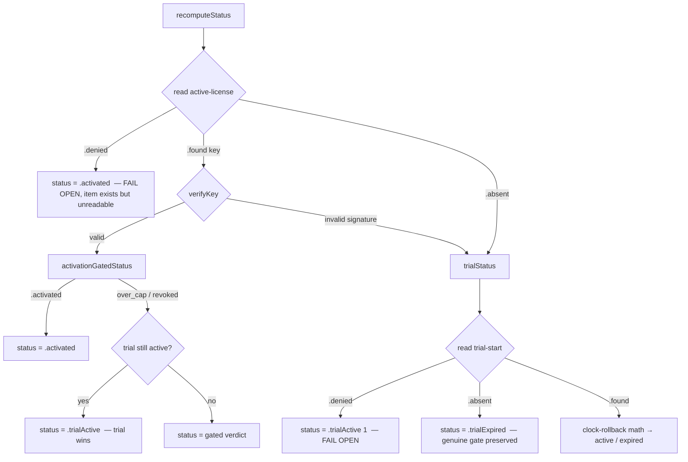

# fix: Fail open on denied Keychain reads so a transient auth failure never gates a licensed user

## Summary

`KeychainLicenseStore.get()` collapses **every** failure to `nil`, so
`LicenseManager.recomputeStatus()` cannot tell "no license" (item genuinely
absent) from "couldn't read the license" (item exists but the Keychain denied
access). When `securityd`/the login keychain transiently returns
`errSecAuthFailed` (-25293) on the app's own items in service
`com.danielius.ClipboardHistory.license`, the app reads `nil`, falls back to the
long-expired trial, and hard-gates a **paying customer** behind `ActivationPanel`
with a "trial expired" message. A reboot (securityd restart) clears it.

This plan makes the license state machine **fail open on a denied read**: a
denial means the item *exists but is temporarily unreadable*, so the user is kept
unblocked instead of gated. A genuine `errSecItemNotFound` (truly no license,
trial genuinely over) still gates — the real gate is preserved. The offline
Ed25519 signature check remains authoritative for key *validity*; this changes
only how we treat *unreadable* state.

Diagnosis and the reboot remedy are captured in
`.claude/rules/keychain-and-crypto.md` (section: "Transient `errSecAuthFailed`
(-25293) on the app's OWN license items").

---

## Problem Frame

**Observed (this session, 2026-07-20):** User pastes a valid key → it "activates"
→ next invoke of Drobu shows the "trial expired" activation gate again.

**Mechanism:**
1. `activate()` verifies the key **offline** (CryptoKit, no Keychain) and the
   online device-activation RPC succeeds → `status` flips to `.activated` in
   memory, UI says "activated".
2. Persisting it (`store.set("active-license", …)`) fails with `-25293` — nothing
   durable is written.
3. Next launch: `recomputeStatus()` reads `active-license` → `-25293` → store
   returns `nil` → falls to `trialStatus()` → trial started 2026-06-06, long past
   14 days → `.trialExpired` → `blocksUsage == true` → `ActivationPanel`.

**Root cause (the code defect):** the `LicenseStore` read surface is `String?`,
which is lossy — it cannot distinguish **absent** from **access-denied**. The
status machine therefore treats a transient, recoverable denial identically to a
permanent absence, and fails *closed* (gates) instead of *open*.

**Why fail-open is correct here:** `errSecItemNotFound` and `errSecAuthFailed`
are distinct OSStatus values. A never-licensed user has **no** `active-license`
item → `errSecItemNotFound` (`.absent`). You can only be *denied* access to an
item that **exists** → a denied read strongly implies the user *was* licensed.
Declining to gate on a denied read is not "granting a free license"; it is
refusing to punish an existing-item user for a transient read failure. This
mirrors the device-cap doctrine already in this file: *only an affirmative
negative verdict blocks* (KTD5/KTD6, fail-open).

---

## Requirements

- **R1** — A denied read (`errSecAuthFailed` / `errSecInteractionNotAllowed`, and
  any non-`errSecItemNotFound` failure) of `active-license` must NOT gate the
  user. `status.blocksUsage` must be `false` in this case.
- **R2** — A genuine `errSecItemNotFound` on `active-license` with an expired
  trial must STILL gate (`.trialExpired`, `blocksUsage == true`). The fix must
  not weaken the real gate.
- **R3** — A denied read of `trial-start` (when `active-license` is genuinely
  absent) must also fail open (non-blocking), for the same reason.
- **R4** — A stored key that reads successfully but fails signature verification
  must still fall back to trial state (unchanged — that is a genuine bad key, not
  an unreadable one).
- **R5** — No key material is ever logged. The existing device-cap fail-open,
  the clock-rollback anchor, and all current `.activated`/`.trialActive`/
  `.trialExpired`/`.activationLimitReached`/`.licenseRevoked` behavior for
  *readable* state is preserved.
- **R6** — Existing `LicenseStore` conformers (`InMemoryLicenseStore`, the test
  `WriteFailingLicenseStore`) must keep compiling with no behavioral change; they
  can never report `.denied` (they have no ACL layer).
- **R7** — New logic ships with Swift Testing coverage in the same commit
  (project rule: logic in `Services/` gets tests).

---

## Key Technical Decisions

**KTD1 — Add a lossless read result; keep `get()` as a derived convenience.**
Introduce `enum LicenseStoreRead { case found(String); case absent; case denied }`
and add `func read(_ key:) -> LicenseStoreRead` to the `LicenseStore` protocol.
Provide a **protocol-extension default** that derives `read` from `get`
(`get() != nil → .found`, else `.absent`, never `.denied`). This means
`InMemoryLicenseStore` and `WriteFailingLicenseStore` need **zero** changes (R6),
while `KeychainLicenseStore` overrides `read` with the real OSStatus mapping.
Rationale: minimal blast radius — the dozens of presence-only call sites
(`activate`, `revalidateIfNeeded`, `licensedEmail`, `persistVerdict`,
`recordFirstLaunchIfNeeded`, device cache) keep using `get()` unchanged; only the
two *gating* reads in the status machine switch to `read()`.

- *Alternative rejected:* make `read` the sole protocol requirement and `get` the
  extension. Cleaner in theory but forces every conformer (incl. both test mocks)
  to reimplement — more churn for no benefit, since only Keychain distinguishes
  denial.
- *Alternative rejected:* a new `LicenseStatus.accessUnavailable` case. More
  honest for UI, but every exhaustive `switch` on `LicenseStatus`
  (`ActivationView`, `SettingsView`, `ActivationCopy`, `blocksUsage`) would need a
  new arm — larger surface for a minimal hardening fix. Reusing `.activated`
  (optimistic, non-blocking) is exactly consistent with the existing device-cap
  "absent verdict → optimistic `.activated`" behavior.

**KTD2 — Denied `active-license` read → optimistic `.activated`.** In
`recomputeStatus()`, branch on `read(activeLicenseKey)`: `.denied` returns
`.activated` immediately (non-blocking, R1). The device-cap verdict reads inside
`activationGatedStatus()` already fail open (a `nil`/denied verdict read →
`default:` → `.activated`), so no change is needed there.

**KTD3 — Denied `trial-start` read → non-blocking trial.** In `trialStatus()`,
a `.denied` read of `trial-start` returns `.trialActive(daysRemaining: 1)` — a
nominal non-blocking status (R3). We cannot compute real days without the anchor;
not-gating is the correct bias, and `daysRemaining: 1` avoids over-claiming
activation. `.absent` still returns `.trialExpired` (R2), and a self-heal write
of the anchor is skipped on a denied read (we cannot trust reads/writes in that
window).

**KTD4 — Extract the OSStatus→result mapping as a pure, tested function.**
`KeychainLicenseStore.classify(status:hasData:) -> LicenseStoreRead` is pure and
unit-testable (the real `SecItem*` syscall stays out of test scope per project
conventions). Map: `errSecSuccess` + data present → `.found`; `errSecItemNotFound`
→ `.absent`; everything else (incl. `errSecAuthFailed`, `errSecInteractionNotAllowed`)
→ `.denied`. Keep the existing error logging for the non-`.absent`/`.found` paths.

---

## High-Level Technical Design

Decision flow for `recomputeStatus()` after the change (the branch shape is the
core of this fix — directional, not implementation spec):

The two `FAIL OPEN` leaves (C, K) are the entire behavioral change. Every other
edge is unchanged from today.

---

## Implementation Units

### U1. Lossless read result on `LicenseStore`; Keychain classifies denial

**Goal:** Give the store a way to say "denied" vs "absent" without disturbing
existing callers.

**Requirements:** R1, R2, R6, KTD1, KTD4.

**Dependencies:** none.

**Files:**
- `Sources/DrobuCore/Services/LicenseManager.swift` — add `LicenseStoreRead`
  enum; add `read(_:)` to the `LicenseStore` protocol with a `get`-derived
  default extension; in `KeychainLicenseStore` add a pure static
  `classify(status:hasData:)`, implement `read(_:)` using it (the real
  `SecItemCopyMatching`), and route `get(_:)` through `read(_:)` so there is one
  syscall path. Preserve the existing "never log key material" and the
  non-`.absent` error logging.
- `Tests/DrobuTests/LicenseManagerTests.swift` — add a `DenyingReadLicenseStore`
  test double (returns `.denied` for a configured key set, `.found`/`.absent`
  otherwise) for U2; add `classify` unit tests.

**Approach:** `LicenseStoreRead` is `Equatable, Sendable`. Default extension:
`if let v = get(key) { .found(v) } else { .absent }`. `KeychainLicenseStore.read`
does the `SecItemCopyMatching` and returns `classify(status:hasData:)`;
`classify` is a pure switch over OSStatus. `get` becomes
`if case .found(let v) = read(key) { v } else { nil }`.

**Patterns to follow:** existing `KeychainLicenseStore.get` query construction
and `Self.describe(status)` logging; `InMemoryLicenseStore` shape for the test
double.

**Test scenarios:**
- `classify(errSecSuccess, hasData: true)` → `.found` is expected only when data
  is non-nil; `classify(errSecSuccess, hasData: false)` → `.denied` (success but
  no data is anomalous, treat as unreadable, not absent).
- `classify(errSecItemNotFound, hasData: false)` → `.absent`.
- `classify(errSecAuthFailed, hasData: false)` → `.denied`.
- `classify(errSecInteractionNotAllowed, hasData: false)` → `.denied`.
- `classify(<any other non-success status>, …)` → `.denied`.
- Protocol default: an `InMemoryLicenseStore` with a value → `read` returns
  `.found`; without → `.absent`; never `.denied`.

**Verification:** `swift build` clean; existing `LicenseManagerTests` still pass
untouched (proves R6 — no conformer churn).

### U2. Fail open on denied reads in the status machine

**Goal:** `recomputeStatus()` and `trialStatus()` never gate on a denied read.

**Requirements:** R1, R2, R3, R4, R5, R7, KTD2, KTD3.

**Dependencies:** U1.

**Files:**
- `Sources/DrobuCore/Services/LicenseManager.swift` — `recomputeStatus()` reads
  `active-license` via `read(_:)`; `.denied` → `status = .activated; return`.
  `.found`/`.absent` keep today's logic. `trialStatus()` reads `trial-start` via
  `read(_:)`; `.denied` → return `.trialActive(daysRemaining: 1)` with an
  `error` log and NO anchor write; `.absent` → `.trialExpired`; `.found` → the
  existing clock-rollback math.
- `Tests/DrobuTests/LicenseManagerTests.swift` — new `@Test` cases using
  `DenyingReadLicenseStore`.

**Approach:** Keep the changes surgical — only the two gating reads move to
`read(_:)`; every other `store.get(...)` in the file stays as-is (device cache,
anchor writes, `activate`, `revalidate`, `licensedEmail`). Add a one-line comment
at each fail-open leaf citing the "denied ⟹ item exists" rationale.

**Patterns to follow:** existing `recomputeStatus` structure and the device-cap
fail-open comment style already in the file.

**Test scenarios:**
- **R1:** active-license read denied (trial long expired) → `status == .activated`,
  `status.blocksUsage == false`. (This is the exact reported bug.)
- **R2:** active-license genuinely `.absent` + trial expired → `.trialExpired`,
  `blocksUsage == true` (real gate preserved).
- **R2:** active-license `.absent` + trial active → `.trialActive` (unchanged).
- **R3:** active-license `.absent` + trial-start denied → non-blocking
  (`.trialActive`), `blocksUsage == false`; assert the anchor (`last-seen`) was
  NOT written during the denied read.
- **R4:** active-license `.found` but signature invalid → falls back to trial
  state (unchanged behavior).
- **Device-cap still fail-open:** active-license `.found` + valid + verdict read
  denied/absent → `.activated` (confirms `activationGatedStatus` default arm).
- **Regression:** a full `activate()` on an `InMemoryLicenseStore` still yields
  `.activated` and persists (proves the default `read` path is transparent).

**Verification:** `swift test` green including the new cases; the reported
scenario (denied active-license + expired trial → not gated) is covered by an
explicit test.

### U3. Version bump + website footer

**Goal:** Ship as a patch release per CLAUDE.md versioning rules.

**Requirements:** worth-shipping bug fix (patch tier).

**Dependencies:** U2.

**Files:**
- `Sources/DrobuCore/Info.plist` — `CFBundleShortVersionString` 1.10.0 → 1.10.1;
  `CFBundleVersion` 23 → 24 (strictly-increasing build number for Sparkle).
- `website/src/components/Footer.astro` — `vX.Y.Z` → `v1.10.1`.

**Approach:** Mirror the version checklist in CLAUDE.md (2 code/site surfaces;
Settings "About" reads the plist at runtime, no edit).

**Test expectation:** none — version metadata only. Verify by reading back the
plist values and the footer string.

**Verification:** `plutil -extract CFBundleShortVersionString raw
Sources/DrobuCore/Info.plist` → `1.10.1`; `CFBundleVersion` → `24`; footer shows
`v1.10.1`.

---

## Scope Boundaries

**In scope:** the denied-vs-absent distinction and fail-open behavior in the
license status machine; the pure classification function and its tests; the patch
version bump.

**Out of scope / non-goals:**
- Changing *why* `securityd` transiently denies (an OS-level state; reboot is the
  operational remedy, already documented in the rule file). This fix makes the
  app *resilient* to it, not preventing it.
- Migrating Keychain items to a different accessibility/partition model, or
  adding `kSecAttrAccessControl`. Larger, riskier, and unrelated.
- Surfacing a user-visible "couldn't verify license, retrying" banner (would
  require a new `LicenseStatus` case — see KTD1 rejected alternative).
- Any change to the write path. If writes are denied the activation simply fails
  and retries later; the bug being fixed is *gating on a denied read*, not the
  write.

### Deferred to Follow-Up Work
- Consider a proactive re-validation kick when a denied read is observed at launch
  (log-only for now). Only worth it if field data shows the denial persists
  without reboot.

---

## Risks & Mitigations

- **Risk:** a truly unlicensed user gets un-gated by a denial. **Mitigation:** an
  unlicensed user has no `active-license` item → `errSecItemNotFound` → `.absent`
  → still gated (R2). `.denied` requires an existing item. Low risk, covered by
  the R2 test.
- **Risk:** protocol change breaks a conformer. **Mitigation:** the default
  extension means existing conformers need no edits; U1 verification runs the
  untouched existing suite to prove it.
- **Risk:** `errSecSuccess` with nil data mis-mapped to `.absent` (would gate).
  **Mitigation:** `classify` maps success-without-data to `.denied` (fail open),
  explicitly tested.

### Accepted residual risk (from code review)

- **Fail-open is a code-free gate bypass (accepted).** The observed transient
  failure is `errSecAuthFailed` (-25293) — which is *indistinguishable by status
  code* from a Keychain item a user deliberately plants with a deny-ACL (create a
  generic-password entry at service `com.danielius.ClipboardHistory.license`,
  account `active-license` or `trial-start`, remove Drobu from its trusted-app
  list). Such a planted item makes `read()` return `.denied` → the app fails open
  to `.activated` / `.trialActive`, bypassing trial expiry, the device cap, and
  revocation — for a user who never held a valid key. **This cannot be closed
  without either (a) not fixing the reported bug** — the real transient failure
  *is* `errSecAuthFailed`, so we must fail open on it — **or (b) corroborating
  with out-of-Keychain state** (UserDefaults/file), which is *more* forgeable than
  the Keychain (`defaults write`) and is denied together with the license in the
  real service-wide-denial scenario anyway, so it would gate genuine users while
  barely raising the attacker's bar. **Accepted** because: the app is a $15
  one-time offline-verified purchase already trivially crackable (block the
  network / patch the binary); fail-open-favoring-the-user is the codebase's
  explicit, pre-existing philosophy (device-cap unreachable → fail open, KTD5/KTD6);
  and the plant-a-Keychain-item path takes more effort than the easier cracks it
  competes with. The revocation-bypass sub-case is likewise already reachable
  offline (a refunded key's signature still verifies; revocation only propagates
  online within the grace window). Documented in `.claude/rules/keychain-and-crypto.md`.
- **What the review *did* change:** `recordFirstLaunchIfNeeded` now routes through
  `read()` and skips the write on a `.denied` trial-start (3 reviewers flagged the
  old `get() == nil` guard conflating denied with absent — it could overwrite a
  genuine, temporarily-unreadable `trial-start` and reset the clock). Tests added.
- **Known limitation (locked keychain):** per `.claude/rules/keychain-and-crypto.md`,
  a *locked* login keychain returns existing items as `errSecItemNotFound` (→
  `.absent` → gated), so this fix does **not** help the locked-keychain case — it
  targets the `errSecAuthFailed` ACL/securityd-corruption case, which is the
  observed bug (the user's `app.log.1` showed -25293, and a reboot cleared it).
  Honest and strictly better than pre-fix for that case; not a regression for the
  locked case (same gating as before).

---

## Sources & Research

- `.claude/rules/keychain-and-crypto.md` — the diagnosed gotcha, the reboot
  remedy, and the fail-closed defect note this plan resolves.
- `.claude/rules/sparkle-macos-gotchas.md` — the signing-identity / "Never Deny"
  Keychain-ACL background.
- `Sources/DrobuCore/Services/LicenseManager.swift` — `KeychainLicenseStore`,
  `recomputeStatus`, `trialStatus`, `activationGatedStatus`, `blocksUsage`.
- `Sources/DrobuCore/Services/CaptureUIPolicy.swift` + `AppDelegate.swift`
  (`showPanel`, capture gates) — the `blocksUsage` consumers, unchanged.
- `Tests/DrobuTests/LicenseManagerTests.swift` — `WriteFailingLicenseStore`,
  `StubActivationClient`, `makeManager` patterns to mirror.

## Definition of Done

- All of R1–R7 satisfied.
- `swift test` green, including: the reported bug scenario (denied active-license
  + expired trial → not gated), R2 real-gate-preserved, R3 trial-start denied,
  R4 bad-signature, device-cap fail-open, and `classify` unit tests.
- Existing `LicenseManagerTests` pass with no edits to `InMemoryLicenseStore` /
  `WriteFailingLicenseStore` (proves R6).
- Version bumped to 1.10.1 / build 24 in `Info.plist` and footer.
- No key material in any log path.
