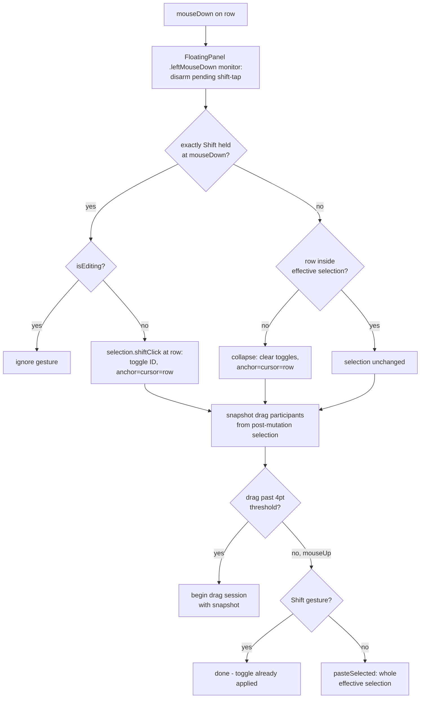

# Shift-Click Cherry-Pick Multi-Selection - Plan

## Goal Capsule

- **Objective:** Shift+Click on a clipboard panel row toggles that row in/out of the multi-selection, enabling non-adjacent (cherry-picked) selections that paste, delete, and drag out correctly.
- **Authority:** Requirements (R-IDs) own product behavior; Key Technical Decisions (KTD-IDs) own implementation mechanism. Session-settled KTDs are not re-litigated.
- **Stop conditions:** Surface to the user instead of guessing if (a) the pure selection model cannot express a settled requirement, or (b) a change would alter `FloatingPanel.pasteItems` ordering behavior (out of scope per Scope Boundaries).
- **Execution profile:** Swift 6 / SwiftPM. Tests ship in the same commit as the code they cover (repo rule). Verify with `swift test`, then a real build+launch.

---

## Product Contract

### Summary

Add mouse-driven cherry-picking to the clipboard panel: Shift+Click toggles individual rows into a non-contiguous multi-selection, plain click on a selected row pastes the whole selection, and all existing selection consumers (multi-paste, multi-delete, drag-out, keyboard range-select) honor the new selection shape.

### Problem Frame

Multi-selection today is keyboard-only (Shift+Arrows) and contiguous-only (`anchor`/`cursor` index range in `PanelView`). A user who wants items 1, 3, and 5 cannot select them at all, and a mouse-first user has no way to multi-select. Live user feedback (2026-08-07) showed a new user reaching for Shift+Click and finding nothing. The click surface already exists: `RowDragSourceView` owns row mouse handling for tap-to-paste and drag-out, so modifier-aware clicks are a natural extension.

### Requirements

**Selection behavior**

- R1. Shift+Click on a clipboard row toggles that row in/out of the multi-selection; non-adjacent rows can be selected together.
- R2. Plain click on a row inside the current multi-selection pastes the whole selection; plain click on any other row collapses the selection and pastes just that row.
- R3. Shift+Arrows keep today's grow/shrink range extension from the cursor; toggled rows outside the live range persist alongside it.
- R4. Multi-paste order is list order, top to bottom. The existing `pasteItems` behavior (text items concatenate into one leading paste, then media in order) is unchanged.
- R5. Delete-forward with a cherry-picked selection deletes all selected rows and lands the cursor on a sensible surviving row.
- R6. Drag-out from a row inside the selection carries the whole selection; from a row outside it carries just that row.
- R7. Releasing Shift after a Shift+Click must not toggle the large preview. A bare Shift tap (no click) still toggles it. Any left click in the panel disarms a pending shift-tap.
- R8. One Escape press clears the entire selection (toggled rows and live range); the rest of the Escape ladder (clear search → close panel) is unchanged.

**Consistency with existing flows**

- R9. Selection resets everywhere it resets today: search text change, filter change, panel close, command-mode transitions, and the save-path edit exits. Discarding an edit keeps the current position, as today. Cmd+1..9 collapses the selection and pastes that single row.
- R10. Single-selection flows are unchanged: plain click pastes, keyboard navigation wraps, Cmd+Right edit entry is blocked only while more than one row is selected.
- R11. Shift+Click while edit mode is active is ignored (mirrors the existing keyboard and drag guards). Plain click mid-edit keeps pasting the clicked row, as today.

**Accessibility**

- R12. Rows expose a VoiceOver "Toggle Selection" action; the default row activation mirrors R2. Selected rows keep the `.isSelected` trait.
- R13. A row advertises the Return affordance only when it is both the cursor row and part of the effective selection, so the visible paste hint never contradicts what Return pastes.

### Acceptance Examples

- AE1. **Covers R1, R2, R4.** Given rows A B C D E, when the user Shift+Clicks A, C, E and then plain-clicks C, then A, C, E paste in list order and the panel closes.
- AE2. **Covers R1.** Given A, C, E selected, when the user Shift+Clicks C, then only A and E remain selected.
- AE3. **Covers R7.** Given the panel open, when the user presses Shift, clicks a row, and releases Shift, then the row toggles and the large preview does not open. When the user taps and releases Shift with no click, the large preview toggles as today.
- AE4. **Covers R3.** Given row E toggled via Shift+Click, when the user presses Shift+Down twice from the cursor, then the two rows below the cursor join the selection and E stays selected; Shift+Up removes the last-added row and E still stays selected.
- AE5. **Covers R6.** Given A and D selected, when the user presses on D and drags past the threshold, then both A and D leave as files; dragging from unselected B carries only B.
- AE6. **Covers R13.** Given A, C, E selected with the cursor on C, when the user Shift+Clicks C to deselect it, then C loses both its highlight and its Return affordance while A and E stay selected, and Return pastes A and E.
- AE7. **Covers R5, R8.** Given rows 2 and 6 of eight selected, when the user presses Delete-forward, then both rows disappear and the cursor lands on the row that followed row 6; a following Escape clears nothing visible and instead clears the search field, as today.
- AE8. **Covers R9, R10, R11, R12.** Given a cherry-picked selection, then each of these collapses it to a single row and pastes or resets as today: Cmd+3, a filter-tab click, typing in the search field, and closing the panel. Cmd+Right stays blocked while more than one row is selected. Mid-edit, Shift+Click does nothing while plain click still pastes the clicked row. Under VoiceOver, the row's "Toggle Selection" action adds and removes rows from the selection and the default action pastes per R2.

### Scope Boundaries

- No Cmd+Click variant (rejected by user — Shift+Click is the single toggle gesture).
- No rubber-band / drag-to-select, no Select All (⌘A). Deferred to follow-up work if requested.
- `FloatingPanel.pasteItems` ordering (text concatenates before media) is accepted as-is; strict interleaved order is out of scope.
- Intentional small behavior change: with a multi-selection active and the large preview open, its arrow relay adopts the panel's collapse-to-edge semantics instead of always wrap-moving. Single-selection relay behavior is unchanged.
- Accepted existing behaviors that carry over: index-based anchor/cursor drift when a new item arrives mid-session; a re-copied item gets a new row ID via `upsert` and silently leaves the toggled set; the no-Accessibility multi-paste fallback handles text only.
- Pre-existing oddity, not fixed here: a plain click mid-edit pastes the clicked row (Shift+Click gets a guard per R11; the plain-click path is untouched).

---

## Planning Contract

### Key Technical Decisions

- KTD1. **Shift+Click toggles the clicked row.** (session-settled: user-directed — chosen over the macOS convention of Shift+Click range-extend plus Cmd+Click toggle: matches the requesting user's mental model and the panel's existing Shift-centric interaction language.)
- KTD2. **Plain click inside the selection pastes the whole selection.** (session-settled: user-approved — chosen over always-paste-single-row: without it there is no mouse-only way to paste a cherry-picked set; mirrors Return and drag-out.) Governs R2.
- KTD3. **Selection is a single ID set with a materialized live range.** State is `toggledIDs: Set<Int64>` plus the existing index-based `anchor`/`cursor`. Each Shift+Arrow replaces its own `anchor...cursor` contribution in the set (remove old range IDs, insert new range IDs — NSTableView semantics), so grow and shrink both work and there is no separate range at query time, which eliminates ghost selections. Effective selection = toggled IDs in list order when non-empty, else the cursor row (floor of one — every downstream consumer assumes at least one selected item). The floor applies only when the list has rows: with `ids` empty (zero search/filter matches, everything deleted) the effective selection is empty and paste/delete/drag/preview paths no-op, matching today's empty-items guard in `selectedItems`. (session-settled: user-approved for the layered grow/shrink behavior.) Governs R3.
- KTD4. **Toggles are keyed by record ID, not index.** Follows the `editingItemId` precedent in `PanelView`: a new item arriving at the top shifts indices, and ID-keyed toggles keep pointing at the right rows. Known accepted limit: `ClipboardRecord.upsert` deletes and re-inserts on re-copy, so a re-copied item leaves the selection.
- KTD5. **The selection model is one pure type, `PanelSelection`, in `Sources/DrobuCore/Services/`.** Follows the `CropGeometry`/`DragExport` pure-engine precedent and keeps the type inside the repo's stated testing mandate (Models/Database/Services). Views and Services share one `DrobuCore` target, so this is a convention choice, not an import constraint.
- KTD6. **The gesture is classified and applied at mouseDown.** Shift+press toggles immediately at mouseDown (NSTableView timing); a plain press collapses-if-outside at mouseDown; the drag snapshot is taken after the selection mutation so drags carry the post-mutation selection; paste fires at mouseUp within the 4pt threshold, using the modifier state captured at mouseDown. This fixes two defects of a mouseUp design: a Shift+Click that jitters past the drag threshold would silently do nothing, and the mouseDown drag snapshot would predate the toggle. Consequence to implement deliberately: a Shift+press that crosses the threshold keeps its toggle and drags the post-toggle participants, so Shift+dragging an already-selected row carries only that row (it was just toggled out), and the deselection persists after a cancelled drag.
- KTD7. **`dragParticipants` becomes side-effect-free.** Its current collapse of `anchor`/`cursor` at mouseDown moves into the explicit press path (the plain-press collapse of KTD6). Participant rule stays: pressed row in selection → whole selection; outside → just the pressed row.
- KTD8. **Cursor and anchor follow a Shift+Click.** The preview panes show the row just acted on, and a following Shift+Arrow extends from it. The cursor row is only a selection fallback when the toggled set is empty, so moving the cursor onto a just-toggled-off row does not re-select it.
- KTD9. **Shift-tap disarm is a panel-wide `.leftMouseDown` local monitor in `FloatingPanel`**, beside the existing `keyDown` disarm — not a per-row hook. This also fixes a live pre-existing bug: Shift+Clicking the search field or a filter tab today arms the detector and the Shift release toggles the large preview. Governs R7.
- KTD10. **Version bump is minor: 1.11.0, build 25.** Mouse cherry-picking is a distinctly new user-facing capability per the repo's versioning policy.

### High-Level Technical Design

Gesture pipeline (replaces the current tap-only `onTap` flow in `RowDragSourceNSView`):

`PanelSelection` operations (pure, fully unit-tested; `ids` is the current list-order array of record IDs):

| Operation | Effect |
|---|---|
| `shiftClick(at:ids:)` | Toggle `ids[index]` in `toggledIDs`; `anchor = cursor = index` |
| `collapse(to:ids:)` | Clear `toggledIDs`; `anchor = cursor = index` (plain press outside selection, Cmd+1..9) |
| `shiftMove(by:ids:)` | Move cursor with clamp; remove old `anchor...cursor` IDs, insert new range IDs |
| `plainMove(by:ids:)` | Multi active → collapse to min (up) / max (down) selected index; else wrap-move; clears toggles |
| `escapeClear(ids:)` | Clear `toggledIDs`, `anchor = cursor`; reports whether anything visible was cleared — a set holding exactly the cursor row's own ID (what a Shift+Down/Shift+Up round-trip leaves) is cleared but reports false, so Escape falls through to the search rung as today. Takes `ids` so the cursor-row test is exact: an index-only proxy misreports a lone highlight that is not the cursor row |
| `reset()` | Back to empty toggles, `anchor = cursor = 0` (search/filter/mode reset sites) |
| `clampAndPrune(ids:)` | Clamp indices to bounds, drop toggled IDs absent from `ids` (observation refresh) |
| `effectiveIDs(ids:)` | Record IDs of the selected rows in list order; empty set → the cursor row's ID (floor of one); empty `ids` → empty |
| `selectedIndices(ids:)` | The same selection expressed as row indices in ascending order — what rendering and drag participants consume |
| `hasMultiSelection(ids:)` | Effective count > 1 (single predicate for all five current `hasMultiSelection` consumers) |
| `indexAfterDeleting(deleted:count:)` | First survivor after the highest deleted index, else last survivor, else 0 |

Pinned model quirk (test it, don't fix it): a toggled row absorbed into a live Shift+Arrow range is removed if the range later shrinks past it — the range replacement owns its span, matching NSTableView.

### Sources & Research

- Selection-site inventory, `pasteItems` ordering, and reset-site list: `Sources/DrobuCore/Views/PanelView.swift` (selection state ~L38–72, keyboard handling `handleClipboardKeyPress`, paste/delete ~L1200–1253, `dragParticipants` ~L1186, `refilterItems` clamp ~L906).
- Gesture mechanics: `Sources/DrobuCore/Views/RowDragSourceView.swift` (4pt threshold, mouseDown snapshot discipline "KTD3" comment).
- Shift-tap detector and its keyDown-only disarm: `Sources/DrobuCore/Views/ShiftTapDetector.swift`, `Sources/DrobuCore/Views/FloatingPanel.swift` (`handleFlagsChanged`, local monitors).
- Sparse-participant consumer: `Sources/DrobuCore/Services/DragExport.swift` (`participantIndices` is `ClosedRange<Int>`-typed today, tested in `Tests/DrobuTests/DragExportTests.swift`).
- Pure-model precedent: `ShiftTapDetector` free function, `CropGeometry`, `SettingsNavigationModel` — all unit-tested without UI.

---

## Implementation Units

### U1. Pure selection model

- **Goal:** `PanelSelection` owns all selection state and transitions; every behavior above is pinned by tests before any UI wiring.
- **Requirements:** R1, R3, R5, R8, R10 (model halves of each); KTD3, KTD4, KTD5, KTD8.
- **Dependencies:** none.
- **Files:** `Sources/DrobuCore/Services/PanelSelection.swift` (new), `Tests/DrobuTests/PanelSelectionTests.swift` (new).
- **Approach:** Struct with `toggledIDs: Set<Int64>`, `anchor: Int`, `cursor: Int` and the operation table from the Planning Contract. All methods take the current list-order `ids: [Int64]` (or count) as input — no view or DB dependency. Include the `indexAfterDeleting` reposition rule and `clampAndPrune`.
- **Test scenarios** (Swift Testing, `@Suite("PanelSelection")`; use `@Test(arguments:)` where cases parallel):
  - Toggle on, toggle off, toggle two non-adjacent rows → effective IDs in list order.
  - Toggle the row under the cursor off when it is the only toggled row → effective selection falls back to the cursor row (floor of one).
  - Shift+Click moves anchor and cursor to the clicked index; toggled state of other rows unchanged.
  - Shift-walk from empty: two `shiftMove(+1)` selects three rows; one `shiftMove(-1)` shrinks back to two.
  - Cherry-pick a row, then shift-walk elsewhere: toggled row persists through grow and shrink (AE4 shape).
  - Walk absorbs a previously toggled row, then shrinks past it → row is deselected (pinned quirk).
  - Toggle a selected row off, then `shiftMove(+1)` from it → the new range re-includes that row (the range owns its span; sibling of the pinned quirk).
  - `escapeClear` on a set holding exactly the cursor row's ID (the Shift+Down/Shift+Up round-trip state) clears it and reports false.
  - `plainMove` with multi active collapses to max index going down, min going up, clears toggles; without multi it wrap-moves.
  - `collapse(to:)` clears toggles and lands both indices on the target.
  - `escapeClear` reports true and empties everything when a toggle or range existed; reports false on a bare cursor.
  - `clampAndPrune` drops IDs absent from the list and clamps out-of-range indices (list shrank).
  - `hasMultiSelection`: false for bare cursor and single toggled row; true for two toggled rows; true mid-shift-walk of two.
  - `indexAfterDeleting`: sparse set {1, 3} in a 5-row list → cursor lands on the survivor after index 3; deleting the tail → last survivor; deleting everything → 0.
  - Stale toggled ID (not in `ids`) is inert: excluded from effective IDs and counts.
  - Empty `ids` (zero visible rows): effective selection is empty, `hasMultiSelection` is false, paste/delete/drag are no-ops.

### U2. Sparse drag participants

- **Goal:** `DragExport.participantIndices` accepts a non-contiguous selection.
- **Requirements:** R6; KTD7 (rule side).
- **Dependencies:** none (keep the signature in plain `Set<Int>`/`[Int]` so U1 and U2 are independent).
- **Files:** `Sources/DrobuCore/Services/DragExport.swift`, `Tests/DrobuTests/DragExportTests.swift`.
- **Approach:** Change `participantIndices(pressed:selection:hasMultiSelection:)` from `ClosedRange<Int>` to a sparse collection; output stays ascending (list order). Behavior for contiguous input is unchanged.
- **Test scenarios:**
  - Pressed inside a sparse selection {0, 2, 4} → returns [0, 2, 4].
  - Pressed outside it → returns [pressed] only.
  - Existing contiguous cases keep passing with the new signature.

### U3. Modifier-aware gesture pipeline and shift-tap disarm

- **Goal:** Row presses carry modifier state; the selection mutation happens at mouseDown; a pending shift-tap can never misfire off a click.
- **Requirements:** R7, R11 (gesture side); KTD6, KTD9.
- **Dependencies:** none (callback signatures land here; PanelView consumes them in U4).
- **Files:** `Sources/DrobuCore/Views/RowDragSourceView.swift`, `Sources/DrobuCore/Views/FloatingPanel.swift`.
- **Approach:**
  1. `FloatingPanel`: add a `.leftMouseDown` local monitor beside the existing `keyDown`/`flagsChanged` monitors that clears the pending shift-tap arm (mirror the `keyDown` disarm).
  2. `RowDragSourceNSView`: capture `event.modifierFlags.intersection(shiftTapRelevantModifiers)` at mouseDown; the gesture is a Shift gesture iff the masked flags equal exactly `[.shift]` (Shift+Cmd etc. stay plain). Add an `onPress(_ isShift: Bool)` callback invoked at mouseDown **before** the drag-records snapshot; `onTap` fires at mouseUp only for non-Shift gestures.
- **Patterns to follow:** existing local-monitor setup in `FloatingPanel`; `shiftTapRelevantModifiers` masking convention in `ShiftTapDetector.swift`.
- **Test scenarios:** extract the gesture classification (masked flags → shift-gesture yes/no) as a pure function and test: bare Shift → true; Shift+Cmd, Cmd, empty, Shift+Option → false. NSView lifecycle and monitors are manual-verification territory per repo testing rules.
- **Verification:** with the panel open, Shift+Click the search field, a filter tab, and a row — releasing Shift never toggles the large preview; a bare Shift tap still does.

### U4. PanelView migration to the set-based selection

- **Goal:** Every selection consumer in the panel runs on `PanelSelection`; Shift+Click works end to end.
- **Requirements:** R1–R6, R8–R13.
- **Dependencies:** U1, U2, U3.
- **Files:** `Sources/DrobuCore/Views/PanelView.swift`, `Sources/DrobuCore/Views/ClipboardRowView.swift`.
- **Approach:** Replace the `anchor`/`cursor` `@State` pair with one `@State` `PanelSelection`, then migrate by checklist (every current `anchor =` / `cursor =` site gets an explicit decision):
  1. Row overlay: `onPress` → `shiftClick` (ignored while `isEditing`, per R11) or the collapse-if-outside rule; `onTap` → `pasteSelected()`. Leave the plain-click path's mid-edit behavior exactly as it is — only the Shift branch is guarded.
  2. `dragParticipants` → side-effect-free, reads `selectedIndices` (KTD7).
  3. Keyboard: Shift/plain arrows → `shiftMove`/`plainMove`; Escape rung → `escapeClear`; Cmd+Right and footer-verb gates → `hasMultiSelection`; Cmd+1..9 → `collapse(to:)` + single paste; large-preview arrow relay → `plainMove`.
  4. `pasteSelected`/`deleteSelected` → effective IDs in list order; delete repositions via `indexAfterDeleting` (drag-staging purge logic unchanged).
  5. Reset sites (search change, filter change, `onDisappear`, filter-tab tap, command-mode transitions, save-path edit exits) → `reset()`; observation refresh → `clampAndPrune` (keep the `editingItemId` re-follow). Discarding an edit resets nothing — it has no selection write today and must not gain one (R9).
  6. Command-mode cursor sites (command-list arrows, command-options arrows, and their resets) migrate via a count-only `plainMove(by:count:)` overload — command rows are keyed by name, not record ID, so the ID-based signatures cannot serve them; the toggled set stays empty in command modes.
  7. Row rendering: `isSelected` from `selectedIndices`; the Return affordance only when the row is the cursor **and** in `selectedIndices` (R13); `PreviewPanel.selectionCount` from effective count.
  8. Accessibility: default row action mirrors the click rule (R2); add `.accessibilityAction(named: "Toggle Selection")`; keep label/trait contract per `.claude/rules/accessibility.md`.
  9. Footer hint: mention Shift+Click selection without dropping the existing `⇧ preview` meaning (exact wording is an implementation choice).
- **Test scenarios:** behavior is pinned in U1/U2; this unit is wiring. `Test expectation: none beyond U1/U2 suites — SwiftUI/AppKit wiring is out of test scope per repo rules.` The acceptance examples (AE1–AE8) are the manual checklist.
- **Verification:** `swift test` green; manual run of AE1–AE8 in the built app.

### U5. Version bump

- **Goal:** Release metadata reflects the new capability.
- **Requirements:** KTD10.
- **Dependencies:** U4.
- **Files:** `Sources/DrobuCore/Info.plist`, `website/src/components/Footer.astro`.
- **Approach:** `CFBundleShortVersionString` 1.10.1 → 1.11.0, `CFBundleVersion` 24 → 25, footer `v1.10.1` → `v1.11.0`.
- **Test expectation:** none — release metadata.
- **Verification:** both files changed in the same commit as the feature merge.

---

## Verification Contract

| Gate | Command / action | Proves |
|---|---|---|
| Unit tests | `swift test` | U1 model behavior, U2 sparse participants, U3 gesture classification; no regression in the existing ~73 tests |
| Build + launch | `pkill -x Drobu; ./build.sh --install && open /Applications/Drobu.app` | App runs with the change (repo rule: always build and launch, not just compile) |
| Manual acceptance | AE1–AE8 in the running app | End-to-end gesture, paste order, preview coexistence, drag-out, toggle-off feedback (R13), delete landing + Escape ladder (R5, R8), resets and Cmd+1..9 and mid-edit and VoiceOver (R9–R12) |
| Regression spot-checks | Bare Shift tap toggles large preview; Shift+Arrows alone behave as before; single click pastes; Cmd+→ edits a single selection | R7, R10 |

## Definition of Done

- All five units implemented; `swift test` green locally and in CI.
- AE1–AE8 verified in the built, installed app — including the toggle-off feedback case (R13), the delete-then-Escape sequence (R5, R8), and the reset / Cmd+1..9 / mid-edit / VoiceOver sweep (R9–R12).
- The shift-tap disarm covers search field, filter tabs, and rows (U3 verification).
- No leftover experimental code paths; `dragParticipants` has no selection side effects.
- Version strings bumped per U5 in the merge commit.
