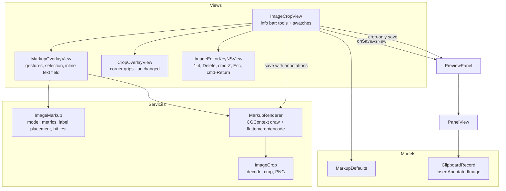

# Image Markup Overlays - Plan

## Goal Capsule

- **Objective:** A Drobu user can take a screenshot (e.g. a dashboard cost graph), mark the interesting spot with a tinted box, an arrow, or a short note, and paste the marked-up image straight from Drobu — without detouring through Canva or Preview.
- **Means:** extend the existing ⌘→ image editor (`ImageCropView` + `CropOverlayView`) with a hand-drawn markup layer whose model, geometry, and renderer live in pure, tested Services code (KTD1, KTD2).
- **Authority:** Product Contract Requirements win on behavior; KTDs win on mechanism; units override neither.
- **Stop conditions:** stop and surface if the shared renderer cannot produce a WYSIWYG match between overlay and saved PNG, or if the inline text field cannot take focus inside the non-activating `FloatingPanel`.
- **Execution profile:** autonomous run on a feature branch; `swift test` green at every commit; build + install + launch at the end.
- **Finish and ship:** the executing agent finishes the remaining work through code review, live validation, and the PR loop.

---

## Product Contract

### Summary

Add three hand-drawn markup tools to the image edit mode: a highlight box with an optional attached comment label, an arrow, and a free-standing text note. The user picks a colour from a four-swatch palette and draws directly on the image; crop keeps working as today. Saving burns the markup into the pixels and adds the result as a new history item at the top of the list, leaving the original screenshot untouched.

### Problem Frame

The user's current workflow for explaining a screenshot is: capture it, open Canva, add a box/arrow/note, export, re-screenshot. For a typical case — a cost graph where something changed on one day — that is several app switches for a ten-second edit. Drobu already owns the screenshot and already has an inline image editor, so the edit the sharer needs is one step away from being on the clipboard. `STRATEGY.md` names image markup (arrows, text) under "Deeper edits within a medium" for exactly this reason: the detour is not gone until the needed edit happens in Drobu.

Nothing is detected automatically. The user draws every shape by hand, like in Paint.

### Requirements

**Tools and drawing**

- R1. The image edit mode offers three tools — Box, Arrow, Note — selectable from the editor's info bar; Box is the default when the editor opens.
- R2. With Box, dragging on the image draws a rectangle rendered as a translucent tint of the current colour with a solid border of that colour.
- R3. With Arrow, dragging draws a thick arrow from the drag start (tail) to the drag end (head) in the current colour.
- R4. With Note, clicking on the image places a free-standing text pill at that point and opens text entry for it.
- R5. Crop corner grips keep working exactly as today; a drag that starts on a crop corner adjusts the crop, any other drag on the image draws with the current tool.

**Text**

- R6. After a box is drawn, an inline text editor opens at the box's label position, styled like the finished pill. Return adds a line; Esc, ⌘↩, or clicking elsewhere finishes and keeps the text (as in Preview, Figma and Excalidraw), and an empty comment leaves the box without a label.
- R7. A box label renders as a solid pill of the box colour, placed just above the box, below it when there is no room above, inside the top of the box when neither fits, and kept inside the visible (cropped) image so the comment always survives the save.
- R8. A note confirmed empty is discarded.
- R9. Double-clicking a box or note re-opens text entry for its label.

**Colour**

- R10. The palette is red (default), yellow, green, blue, shown as swatches in the info bar; keys 1–4 select a colour; the chosen colour persists across editor sessions.
- R11. Selecting a colour while an annotation is selected recolours that annotation.

**Editing**

- R12. Clicking an annotation selects it; Delete (or Backspace) removes the selected annotation. Drawing a new shape or clicking empty canvas clears the selection, and a newly drawn shape is never auto-selected.
- R13. ⌘Z removes the most recently added annotation.

**Save and discard**

- R14. ⌘↩ with at least one annotation renders the annotations into the image at full pixel resolution, then applies the crop, encodes PNG, and inserts the result as a new history item at the top of the list; the original item is unchanged.
- R15. ⌘↩ with no annotations keeps today's behaviour exactly (crop-only replaces in place; untouched crop behaves like Esc).
- R16. Esc discards all annotations and exits edit mode, as today.
- R17. Stroke widths and font sizes follow the image's pixel density so markup reads at the same visual weight as the screenshot's own UI text on Retina and non-Retina screenshots.

**Accessibility**

- R18. Tool buttons and colour swatches are VoiceOver buttons with labels and a selected trait; the markup canvas announces how many annotations it holds.

### Key Decisions

- **Hand-drawn only, no auto-detection.** The user wants a Paint/Canva-style overlay, not smart highlighting. Governs R1–R4. (session-settled: user-directed — chosen over any detection of "what to highlight": the user explicitly clarified they only want an overlay they draw themselves)
- **Tinted box + border as the highlight style.** Governs R2. (session-settled: user-approved — chosen over outline-only and spotlight-dim: the graph line stays visible through the tint and a thin box reads as a "this day" band)
- **Comment as a label attached to the box.** Governs R6, R7. (session-settled: user-approved — chosen over a caption strip below the image and a draggable label with leader line: the comment sits where the change is, at the lowest build cost)
- **Small remembered palette.** Governs R10. (session-settled: user-approved — chosen over one fixed colour)
- **Annotated save adds a new item; original kept.** Governs R14. (session-settled: user-directed — chosen over replace-in-place, which the user declined in favour of keeping the clean screenshot for re-annotation)
- **Arrow and free-standing note ship in v1 alongside the box.** Governs R3, R4, R8. (session-settled: user-directed — the user selected both when offered the tool list)

### Scope Boundaries

- No blur/redact, freehand pen, ellipse, or shape fill styles beyond the tinted box.
- No moving or resizing a shape after it is drawn (delete and redraw instead).
- No markup on GIFs or videos — image kind only.
- No editable/re-openable annotation layers after save; markup is flattened into pixels.
- Considered, not built: a full undo/redo stack. ⌘Z only pops the last-added annotation (R13); deletes are not undoable. Evidence that would change this: users reporting lost work from an accidental Delete.
- Considered, not built: indexing label text into `plainText` for search. Nobody asked for it, and the in-place crop path would silently drop it on the next edit. Evidence that would change this: users searching history for annotated screenshots by their comment.
- Considered, not built: a confirmation before Esc discards annotations. Esc already discards crops silently and the drawing session is seconds long.

#### Deferred to Follow-Up Work

- Drag-to-move / resize handles on existing annotations.
- Blur/redact tool (named in `STRATEGY.md` alongside arrows and text).

---

## Planning Contract

### Key Technical Decisions

- KTD1. **One renderer draws both the live overlay and the saved PNG.** `MarkupRenderer` draws annotations into any `CGContext` whose user space is content pixels with a top-left origin. The overlay NSView (flipped) applies a translate+scale from content pixels to its aspect-fit rect and calls the same function; the export flips a bitmap context to top-left and calls it at 1:1. This makes the overlay a faithful preview of the save by construction, instead of two drawing paths that drift.
- KTD2. **Annotations are stored in content-pixel space, never view points.** Follows `CropGeometry` and `.claude/rules/media-editing-gotchas.md` ("Pixel space: `CGImage.width/height`, never `NSImage.size`"). View↔content conversion reuses `CropGeometry.fittedRect` / `contentPoint(fromViewPoint:fittedRect:)`, so panel resizes never move annotations.
- KTD3. **Render order is annotate full image → crop.** Annotations are composited onto the full decoded `CGImage`, then `ImageCrop.cropAndEncodePNG` crops. Anything drawn outside the crop is cut off, which matches what the user sees (the crop overlay dims outside the crop above the markup layer). Label pills are the exception that must not be cut: pill placement is computed at draw time against the current crop rect as its bounds (R7), so overlay and export agree and the comment survives.
- KTD4. **Style metrics derive from the image's pixel density, not its pixel size.** A pure `MarkupMetrics` multiplies fixed point-based base sizes (stroke, font, pill padding, arrowhead) by a density scale read from the image header (`kCGImagePropertyDPIWidth / 72`, default 1 when absent, clamped to a sane range) (R17). Annotation text then matches the screenshot's own UI text, a 5K screenshot cropped to a small graph does not get oversized labels, and density is stable while the user drags crop corners. Pixel-size scaling was rejected: it makes a small 2x region capture get thinner strokes than a 1x full-screen capture.
- KTD5. **Text uses CoreText inside the pure renderer, not AppKit string drawing.** The renderer stays a `CGContext` function testable without a view hierarchy. Wrapping uses a framesetter constrained to a maximum pill width (a fraction of the image width). In the top-left (flipped) user space, flipping only the text matrix makes glyphs upright but reverses wrapped line order. The shared text function instead saves state, translates by `(0, textRect.minY + textRect.maxY)`, scales `(1, -1)`, draws the frame built in that local y-up space with an identity text matrix, then restores.
- KTD6. **Separate overlay view below the crop overlay.** A new `MarkupOverlayView` (NSViewRepresentable) sits in the `ImageCropView` ZStack beneath `CropOverlayView`. The crop overlay's `hitTest` already claims only corner grab zones, so corner drags reach it and everything else falls to the markup overlay. The markup overlay claims hits inside the fitted image rect only. Window drag-by-background therefore no longer works over the image while editing (it still works in the letterbox margin). That is accepted, because the image is the drawing canvas in this mode.
- KTD7. **Image-editor keys extend `EditorKeyNSView` by subclass.** Esc/⌘↩ stay in the base class. A subclass for the image editor adds 1–4 (colour), Delete/Backspace (remove selected), and ⌘Z (pop last), forwarding to closures. ⌘Z may be claimed by the app's default Edit › Undo menu item via `performKeyEquivalent` before `keyDown`. If live validation shows that, intercept it in the subclass's `performKeyEquivalent`, guarded on the key view being first responder so the label field keeps its own undo. The inline text field takes first responder only while editing a label. Its delegate's `control(_:textView:doCommandBy:)` maps `insertNewline` to commit, `cancelOperation` to cancel-edit-only (otherwise Esc triggers word completion), and ⌘↩ to commit-then-save. After every commit or cancel the overlay calls `makeFirstResponder` on the key view, which `ImageCropView` passes to it as a weak reference. Without that, focus falls to the window and every editor key stops working.
- KTD8. **New-item insert copies provenance.** A new `ClipboardRecord` static inserts the annotated PNG via `upsert` (dedup by hash, fresh `createdAt` → top of list). It copies `sourceApp`/`sourceBundleId` from the original and sets `plainText` to the usual `mediaDisplayText`, like any captured image.
- KTD9. **Colour persistence is a small `UserDefaults` enum in Models/.** Mirrors `CaptureHotkeyDefaults`: a key, `load()` falling back to red, `save(_:)`. No notification is needed; the editor reads it on open.

### High-Level Technical Design

Save branching inside `ImageCropView.save()`:

| Annotations | Crop | Result |
|---|---|---|
| none | full frame | behaves like Esc (unchanged) |
| none | cropped | crop, replace in place (unchanged) |
| ≥1 | any | render markup on full image → crop → PNG → new item |

### Assumptions

- Keys 1–4 and Delete do not collide with anything while editing: `PanelView.handleClipboardKeyPress` already returns `.ignored` when `isEditing`, and the editor's key view owns first responder.
- Tool switching is click-only in the info bar. No letter shortcuts are added, so typing in a label never triggers a tool switch.
- Click-vs-drag and the arrow hit tolerance are defined in view points (about 4 pt and 6 pt) and converted to content pixels with the fitted-rect scale, like `CropOverlayView`'s constant `cornerSlop`. A drag under the click threshold is a click (select / deselect / place note). Arrows shorter than the minimum are discarded.
- Label max width is about 60% of the image width; long text wraps; the field is single-paragraph (Return confirms, no newlines).
- Yellow uses dark label text and the other colours use white, for contrast.
- After an annotated save, the new item is at the top and `selection.reset()` selects it, so Return pastes the marked-up image straight away.
- A new annotation's label field opening immediately after a box draw is the expected flow; clicking elsewhere on the canvas commits the field like Return.

### Sources & Research

- Editor host and save flow: `Sources/DrobuCore/Views/ImageCropView.swift`, `Sources/DrobuCore/Views/PreviewPanel.swift` (`imagePreview`), `Sources/DrobuCore/Views/PanelView.swift` (`saveImageCrop`, `commitMediaEdit`).
- Overlay idioms to mirror: `Sources/DrobuCore/Views/CropOverlayView.swift` (flipped view, `hitTest` pass-through, `acceptsFirstMouse`, `mouseDownCanMoveWindow = false`, accessibility value updates guarded by `!= oldValue`).
- Geometry: `Sources/DrobuCore/Services/CropGeometry.swift`; pixel helpers `Sources/DrobuCore/Services/ImageCrop.swift`.
- Insert/dedup semantics: `ClipboardRecord.upsert`, `mediaDisplayText` in `Sources/DrobuCore/Models/ClipboardRecord.swift`.
- Pixel-test helpers to reuse: `Tests/DrobuTests/ImageCropTests.swift` (`makePNG`, `pixelDimensions`).
- Rules: `.claude/rules/media-editing-gotchas.md`, `.claude/rules/accessibility.md`, `.claude/rules/appkit-window-gotchas.md` (no new windows are planned; the text field is a subview).

---

## Implementation Units

### U1. Markup model, metrics, and geometry

- **Goal:** Pure value types and geometry for annotations, independent of any view.
- **Requirements:** R1–R4, R7, R12, R17
- **Dependencies:** none
- **Files:** `Sources/DrobuCore/Services/ImageMarkup.swift` (new), `Tests/DrobuTests/ImageMarkupTests.swift` (new)
- **Approach:**
  1. `MarkupColor` (red, yellow, green, blue) with RGB values, a label-text colour (dark for yellow), and an accessibility name; `MarkupTool` (box, arrow, note).
  2. `MarkupAnnotation` holding a stable id, colour, and a shape: box (rect + label), arrow (tail, head), note (anchor point + text). Content-pixel coordinates (KTD2).
  3. `MarkupMetrics(densityScale:)` — stroke width, font size, pill padding, corner radius, arrowhead length/width (KTD4). Add a header-only density reader next to `ImageCrop.isBitmapData`.
  4. Label/pill layout: given a box rect, measured text size, and the bounds (the current crop rect), return the pill rect above / below / inside-top, clamped to the bounds (R7, KTD3). Note pills are anchored at their point and clamped to the same bounds.
  5. Hit-testing: topmost-first over annotations; a box hits only within a tolerance band around its border or on its pill (its interior stays free for drawing and note placement); an arrow hits within a tolerance of its segment; a note hits on its pill. Tolerances are passed in as content-pixel values the caller derives from view points.
  6. Arrowhead geometry from tail/head and metrics.
  7. Normalising a drag (start/end) into a rect clamped to content bounds, plus the click classification against a caller-supplied threshold.
- **Patterns to follow:** `CropGeometry` (pure struct, top-left content pixels, `Equatable`, doc comments on invariants).
- **Test scenarios:**
  - A 144-DPI image gets twice the stroke width and font size of a 72-DPI image, regardless of pixel dimensions; missing DPI behaves as 72.
  - Label pill sits above the box when there is room above.
  - Label pill moves below the box when the box touches the top edge of the bounds.
  - With a crop rect as bounds, a box at the crop's top edge gets its label below, even though there is image above it.
  - Label pill falls back inside the box top when neither above nor below fits.
  - Label pill is clamped horizontally when the box is at the right edge.
  - A dragged rect from bottom-right to top-left normalises to the same rect as top-left to bottom-right.
  - A drag outside content bounds clamps to the bounds.
  - A drag shorter than the threshold is classified as a click, and one past it as a drag (check at two thresholds that model two display scales).
  - Hit test on a box border returns the box; a point in the box interior misses.
  - Hit test returns the topmost annotation when two box borders overlap.
  - Hit test on a point near the arrow shaft (within tolerance) hits the arrow; a far point misses.
  - Hit test on empty canvas returns nil.
  - Arrowhead points lie on the far side of the head along the tail→head direction.
- **Verification:** all scenarios pass; no AppKit import in the file.

### U2. Markup renderer and flatten-crop-encode pipeline

- **Goal:** Draw annotations into a `CGContext` and produce the final PNG.
- **Requirements:** R2, R3, R4, R7, R14, R17
- **Dependencies:** U1
- **Files:** `Sources/DrobuCore/Services/MarkupRenderer.swift` (new), `Tests/DrobuTests/MarkupRendererTests.swift` (new)
- **Approach:**
  1. `draw(_ annotations:, in context:, metrics:, bounds:)` — assumes top-left content-pixel user space (KTD1); `bounds` is the current crop rect used for pill placement (KTD3). Box: tint fill (~20–25% alpha) + solid stroke + optional label pill. Arrow: thick round-capped shaft + filled head. Note: solid pill with text.
  2. Text via CoreText framesetter with max width, using the local-flip draw (KTD5). Measurement and drawing share one function so layout (U1) and drawing agree.
  3. `renderPNG(image:, annotations:, crop:, metrics:)` — create an RGBA bitmap at full image size, draw the image in the context's native (unflipped) coordinates, then apply the top-left flip and draw the annotations, `makeImage()`, then hand off to `ImageCrop.cropAndEncodePNG` (or encode directly when the crop is full-frame) (KTD3). Flipping before drawing the image saves it upside down.
- **Patterns to follow:** `ImageCrop` (static enum, nil on failure, no view state).
- **Test scenarios:**
  - A box on a solid blue image tints a pixel inside the box toward red, while a pixel far outside is unchanged.
  - The box border pixel is the fully saturated box colour.
  - An arrow from left to right colours a pixel on the shaft midpoint; a pixel above the shaft is unchanged.
  - A note with text changes pixels inside its pill region (the pill is drawn) and the text pixels differ from the pill fill (text is drawn).
  - The background is not flipped: a red-top/blue-bottom source rendered with one annotation keeps a red top row in the output.
  - Wrapped label lines keep their order: a label whose first line is long and second line short puts more ink in the upper half of the pill than the lower half.
  - A box at the crop's top edge has its label drawn below it, and that label's ink is present in the cropped PNG.
  - With a crop applied, the output size equals the crop size and a box drawn inside the crop appears at the crop-relative offset.
  - An annotation entirely outside the crop leaves the cropped output identical to a crop-only render.
  - A non-bitmap input returns nil.
- **Verification:** pixel assertions pass; output PNG decodes at the expected dimensions.

### U3. Colour persistence

- **Goal:** Remember the last chosen colour.
- **Requirements:** R10
- **Dependencies:** U1
- **Files:** `Sources/DrobuCore/Models/MarkupDefaults.swift` (new), `Tests/DrobuTests/MarkupDefaultsTests.swift` (new)
- **Approach:** Per KTD9; take an injectable `UserDefaults` so tests use a throwaway suite.
- **Patterns to follow:** `Sources/DrobuCore/Models/CaptureHotkeyDefaults.swift`
- **Test scenarios:**
  - With no stored value, `load` returns red.
  - Saving yellow, then loading, returns yellow.
  - A garbage stored value falls back to red.
- **Verification:** tests pass using an isolated defaults suite (never `UserDefaults.standard`).

### U4. Insert annotated image as a new history item

- **Goal:** Persist the annotated PNG as a new record without touching the original.
- **Requirements:** R14
- **Dependencies:** none
- **Files:** `Sources/DrobuCore/Models/ClipboardRecord.swift`, `Tests/DrobuTests/ClipboardRecordTests.swift`
- **Approach:** Add a static that reads the original row by id, builds a `kindImage` record with the new data, its SHA-256 hash, `createdAt = now`, the original's source app/bundle, and `plainText` per KTD8, then `upsert`s it and returns the new row. If the original row is gone (deleted while editing), still insert, with nil provenance.
- **Patterns to follow:** `updateMediaData`, `upsert`, `mediaDisplayText`.
- **Test scenarios:**
  - Inserting an annotated image leaves the original row's data and hash unchanged and adds exactly one new row.
  - The new row is the most recent by `createdAt` and has `kind == image`.
  - The new row copies `sourceApp` / `sourceBundleId` from the original.
  - The new row's `plainText` is the standard image display text.
  - Inserting when the original id no longer exists still inserts the new row.
  - Inserting the same annotated bytes twice leaves a single row (hash dedup).
- **Verification:** tests pass against `makeTestDatabase()`.

### U5. Markup overlay view

- **Goal:** The interactive drawing surface: gestures, live preview, selection, and inline label editing.
- **Requirements:** R2–R9, R11–R13, R18
- **Dependencies:** U1, U2
- **Files:** `Sources/DrobuCore/Views/MarkupOverlayView.swift` (new)
- **Approach:**
  1. `NSViewRepresentable` wrapping a flipped `NSView`; binds the annotation list, current tool, current colour, selected id, and an `isInteractionEnabled` flag (false while saving).
  2. `hitTest` claims points inside the fitted image rect only (KTD6); `acceptsFirstMouse = true`; `mouseDownCanMoveWindow = false`.
  3. Decide select-vs-draw on mouseUp, not mouseDown (R5). mouseDown always records the start; mouseDragged past the view-point click threshold starts and updates a draft for the current tool, wherever the drag began. On mouseUp, a drag commits the shape; a box commit opens the inline field. A click (under the threshold) hit-tests: on an annotation → select it (double-click → label editing, R9); on empty canvas with the Note tool → place a note and open its field; otherwise → clear the selection. Starting a draft also clears the selection (R12).
  4. Inline field: an `NSTextField` subview positioned at the pill rect in view space, with the delegate behaviour and focus handback from KTD7. Return commits, Esc cancels the edit only (new note → removed; box → stays unlabeled), ⌘↩ commits then saves, and clicking elsewhere commits.
  5. `draw`: apply the content→view transform and call `MarkupRenderer.draw` (KTD1); draw the draft and a selection outline on top (view-only chrome, never exported).
  6. Accessibility: group role, label "Markup canvas", value "N annotations" updated on change only.
- **Patterns to follow:** `CropOverlayView` (coordinator → binding writes, guarded `didSet` redraws, cursor rects), `.claude/rules/accessibility.md` for NSViewRepresentable.
- **Test scenarios:** `Test expectation: none -- AppKit view wiring is outside unit-test scope by repo convention; its geometry and drawing are covered by U1/U2 and it is validated live.`
- **Verification:** compiles; live validation in U6 exercises every gesture.

### U6. Editor integration, keys, info bar, and save wiring

- **Goal:** Turn the crop editor into the crop + markup editor and route the two save paths.
- **Requirements:** R1, R5, R10, R11, R13–R16, R18
- **Dependencies:** U2, U3, U4, U5
- **Files:** `Sources/DrobuCore/Views/ImageCropView.swift`, `Sources/DrobuCore/Views/EditorKeyNSView.swift` (subclass may live in `ImageCropView.swift` instead), `Sources/DrobuCore/Views/PreviewPanel.swift`, `Sources/DrobuCore/Views/PanelView.swift`
- **Approach:**
  1. `ImageCropView` state: annotations, tool (Box default), colour (from `MarkupDefaults`), selected id. ZStack order: key view, image, `MarkupOverlayView`, `CropOverlayView` on top (KTD6).
  2. Info bar: three tool buttons (SF Symbols) and four colour swatches, each with an a11y label, the `.isButton` trait, and `.isSelected` when active (R18). Keep the existing save/discard hint. It must fit the preview pane width.
  3. Key subclass (KTD7): 1–4 → set the colour, persist it, and recolour the selected annotation if one is selected (R11). Delete/Backspace → remove the selected annotation. ⌘Z → pop the last annotation. Pass the key view weakly to the markup overlay for focus handback.
  4. `save()` follows the branching table in High-Level Technical Design. It reads the density scale once at decode for both overlay and export metrics. The annotated branch calls the U2 pipeline off the main actor, then a new `onSaveAsNew(Data)` callback. Existing error/"Saving…" states are reused.
  5. `PreviewPanel` gains an `onImageSaveAsNew` passthrough. `PanelView` adds `saveAnnotatedImage`, which reuses the `commitMediaEdit` close-edit-mode shape but calls the U4 insert. `selection.reset()` then selects the new top item.
  6. Bump version: `Sources/DrobuCore/Info.plist` to `1.12.0` / build `27`, and `website/src/components/Footer.astro` to `v1.12.0`.
- **Patterns to follow:** existing `save()` detached-task + `MainActor.run` shape; `commitMediaEdit` `guard isEditing` (`.claude/rules/media-editing-gotchas.md`, "Detached saves outlive the edit session").
- **Test scenarios:** `Test expectation: none -- view/panel wiring; the save branch's data effects are covered by U2 (pixels) and U4 (DB). Live-validated.`
- **Verification:** live in the installed app: draw each tool, label, recolour, delete, ⌘Z, crop + markup save → new top item with markup and the original kept; crop-only save still replaces in place; Esc discards.

### U7. Shared editor session (state out of the view)

- **Goal:** One editing state that both the inline pane and the large preview display, so an edit survives moving between them.
- **Requirements:** R19, R21, R14–R16 (unchanged save routing)
- **Dependencies:** U6
- **Files:** `Sources/DrobuCore/Views/ImageEditSession.swift` (new), `Sources/DrobuCore/Views/ImageCropView.swift`, `Sources/DrobuCore/Views/MarkupToolbar.swift` (new), `Tests/DrobuTests/ImageEditSessionTests.swift` (new)
- **Approach:** A `@MainActor @Observable` session owns the decoded image, crop geometry, annotations, selection, tool, colour, metrics, saving/error state, and the save/discard callbacks. `ImageCropView` becomes a presentation of a session (inline or large). The tool bar is extracted so the large preview's view mode can reuse it.
- **Test scenarios:**
  - Save with markup calls the save-as-new callback with a PNG and not the in-place one.
  - Save with only a crop calls the in-place callback with a PNG of the crop size.
  - Save with nothing changed calls discard.
  - Picking a colour recolours only an explicitly selected annotation and persists the colour.
  - Undo removes the last annotation and clears a selection that pointed at it.
- **Verification:** tests pass; the inline editor behaves exactly as before.

### U8. Markup in the large preview

- **Goal:** The Shift large preview gains the markup bar for images, with Live Text as the default Select text tool.
- **Requirements:** R19–R22
- **Dependencies:** U7
- **Files:** `Sources/DrobuCore/Views/LargePreviewPanel.swift`, `Sources/DrobuCore/Services/ImageMarkup.swift` (`MarkupTool.select`), `Sources/DrobuCore/Views/MarkupOverlayView.swift`
- **Approach:** View mode shows Live Text plus the bar; picking a drawing tool asks the panel to start editing that item. Edit mode hosts the same editor with `LiveTextImageView` as its base layer; Live Text interaction is on only while the tool is Select text, when the drawing layer passes clicks through. While editing, the panel stops intercepting Return/Esc/arrows so keys reach the editor and label field.
- **Test expectation:** none — AppKit/SwiftUI wiring; covered by U7's session tests and live validation.

### U9. Shift moves an active edit between inline and large

- **Goal:** Shift during an image edit opens the large preview with the same session; Shift again returns inline.
- **Requirements:** R20, R21, R23
- **Dependencies:** U7, U8
- **Files:** `Sources/DrobuCore/Views/PanelView.swift`, `Sources/DrobuCore/Views/PreviewPanel.swift`
- **Approach:** `PanelView` owns the session for an image edit and passes it to whichever surface shows the editor; the inline pane shows a placeholder while the large preview holds it. Keyboard focus follows the editor: the large preview becomes key when it takes an edit, and the main panel takes it back when the large preview closes. A label being typed is committed when its surface goes away.
- **Test expectation:** none — panel wiring; live validation.

#### Follow-up requirements (large-preview markup)

- R19. For images, the Shift large preview shows the markup bar: Select text (default, Live Text as today), Box, Arrow, Note, and the colours.
- R20. Picking a drawing tool in the large preview starts editing that image in place; Shift during an inline image edit moves the edit into the large preview, and Shift again moves it back.
- R21. Shapes, crop, selection, tool, and colour carry over unchanged between the two surfaces; only one surface shows the editor at a time, and the inline pane says the edit is in the large preview.
- R22. In large-preview edit mode, Live Text works only while Select text is the tool; drawing tools draw instead.
- R23. In large-preview edit mode ⌘↩ saves, Esc discards (a second Esc closes the preview), and 1–4, Delete and ⌘Z behave as inline; saving keeps today's routing (R14, R15).
- R25. Notes and comments can span several lines; the editor grows as you type and wraps at the label's maximum width, matching the saved pill.
- R26. ⌘↩ while typing finishes the note; a second ⌘↩ saves the image. A second Esc likewise discards the edit.
- R27. Dragging a note's pill moves the note, kept inside the visible crop; a click still selects it and a double-click edits it.
- R24. Out of scope: GIF and video editing in the large preview; snapping boxes to Live Text words (deferred).

---

## Verification Contract

| Gate | Command / action | Proves |
|---|---|---|
| Unit tests | `swift test` | U1–U4 behaviour; no regressions in the existing ~520 tests |
| Build | `pkill -x Drobu; ./build.sh --install && open /Applications/Drobu.app` | Developer-ID-signed build compiles and launches clean |
| App log | `cat ~/Library/Application\ Support/ClipboardHistory/app.log` | No new errors during an edit/save session |
| Live check | ⌘→ on a screenshot, draw box+label / arrow / note, ⌘↩ | WYSIWYG render, new item on top, original intact, Return pastes |

## Definition of Done

- All R1–R18 behaviours observable in the installed app; U1–U4 tests pass alongside the full suite.
- Overlay preview and saved PNG match visually (KTD1).
- Crop-only and Esc paths behave exactly as before (R15, R16).
- Version bumped in both places.
- No dead-end or experimental code left from abandoned approaches; no `Log` calls that include label text (user content).
- Any non-obvious gotcha hit during implementation (e.g. CoreText in a flipped context, text field focus in the floating panel) is appended to `.claude/rules/media-editing-gotchas.md`.
